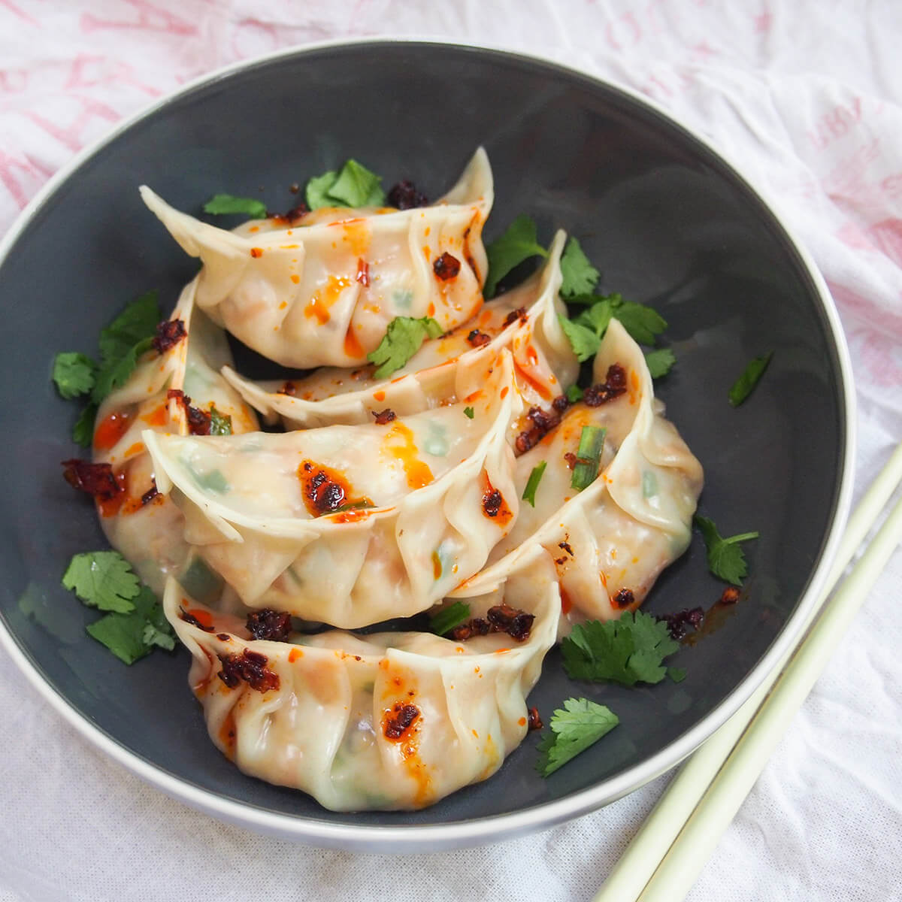

# Jiaozi

*Hand-folded Chinese dumplings, pork and chive in a hot-water dough, pleated into half-moons. The shape is meant to look like a gold ingot, eat enough on the eve of Lunar New Year and prosperity follows. Boiled is traditional; pan-fried with a crisp underside (pot-stickers) is also fair game.*

**Serves:** 4 (makes about 30 dumplings)

**Prep Time:** 60 minutes (most of it folding)

**Cook Time:** 12 minutes

## Overview
Jiaozi are the dumplings every Chinese family makes together at the New Year, lined up on flour-dusted trays around the kitchen, pleated by hands that have been doing it for fifty years and hands that are doing it for the first time. The wrapper dough uses just-boiled water (a hot-water dough gives a tender, slightly stretchy wrapper that doesn't dry out) and rests covered for half an hour before rolling. The filling is the standard family combination: minced pork with finely chopped Chinese chives bound by soy, sesame oil, ginger and Shaoxing; a generous teaspoon goes in each wrapper, the edge pleats along one side, the whole thing seals into a half-moon shape with a curved top. Boil in batches with the "three-cup" trick: add a splash of cold water between each rolling boil to stop the wrappers blistering. Eat with a dipping sauce of sharp black vinegar and chilli, by the dozen.

## Ingredients

### The wrappers
- 300 g plain flour (plus extra for rolling)
- 180 ml water (just-boiled)
- A pinch of fine sea salt

### The filling
- 400 g minced pork (about 20% fat)
- 1 large bunch Chinese chives (about 120 g, finely chopped): substitute regular chives or finely-sliced spring onion greens
- 2 tablespoons light soy sauce
- 1 tablespoon shaoxing wine
- 1 teaspoon dark soy sauce (for colour)
- 1 teaspoon sesame oil
- 1 thumb fresh ginger (finely grated)
- 2 spring onions (white and pale green parts only, finely chopped)
- 1/2 teaspoon white pepper
- 1 teaspoon caster sugar
- 1 medium egg
- 1 tablespoon vegetable oil

### The dipping sauce
- 4 tablespoons Chinkiang black vinegar
- 1 tablespoon light soy sauce
- 1 teaspoon sesame oil
- 1 teaspoon chilli oil
- 1 thumb fresh ginger (cut into fine threads)

## Method

### Stage 1 - Make the dough
1. Put the flour and salt in a wide bowl. Pour in the just-boiled water in a thin stream while stirring with chopsticks or a wooden spoon. The flour will go through a shaggy phase, then come together.
1. When cool enough to touch, turn out onto a lightly floured surface and knead for 8 minutes until smooth and elastic. The dough should feel slightly drier than bread dough.
1. Cover with a damp cloth and rest for 30 minutes. The gluten relaxes; the dough becomes far easier to roll.

### Stage 2 - Make the filling
1. Combine all the filling ingredients in a large bowl. Mix with chopsticks or a fork in one direction only for 2-3 minutes, the mince develops a slightly sticky, springy texture that holds shape when wrapped.
1. Cover and chill while you roll the wrappers.

### Stage 3 - Roll and fill
1. Divide the dough into 4 pieces. Keep 3 covered with the damp cloth while you work the fourth.
1. Roll each piece into a rope about the thickness of a finger, then cut into 1.5 cm pieces. With a small rolling pin, roll each piece into a 7-8 cm round, thinner at the edge than the centre, this matters for the seal.
1. Place a heaped teaspoon of filling in the middle of a wrapper. Fold the wrapper in half over the filling and pinch shut at the centre point. Pleat 3-4 small folds along the edge facing you, pressing each pleat against the flat back edge to seal. The dumpling should sit upright, belly down, with the pleated edge curving like the rim of a gold ingot.
1. Place the finished dumplings on a tray dusted with flour, well-spaced so they don't stick together. Cover with a slightly damp cloth as you go.

### Stage 4 - Cook
1. Bring a wide pan of water to a rolling boil and salt lightly.
1. Drop in dumplings in batches of 10-12 so the water doesn't crash off the boil. Stir gently once to stop them sticking to the bottom.
1. When the water returns to a boil, add a small cup of cold water (about 100 ml). When it returns to boil again, add a second small cup. After the third return to boil, the dumplings should be floating high and the wrappers slightly translucent. Lift out with a slotted spoon.
1. While the dumplings cook, whisk together the dipping sauce ingredients in a small bowl.
1. Serve immediately, on a wide plate with the dipping sauce on the side. Eat with chopsticks; one bite, then a dip, then another bite.

### Stage 5 (alternative) - Pot-stickers
1. Heat 2 tablespoons of vegetable oil in a large non-stick frying pan over medium-high heat.
1. Arrange dumplings flat-side-down in a single layer. Fry undisturbed for 2 minutes until the bottoms are deep golden.
1. Pour in 100 ml of water; the pan will hiss spectacularly. Cover immediately and steam for 5 minutes.
1. Uncover, let the remaining water evaporate (1-2 more minutes), and the dumplings should now have a crisp golden base and steamed tops.

## Notes
- Hot-water dough is the secret to a wrapper that takes the boiling well without splitting. Cold-water dough is for fresh noodle, not jiaozi.
- The mixing-in-one-direction trick for the filling is non-negotiable in many Chinese households; it builds the springy texture that holds the pleats.
- Frozen dumplings keep beautifully. Lay them flat-spaced on a floured tray, freeze until firm (about an hour), then bag. Cook from frozen, add an extra cold-water cycle in the boil.

## Serving
- On a wide platter, pointed ends up like a tray of ingots, with the dipping sauce in small individual bowls. Eaten on the eve of Lunar New Year, or any time you want a project that takes an afternoon and feeds eight.

## Storage
Freeze raw, as above, up to 3 months. Cooked dumplings don't reheat well, the wrappers go gummy. Cook in batches.
