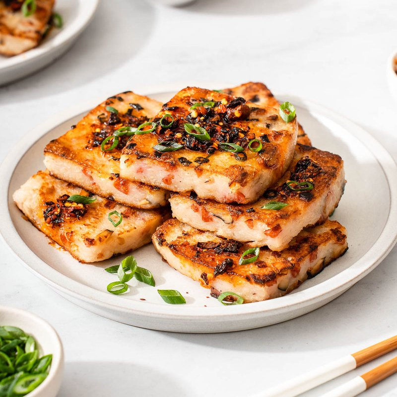

# Lo Bak Go

*The Cantonese dim-sum cake: grated daikon braised with dried shrimp, Chinese sausage and rice flour, steamed firm, then pan-fried crusty.*

**Serves:** 8 (makes one 20 cm cake; 16 slices)

**Prep Time:** 30 minutes

**Cook Time:** 1 hour 30 minutes

## Overview
Dried shrimp and dried shiitake soak in warm water until plump; the soaking water is reserved. Chinese sausage dices fine; shallots, soaked shrimp and shiitake chop separately. All these flavourings fry together in oil until aromatic. Grated daikon is added with the shiitake-shrimp soaking liquid; cooked for 10 minutes covered until softened. Rice flour whisks with cold water into a smooth slurry; pours into the daikon mixture; cooks for 2 minutes, stirring, until thickened into a batter. Tipped into a greased loaf tin; smoothed; steamed for 60 minutes in a wide pot. Cooled fully, refrigerated, then sliced 1 cm thick and pan-fried in oil until crusted gold on both sides. Served with chilli oil and a dipping sauce of light soy and rice vinegar.

## Ingredients

### Flavour base
- 20 g dried shrimp (sold at Asian shops)
- 4 dried shiitake mushrooms
- 200 ml water (just-boiled, for soaking the shiitake and shrimp)
- 2 Chinese sausages (lap cheong, sold vacuum-packed at Asian shops)
- 2 shallots (small, finely diced)
- 2 tablespoons vegetable oil
- 1 teaspoon white pepper
- 1 teaspoon salt
- 1 tablespoon light soy sauce

### Main body
- 1 kg daikon radish (peeled and grated - should yield about 700 g grated)
- 300 g rice flour (NOT glutinous rice flour)
- 500 ml cold water (for the slurry)

### For frying (final stage)
- 4 tablespoons vegetable oil

### Dipping
- 4 tablespoons light soy sauce
- 1 tablespoon rice vinegar
- 1 teaspoon sesame oil
- 1 red chilli (small, sliced) or chilli oil

## Method

### Stage 1 - Soak
1. Place dried shrimp and shiitake in a small bowl; cover with the just-boiled water.
1. Soak 20 minutes until soft.
1. Drain through a sieve - RESERVE the soaking water.
1. Squeeze the shiitake; trim off the stems; finely chop the caps.
1. Roughly chop the shrimp.

### Stage 2 - Prep the sausage
1. Steam or microwave the Chinese sausages 2-3 minutes to soften.
1. Slice each one in half lengthwise, then dice into 3 mm cubes.

### Stage 3 - Fry the aromatics
1. Heat 2 tablespoons oil in a wide deep pan over medium-high heat.
1. Add the diced sausage; fry 2 minutes until the fat begins to render and the sausage colours slightly.
1. Add the chopped shallots; cook 3 minutes until soft.
1. Add the chopped shrimp and shiitake; cook 2 minutes.
1. Season with salt, white pepper and soy sauce.

### Stage 4 - Cook the daikon
1. Add the grated daikon to the pan.
1. Pour in the reserved shiitake-shrimp soaking water.
1. Bring to a simmer; cover; reduce heat.
1. Cook 10 minutes - the daikon softens and releases its own water; the mass becomes wet and translucent.

### Stage 5 - Rice flour slurry
1. In a separate bowl, whisk rice flour with 500 ml cold water until lump-free.
1. With the daikon pan still over low heat, slowly pour in the slurry, stirring constantly.
1. The mixture thickens rapidly into a heavy batter. Cook 2-3 minutes, stirring, until it has the consistency of thick porridge.
1. Off heat.

### Stage 6 - Steam
1. Grease a 20 cm square or round tin with oil.
1. Tip the batter into the tin; smooth the top.
1. Set up a wide pot with a steamer rack or a few balled-up bits of foil.
1. Bring water to a boil; place the tin on the rack (water must not touch the tin).
1. Cover; steam 50-60 minutes over medium heat. A toothpick inserted should come out clean.
1. Top up the boiling water as needed.

### Stage 7 - Cool and chill
1. Lift the tin out; cool to room temperature.
1. Cover; refrigerate at least 4 hours, ideally overnight. The cake firms up considerably and slices cleanly.

### Stage 8 - Slice and fry
1. Run a knife around the edge of the tin; turn out the cake onto a board.
1. Slice into 1 cm thick pieces (about 16 slices).
1. Heat oil in a wide non-stick frying pan over medium heat.
1. Fry the slices 3-4 minutes per side until deep golden brown and crusted.
1. Lift onto a plate.

### Stage 9 - Serve
1. Plate 2-3 slices per person.
1. Whisk the dipping sauce ingredients; offer in small bowls.
1. Drizzle a little chilli oil for those who want heat.

## Notes
- **Plain rice flour, NOT glutinous:** Lo bak go uses regular rice flour for its slight crumb-like structure. Glutinous rice flour (sticky / sweet rice flour) is wrong and gives a gummy mochi-like cake.
- **Soak the shrimp and shiitake liquid is umami:** The reserved soaking water is liquid gold - it's loaded with the flavour of both ingredients. Use it instead of plain water for cooking the daikon.
- **Fully chill before slicing:** Hot lo bak go falls apart. The chill (and the 4-hour rest) sets the starch and lets you slice clean firm pieces that hold together in the frying pan.

## Storage
- The steamed un-fried cake refrigerates 5 days; fry slices fresh.
- The cake freezes well: wrap whole in cling film; freeze 2 months; defrost overnight; slice and fry.
- Fried slices keep 1 day in the fridge; re-fry briefly to crisp.
