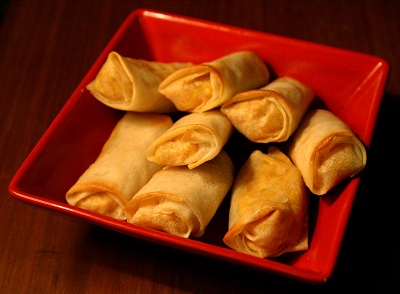

# Spring Rolls

*Cantonese spring rolls: thin wheat wrappers rolled around shredded vegetables and pork (or prawn), deep-fried till the shell shatters.*

**Prep Time:** 15 minutes

**Cook Time:** 1 minute

**Serves:** 12

## Overview
These spring rolls are the polite-takeaway version: neat, savoury, and a textural workout in three bites. The filling is stir-fried in a fast hot wok: Parma ham, mange tout, red pepper, water chestnuts and bean sprouts together for two minutes, seasoned with two soy sauces (light for flavour, dark for colour), sesame oil and a glug of sherry. The mixture cools fully before going into the wrappers; hot filling steams the inside of the roll and sabotages the crunch. Each spring roll wrapper rolls tight around a tablespoon of cooled filling, sealed with egg wash, deep-fried at 180°C for three minutes until uniformly gold. Eat hot from the kitchen paper with sweet chilli sauce or sharp Chinkiang vinegar for dipping; equally good the next day from a lunchbox.

## Ingredients
- 1 packet spring roll skins
- 175 grams Parma ham
- 110 grams mange tout (trimmed)
- 110 grams red pepper (de-seeded)
- 110 grams waterchestnuts (drained)
- 1 tablespoon groundnut oil
- 110 grams fresh bean sprouts
- 4 spring onions (finely shredded)
- 1 teaspoon salt
- 1 teaspoon sugar
- 1 teaspoon light soy sauce
- 1 teaspoon dark soy sauce
- 1 teaspoon sesame oil
- 1 ½ tablespoons dry sherry (or rice wine)
- 1 litre oil (for deep frying)
- 3 tablespoons plain flour (blended with 1 ½ tablespoons water)

## Method
### To prepare the filling
1. Finely shred the Parma ham, mange tout and pepper into very thin slices using a very sharp knife.
1. Rinse the waterchestnuts in cold water, drain and slice very finely.
1. Heat a wok or large frying pan, add the 1 tablespoon of groundnut oil when the wok is very hot.
1. Stir fry the Parma ham and vegetables for 1 minute.
1. Add the salt, sugar, soy sauces, sesame oil and sherry or rice wine.
1. Stir fry for 3 minutes and tip into a chinois or fine-meshed conical sieve to drain and cool.

### To make the pancakes
1. Mix the flour paste in a small bowl.
1. Put about 3 tablespoons of the cooled filling on each spring roll skin.
1. Fold in each side and then roll it up tightly.
1. Use the flour paste to seal the open end by brushing a small amount on the edge.
1. Press the edge onto the roll to seal.

### To cook the pancakes
1. Heat the 1 litre of oil in a deep fat fryer or large wok until it is hot and almost smoking.
1. Deep fry the spring rolls in several batches until they are golden brown.
1. Drain on kitchen paper and serve at once.

## Notes
- Drain the filling thoroughly in a fine-meshed sieve before wrapping, excess moisture will make the skins soggy and prone to splitting during frying.
- Roll the spring rolls tightly and seal the edges well with flour paste to prevent them from opening in the oil.
- Fry in batches to avoid overcrowding the oil, which lowers the temperature and results in greasy rather than crisp rolls.
- The filling must be fully cooled before wrapping, otherwise the steam will soften the skins from the inside.

## Serving
Serve with: sweet chilli sauce, soy sauce, or a light dipping sauce
Temperature: hot, immediately after draining
Amount: 2-3 rolls per person as a starter or side

## Storage
- Store uncooked assembled spring rolls in the fridge for up to 4 hours before frying, covered with a damp cloth to prevent drying out.
- Cooked spring rolls can be stored in an airtight container in the fridge for up to 2 days and re-crisped in a hot oven.
- Uncooked spring rolls can be frozen on a tray and then bagged; fry from frozen, allowing extra cooking time.

*Spring rolls are among the best known Chinese snacks. They are not difficult to make and are a perfect starter for any meal.*
