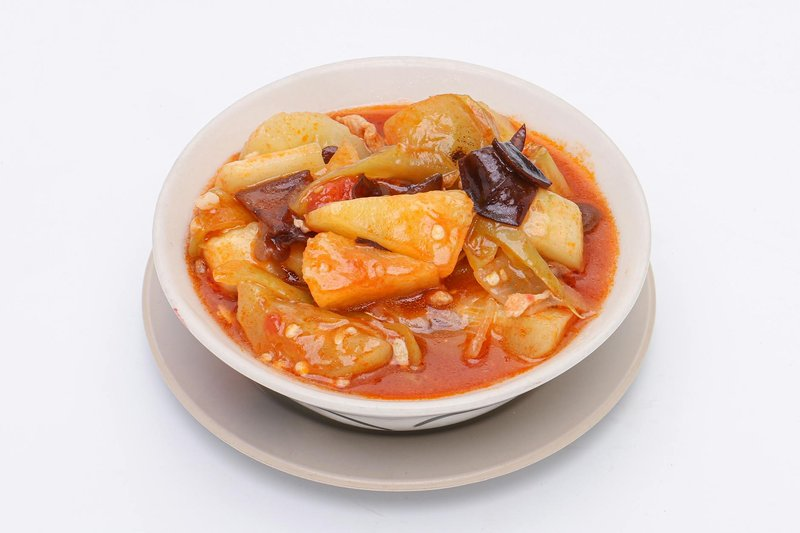

# Sweet and Sour Prawns

*Cantonese sweet and sour prawns: cornflour-dusted prawns shallow-fried and tossed in a tangy tomato-vinegar-sugar sauce with peppers and spring onion.*

**Serves:** 4
**Prep Time:** 15 minutes
**Cook Time:** 8 minutes

## Overview
This is a brighter, lighter sibling of sweet and sour pork, where the prawns cook in seconds and the sauce stays clean instead of getting heavy. Large prawns are dredged in cornflour and shallow-fried until the shells colour and the meat just curls, then lifted out so they don't overcook while you build the sauce. Tomato, rice vinegar, sugar, soy and a flake of dried chilli reduce in the same pan into something glossy and the colour of dark coral; a slurry of cornflour at the end gives it body. The prawns return for a final toss in the sauce, no more than thirty seconds, and out they go onto a warm dish. Eat over rice or as a starter with a beer; the chilli builds slowly behind the sweet and sour.

## Ingredients

### Protein & Vegetables
- 225 grams prawns (shelled and de-veined)
- 110 grams tinned chestnuts (or fresh water chestnuts, drained, sliced)
- 75 grams red bell pepper (or green bell pepper, roughly chopped)
- 2 spring onions

### Cooking
- 2 teaspoons groundnut oil
- 2 teaspoons garlic (finely chopped)

### Sauce
- 70 ml Chinese chicken stock
- 1 tablespoon dry sherry (or rice wine)
- 2 teaspoons light soy sauce
- 1 tablespoon tomato purée
- 1 tablespoon cider vinegar
- 1 tablespoon sugar
- 2 teaspoons cornflour (blended with 2 teaspoons water)

## Method

### Stage 1 - Prepare
1. Wash the prawns and pat dry on kitchen paper.
1. Slice the water chestnuts.
1. Cut the spring onions diagonally into 3 ½ cm pieces.

### Stage 2 - Cook Prawns
1. Heat a wok or large frying pan.
1. When hot, add the oil and stir-fry the prawns for 1 minute.
1. Remove them with a slotted spoon and drain on kitchen paper.

### Stage 3 - Build Sauce
1. Add the garlic and spring onions to the pan and stir-fry for a few seconds.
1. Add the pepper and fresh water chestnuts (if using fresh) and stir-fry for 30 seconds.
1. Add the sauce ingredients and bring to the boil.
1. Simmer for 4 minutes.

### Stage 4 - Combine & Serve
1. If using tinned water chestnuts, add them now.
1. Boil over high heat for another 30 seconds.
1. Return the prawns to the pan and warm through.
1. Serve immediately with steamed rice.

## Notes
- **Fresh vs. tinned water chestnuts:** Fresh add superior crunch; tinned are a convenient alternative but soften slightly upon extended cooking.
- **Prawn doneness:** Prawns cook very fast. Ensure they don't overcook in the final warming step, they should be heated through but still tender.
- **Sauce balance:** The combination of sugar, vinegar, tomato purée, and soy should be perfectly balanced. Taste and adjust if needed.

## Serving
- Serve with: Steamed white rice and a simple vegetable

## Storage
- Best served immediately
- Keeps 1 day refrigerated (texture deteriorates; prawns may become rubbery)
- Not recommended for freezing
