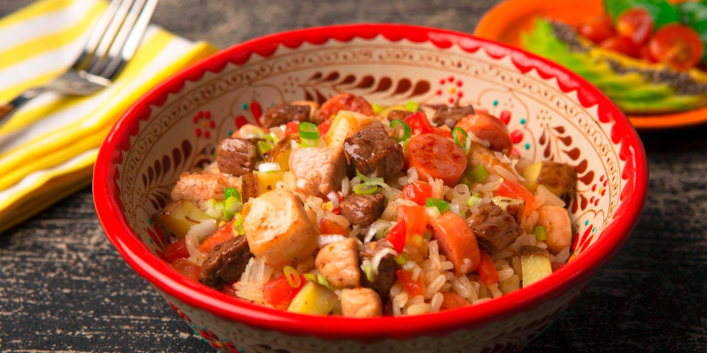

# Arroz Atollado

*Colombia's creamy rice with chicken and pork: medium-grain rice cooked into a deliberately wet creamy risotto-like stew with diced chicken, pork ribs, sausage, peas, potato and the traditional hogao base. The Valle del Cauca specialty, brothy and luxuriously creamy, eaten with a spoon from deep bowls.*

**Serves:** 6

**Prep Time:** 30 minutes

**Cook Time:** 1 hour

## Overview
Arroz atollado means "stuck rice", a name that captures the texture: thick, dense, brothy. The traditional creamy rice dish of Colombia's Valle del Cauca region, and especially of Cali, where Caleño families make it for Sunday lunch and every típico Valluno restaurant keeps it on the menu. Medium-grain rice cooks into a deliberately wet, almost risotto-like stew alongside diced chicken thigh, pork ribs, sliced sausage, peas, potato and the traditional Colombian hogao (the onion-tomato-pepper base). The starch the rice releases is what gives the dish its signature creaminess; long-grain doesn't carry the same body, so reach for Calrose or similar. Unlike most rice dishes that aim for fluffy separated grains, arroz atollado is meant to be soupy-creamy, eaten with a spoon from deep bowls. Topped with chopped fresh coriander and served with lime wedges and ají picante on the side.

## Ingredients

### Meats
- 400 g chicken thigh (boneless, cubed)
- 400 g pork ribs (small pieces; or pork shoulder cubed)
- 200 g chorizo (sliced)
- 200 g blood sausage / morcilla (sliced; optional but very Colombian)

### Cooking
- 4 tablespoons olive oil
- 1 large onion (finely chopped)
- 1 large green bell pepper (finely chopped)
- 1 large red bell pepper (finely chopped)
- 6 garlic cloves (crushed)
- 6 tablespoons hogao
- 3 tablespoons tomato paste
- 1 tablespoon achiote (annatto) for colour
- 2 tablespoons ground cumin
- 2 tablespoons dried oregano
- 1 ½ teaspoons fine sea salt
- 1 teaspoon ground black pepper

### Rice and liquid
- 500 g medium-grain rice (rinsed)
- 1.8 litres hot chicken stock (the dish needs LOTS of liquid for the soupy texture)
- 2 bay leaves

### Additions
- 3 medium potatoes (peeled and cubed small)
- 200 g frozen peas
- 2 medium carrots (peeled and diced)
- 200 g cassava/yuca (optional; cubed)

### To finish
- 1 large bunch fresh coriander (chopped)
- 1 small bunch fresh culantro/recao (chopped, optional)
- 6 spring onions (sliced)
- Lime wedges

### To serve
- Avocado slices
- Ají picante
- Arepas

## Method

### Stage 1 - Brown the meats
1. Heat the olive oil in a very large heavy pot over medium-high heat.
2. Brown the pork ribs 4 minutes per side; lift out.
3. Brown the chicken 3 minutes per side; lift out.
4. Add the chorizo and morcilla; cook 3 minutes till browned; lift out.

### Stage 2 - Build the base
1. Reduce heat to medium.
2. Add the chopped onion and bell peppers; cook 8 minutes till soft.
3. Add the crushed garlic; cook 30 seconds.
4. Add the hogao, tomato paste, achiote, cumin, oregano, salt and pepper; cook 2 minutes.

### Stage 3 - Return meats and add liquid
1. Return the pork ribs and chicken (and any juices) to the pot.
2. Pour in the hot chicken stock.
3. Add the bay leaves.
4. Bring to a simmer; cover and cook 25 minutes till the pork is starting to tender.

### Stage 4 - Add rice
1. Stir in the rice.
2. Add the chorizo and morcilla.
3. Cover and continue to simmer 15 minutes; stir occasionally to prevent sticking and to release the rice's starch into the broth.

### Stage 5 - Add vegetables
1. Add the cubed potatoes, peas, carrots and yuca (if using).
2. Continue cooking uncovered for 12-15 minutes; stir occasionally.
3. The dish should be thick and creamy; not dry. Add more hot stock if it dries out.

### Stage 6 - Finish
1. Take off the heat.
2. Lift out the bay leaves.
3. Stir in most of the chopped coriander, culantro and spring onions.
4. Taste; adjust salt.

### Stage 7 - Serve
1. Ladle generously into deep bowls.
2. Scatter the remaining coriander and spring onions.
3. Sliced avocado and lime wedges on the side.
4. Ají picante on the table.
5. Eat with a spoon (it's a thick soup-rice).

## Notes
- **Wet creamy texture intentional:** aim for risotto-soupy, not dry.
- **Multiple proteins:** chicken + pork ribs + sausage. The combination gives proper depth.
- **Medium-grain rice:** releases starch for the creamy texture.
- **Lots of liquid:** 1.8 litres for 500 g of rice gives the proper soupy result.
- **Eat from bowls with spoons:** the dish is soupy.

## Variations
**Without pork ribs:** use 600 g pork shoulder cubed; same technique.
**Vegetarian arroz atollado:** skip the meat; double the vegetables; use vegetable stock + 2 tablespoons of soy sauce or miso for umami. Different but works.
**Atollado de pollo:** skip the pork and sausage; use 800 g chicken thigh; lighter version.
**Atollado de mariscos:** seafood version with shrimp, mussels and white fish in the last 10 minutes.

## Serving
In deep bowls with a spoon. Avocado, lime, ají picante on the side. Drink: Club Colombia beer or fresh juice. Often a Caleño Sunday lunch.

## Storage
- Keeps refrigerated 4 days; thickens significantly overnight.
- Reheat with extra stock to restore the soupy texture.
- Freezes 3 months in portions.
- Day-old atollado is even better; flavours deepen.
