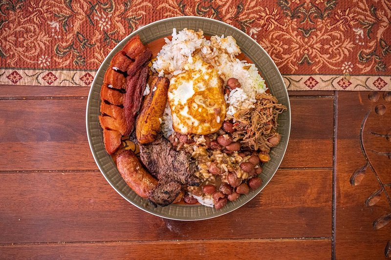

# Bandeja Paisa

*Colombia's national mega-plate, from the Antioquia (paisa) region: a single platter holding red beans, white rice, chicharrón (crackling pork belly), chorizo, fried egg, sliced avocado, an arepa, a slice of ripe plantain and a strip of grilled steak. Eaten for lunch, with effort, often with a beer. Not a single recipe - a composition.*

**Serves:** 4

**Prep Time:** 30 minutes (assumes beans and pork belly cooked)

**Cook Time:** 30 minutes

## Overview
Each component cooks separately and arrives on the same wide platter: braised red beans (frijoles paisas); white long-grain rice; fried pork belly (chicharrón); grilled or fried chorizo; sliced grilled steak; ripe plantain fried sweet; an egg sunny-side up; half an avocado; an arepa de maíz.

## Ingredients

### Per serving
- 250 g cooked frijoles paisas (see recipe)
- 200 g cooked white rice
- 1 piece chicharrón (90 g pre-cooked pork belly - see Notes)
- 1 chorizo (Colombian-style or Spanish chorizo)
- 1 thin steak (sirloin or skirt, 100-120 g per person)
- ½ ripe plantain (sliced lengthways and fried - tajadas)
- 1 large egg
- ½ ripe avocado
- 1 arepa de maíz blanco (white-corn arepa, 1 per person)
- Vegetable oil for frying
- Salt and ground black pepper

### Garnish
- 1 small bowl of hogao (Colombian sofrito, on the side)
- A few sliced spring onions

## Method

### Stage 1 - Reheat beans and rice
1. Warm the beans gently in a pot, with a splash of stock if thick.
1. Reheat the rice covered with a splash of water.

### Stage 2 - Chicharrón
1. Heat 5 mm of oil in a wide pan to medium-high.
1. Fry the pre-cooked pork belly pieces skin-up first, 4-5 minutes, then flip and cook 3 more minutes until the skin is crisp and blistered. (See Notes for the pre-cooking step.)
1. Drain on kitchen paper.

### Stage 3 - Chorizo
1. In the same pan, fry the chorizo 4-5 minutes, turning, until plump and gold.

### Stage 4 - Plantain
1. Lower the heat to medium. Add the plantain slices; fry 2-3 minutes per side until deep gold and soft.
1. Salt lightly.

### Stage 5 - Steak
1. Heat a separate pan very hot. Sear the steaks 90 seconds per side. Rest 3 minutes; slice or leave whole.

### Stage 6 - Eggs
1. In a clean pan, fry each egg sunny-side up.

### Stage 7 - Arepa
1. Warm the arepas on a dry hot pan 90 seconds per side.

### Stage 8 - Plate
1. On a wide platter (the bandeja), arrange each component in its own corner:
   - Rice in the centre with beans ladled to one side
   - Chicharrón on top of the beans
   - Chorizo, plantain, arepa, steak, avocado around the edge
   - Egg balanced on the rice
1. Place hogao and spring onions in a small bowl on the side.

### Stage 9 - Eat
1. With a fork and a smile. Mix components as you go.

## Notes
- **Pre-cooked pork belly:** Season pork belly with salt, refrigerate 2 hours, simmer covered in water 1 hour 30 minutes, then cool and slice. Fry portions as needed. Or use a butcher's chicharrón cuts.
- **Arepa is the bread:** Made from white-corn pre-cooked masarepa. Sold in Latin food shops as Harina P.A.N. Mix with water + salt + cheese, shape into patties, griddle.
- **Components ahead:** The trick is to have beans, rice, pork belly and chorizo ready. Then it's a fast assembly.

## Storage
- All components keep 3 days separately. Don't pre-plate.
