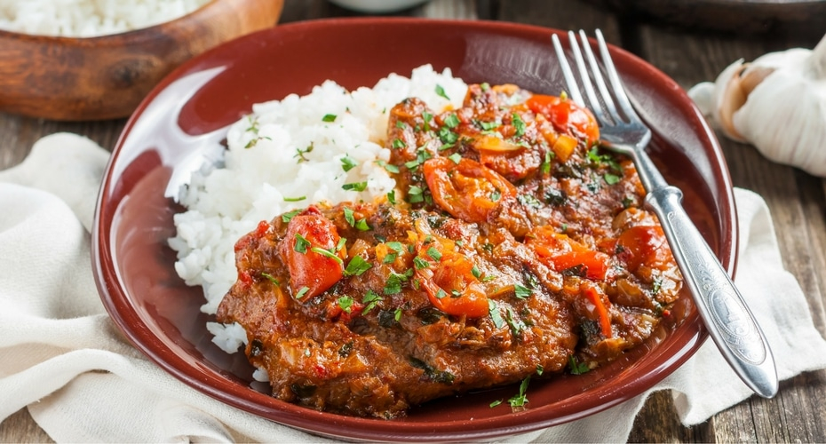

# Bistec a la Criolla

*Colombia's steak in tomato-onion sauce: thin slices of beef seared briefly then simmered with a base of sautéed onions, tomatoes, peppers, garlic, the canonical Colombian hogao and a touch of cumin till the sauce thickens and clings to the meat. The Colombian everyday family dinner, ladled over white rice with a fried egg, plantains and avocado.*

**Serves:** 4

**Prep Time:** 20 minutes (plus 30 minutes marinating)

**Cook Time:** 40 minutes

## Overview
Bistec a la criolla (literally "Creole steak"; "criollo" meaning the indigenous Colombian style) is one of Colombia's most everyday dinner-table dishes and a staple of Bogotá-paisa home cooking: thin slices of beef (the canonical cut is "muchacho" - eye round; or top sirloin; or skirt steak - sliced thin) are first briefly marinated in lime, garlic and salt, seared briefly in a hot pan, then slow-simmered in a base of sautéed onions, chopped tomatoes, green peppers, garlic, hogao (the foundational Colombian onion-tomato sauce), cumin, oregano and a touch of beef stock till the sauce thickens to a glossy orange-red coating around the beef and the meat is tender. Served ladled over plain white rice with a fried egg, sliced sweet plantains and avocado on the plate. The dish distinguishes itself from the Cuban bistec encebollado by the tomato dominance (Cuban is onion-dominant), the hogao base and the typical Colombian platter presentation. Three details define proper bistec a la criolla. First, hogao is essential. The Colombian onion-tomato-pepper base gives the dish its character. Second, thin beef, briefly seared. The thin meat sears in 60 seconds; longer goes tough. Third, the sauce thickens to cling. The proper bistec a la criolla has a thick sauce that coats the meat; not a watery stew.

## Ingredients

### Beef
- 800 g top sirloin or muchacho (eye round) or skirt steak (sliced thin, 5 mm)
- Juice of 1 lime
- 4 garlic cloves (crushed)
- 1 ½ teaspoons fine sea salt
- 1 teaspoon ground black pepper
- 1 tablespoon dried oregano
- 1 tablespoon ground cumin

### Cooking
- 3 tablespoons olive oil
- 2 large white onions (sliced into half-moons)
- 1 large green bell pepper (sliced into strips)
- 1 large red bell pepper (sliced into strips)
- 6 garlic cloves (crushed)
- 4 medium ripe tomatoes (chopped)
- 4 tablespoons hogao
- 2 tablespoons tomato paste
- 1 tablespoon achiote/turmeric
- 200 ml beef stock
- 1 tablespoon Worcestershire sauce
- 2 bay leaves
- 1 ½ teaspoons fine sea salt
- 1 teaspoon ground black pepper
- 1 small fresh chilli (sliced, optional)

### To finish
- 1 small bunch fresh coriander (chopped)
- 4 spring onions (sliced)
- Lime wedges

### To serve
- Plain white rice
- Sweet plantains (maduros)
- Fried eggs (1 per person)
- Sliced avocado
- Arepas
- Ají picante

## Method

### Stage 1 - Marinate the beef
1. Combine the lime juice, crushed garlic, salt, pepper, oregano and cumin in a wide bowl.
2. Add the beef slices; toss to coat.
3. Refrigerate 30 minutes.

### Stage 2 - Sear the beef
1. Heat 2 tablespoons of the olive oil in a wide heavy pan over high heat.
2. Sear the beef in batches for 60 seconds per side just to brown.
3. Lift out.

### Stage 3 - Sauté the vegetables
1. Reduce heat to medium.
2. Add the remaining tablespoon of oil.
3. Add the sliced onions and bell peppers; cook 10 minutes till soft.
4. Add the crushed garlic; cook 30 seconds.

### Stage 4 - Build the sauce
1. Add the chopped tomatoes; cook 5 minutes till they break down.
2. Add the hogao and tomato paste; cook 3 minutes till deepened.
3. Add the achiote, Worcestershire sauce, bay leaves, salt and pepper.
4. Pour in the beef stock.
5. Add the chilli if using.
6. Bring to a simmer.

### Stage 5 - Return the beef
1. Return the seared beef (and any juices) to the pan.
2. Reduce heat to low.
3. Cover with the lid slightly ajar.
4. Simmer 20-25 minutes till the beef is tender and the sauce has thickened to a glossy coating.

### Stage 6 - Finish
1. Take off the heat.
2. Lift out the bay leaves.
3. Stir in the chopped coriander and spring onions.
4. Taste; adjust salt.

### Stage 7 - Serve
1. Spoon white rice into deep plates.
2. Place 2-3 slices of beef with plenty of sauce over the rice.
3. Add a fried egg on top of the beef (yolk runny).
4. Maduros, avocado, arepa alongside.
5. Lime wedges and ají picante on the table.

## Notes
- **Hogao is the foundation:** don't skip.
- **Thin beef, brief sear:** 60 seconds per side. Longer = tough.
- **Sauce thick enough to cling:** simmer 20-25 minutes till glossy.
- **Fried egg on top:** the canonical Colombian touch.
- **Don't oversalt:** the Worcestershire and hogao bring salt.

## Variations
**With chicken (pollo a la criolla):** swap beef for chicken thigh fillets; cook 30 minutes till tender.
**Pork chops a la criolla:** swap for thin pork chops; common variation.
**With chorizo:** add 100 g of sliced chorizo to the base; gives richness.
**Spicier:** double the chilli; add 1 chopped habanero; properly fierce.

## Serving
On a plate of white rice with the bistec topped with a fried egg, maduros and avocado alongside. Arepa, lime, ají on the side. Drink: Club Colombia beer or fresh limonada.

## Storage
- Keeps refrigerated 4 days; flavour deepens.
- Reheat gently with a splash of stock.
- Freezes 3 months.
- Day-old bistec a la criolla makes excellent arepa or empanada filling.
