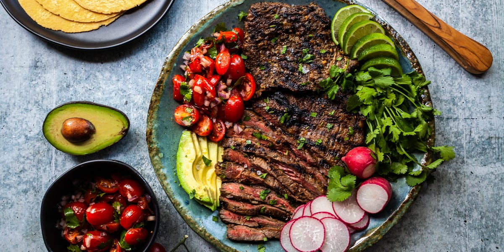

# Carne Asada Colombiana

*Colombia's grilled steak: thin slices of beef (skirt or flank) marinated in garlic, cumin, oregano and lime, grilled over hot charcoal till the outside chars and the inside stays pink. The Colombian-asado classic, the traditional centrepiece of the famous "bandeja paisa" platter, served with white rice, beans, plantains and a fried egg.*

**Serves:** 4-6

**Prep Time:** 20 minutes (plus 4 hours marinating)

**Cook Time:** 12 minutes

## Overview
Carne asada Colombiana is Colombia's grilled-steak classic and a fundamental component of weekend asados and the traditional bandeja paisa platter. Thin slices of beef (skirt is traditional; flank works too) marinate in a fragrant paste of crushed garlic, ground cumin, dried oregano, lime juice, salt and pepper for a few hours, then grill over hot charcoal or a screaming-hot grill pan for just two or three minutes per side till the outside chars and the inside stays pink and juicy. The cut sometimes goes by "vacío" or "matambre" in Colombian Spanish; slice it across the grain when serving. Rarely eaten alone; it's the centrepiece of a bandeja (platter) with all the traditional sides arranged around it: rice, frijoles paisas, patacones, maduros, chorizo, chicharrón, a fried egg, an arepa, sliced avocado, and ají picante on the table.

## Ingredients

### Beef and marinade
- 1 kg skirt steak (or flank steak; or top sirloin sliced thin to 1 cm; the thinner the better)

### Marinade
- 12 garlic cloves (crushed)
- 4 tablespoons olive oil
- Juice of 4 limes
- 2 tablespoons soy sauce
- 1 tablespoon Worcestershire sauce
- 2 tablespoons ground cumin
- 2 tablespoons dried oregano
- 1 tablespoon ground paprika
- 2 teaspoons fine sea salt
- 1 teaspoon ground black pepper
- 1 tablespoon achiote (annatto) powder (optional, for colour)

### To finish
- Flaky sea salt
- Lime wedges
- 2 tablespoons fresh coriander (chopped)

### To serve (the traditional Colombian bandeja-style presentation)
- Plain white rice
- Frijoles paisas (red beans; see existing colombian side)
- Patacones (Colombian patacones; see existing colombian side)
- Maduros (sweet plantains)
- Fried eggs (1 per person; runny yolks)
- Sliced avocado
- Chorizo (sliced)
- Chicharrón (pork crackling)
- Arepas
- Ají picante

## Method

### Stage 1 - Marinate the beef
1. Lay the beef in a wide flat container (or zip-lock bag).
2. Combine all marinade ingredients to a paste.
3. Rub thoroughly over the beef.
4. Cover and refrigerate 4-12 hours.

### Stage 2 - Bring to room temperature
1. Take out 30 minutes before grilling.

### Stage 3 - Prepare the grill
1. Light a charcoal grill; let burn down to glowing embers.
2. Or heat a heavy ridged grill pan over high heat till smoking.

### Stage 4 - Grill the beef
1. Lift the beef from the marinade.
2. Place on the hot grill or pan.
3. Cook 2-3 minutes per side for medium-rare (pink centre); 3-4 minutes for medium.
4. The exterior should be deeply charred; the interior pink and juicy.
5. Don't move during the cook; let the surface sear.

### Stage 5 - Rest and slice
1. Transfer to a board; cover loosely with foil; rest 5 minutes.
2. Slice thinly (5 mm) across the grain.

### Stage 6 - Plate (bandeja-style)
1. Arrange the sliced beef on one section of a wide platter.
2. Add a portion of white rice.
3. Add frijoles paisas alongside.
4. Add patacones, maduros, sliced avocado, chorizo, chicharrón, an arepa.
5. Top with a sunny-side-up egg.
6. Sprinkle flaky salt and coriander over the beef.
7. Lime wedges; ají picante on the table.

## Notes
- **Skirt steak across the grain:** essential for tender slices.
- **Hot grill, brief cook:** 2-3 minutes max per side.
- **Don't overcook:** medium-rare is the target.
- **Rest before slicing:** 5 minutes.
- **Bandeja-style serving:** the dish is meant as part of a platter, not alone.

## Variations
- **With chimichurri:** serve with Argentine-style chimichurri (parsley, garlic, oregano, vinegar, oil); less traditional Colombian but excellent.
- **Carne en polvo (the powdered-beef variation):** shred the cooked beef finely; sauté with onion and lots of cumin; serves as a different texture experience. Common Andean Colombian variation.
- **Mariquita-bandeja:** add Cuban-style plantain chips; gives a textural contrast.
- **Spicier marinade:** add 2 chopped chillies and 1 tablespoon of smoked paprika; properly fierce.

## Serving
- As the centerpiece of bandeja paisa, with all the traditional Colombian sides arranged around. Drink: Club Colombia beer, aguardiente, or fresh limonada de coco.

## Storage
- Best eaten immediately while warm.
- Cooked beef keeps refrigerated 3 days; reheat in a hot pan briefly.
- Marinated raw beef keeps refrigerated 12 hours.
- Don't freeze cooked beef.
- Day-old carne asada is excellent in arepas or wraps.
