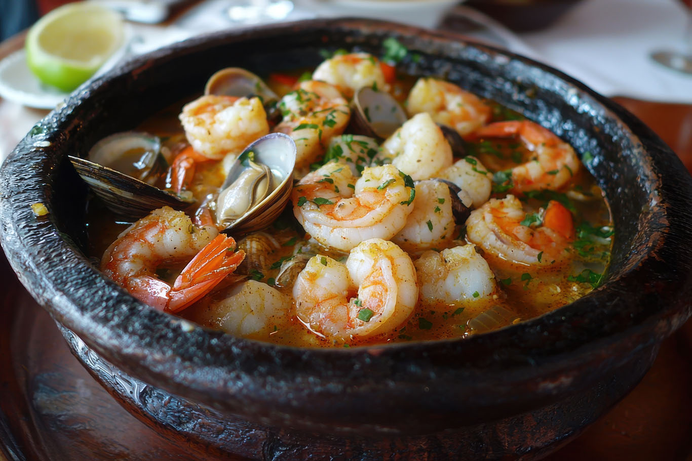

# Cazuela de Mariscos

*Colombia's Caribbean coast seafood stew: a creamy coconut-tomato base with shrimp, mussels, clams, octopus, white fish and crab, slowly cooked with hogao, garlic, achiote, white wine and a generous amount of fresh coriander till the seafood is just cooked and the sauce reduces to a rich orange-pink chowder. The Cartagena and San Andrés coastal classic, eaten with a piece of bread and a cold beer overlooking the sea.*

**Serves:** 6

**Prep Time:** 30 minutes

**Cook Time:** 35 minutes

## Overview
Cazuela de mariscos (literally "seafood casserole/stew") is the canonical Colombian-Caribbean seafood stew and a signature dish of the coastal cities of Cartagena, Santa Marta and the islands of San Andrés and Providencia: a rich creamy base of coconut milk, sautéed onions, bell peppers, tomato, garlic, the canonical Colombian hogao, achiote (annatto for the deep orange colour), white wine, fish stock and a generous amount of fresh coriander, in which a mix of seafood (shrimp, mussels, clams, octopus pieces, white fish, crab) is gently simmered till everything is just cooked through and the sauce has reduced to a rich orange-pink chowder. Served in deep bowls or terracotta cazuelas at the centre of the table, with sliced avocado, fried plantains, crusty bread and lime wedges on the side. The dish is what every Cartagena-Costeño coastal restaurant has on its menu; what every coastal Colombian family makes for special weekend lunches; what tourists try at the beachside restaurants of San Andrés. Three details define proper cazuela de mariscos. First, coconut milk and hogao together. The combination of the rich Caribbean coconut and the Colombian onion-tomato base is what makes it distinctly Colombian-coastal. Second, varied seafood. Multiple types (shrimp, mussels, clams, fish, octopus, crab) give layered ocean flavour. Third, don't overcook the seafood. The most common error. Seafood takes 5-8 minutes total in the warm sauce.

## Ingredients

### Seafood
- 300 g large raw shrimp (peeled and deveined)
- 300 g mussels (in shells; cleaned and debearded)
- 300 g clams (in shells; cleaned)
- 200 g white fish (cod, snapper, or sea bass; cubed into 3 cm pieces)
- 200 g octopus (pre-cooked; sliced)
- 200 g crab meat (cooked picked; or 4 small crab claws in shell)

### Base
- 4 tablespoons olive oil
- 2 large onions (finely chopped)
- 1 large green bell pepper (finely chopped)
- 1 large red bell pepper (finely chopped)
- 8 garlic cloves (crushed)
- 4 medium tomatoes (chopped)
- 4 tablespoons hogao
- 3 tablespoons tomato paste
- 1 tablespoon achiote/annatto (for colour and flavour)
- 1 tablespoon ground cumin
- 1 tablespoon dried oregano

### Liquid
- 1 tin (400 ml) coconut milk
- 200 ml dry white wine
- 400 ml fish stock (or shrimp stock; or chicken stock)
- 1 teaspoon Aleppo pepper or smoked paprika
- 1 ½ teaspoons fine sea salt
- 1 teaspoon ground black pepper

### To finish
- 1 large bunch fresh coriander (chopped; reserve some for garnish)
- 2 tablespoons fresh culantro/recao (optional)
- Juice of 2 limes
- 50 g butter (for finishing)

### To serve
- Crusty bread (Cuban or French baguette)
- Plain white rice
- Patacones (fried green plantains)
- Sliced avocado
- Lime wedges
- Ají picante

## Method

### Stage 1 - Prepare the seafood
1. Set out the seafood; cleaned, in separate bowls.
2. Refrigerate till needed.

### Stage 2 - Build the base
1. Heat the olive oil in a wide heavy pot over medium heat.
2. Add the chopped onions and bell peppers; cook 10 minutes till deeply soft.
3. Add the crushed garlic; cook 30 seconds.
4. Add the chopped tomatoes; cook 5 minutes till they break down.
5. Add the hogao and tomato paste; cook 3 minutes till deepened.
6. Add the achiote, cumin, oregano, Aleppo pepper, salt and pepper.

### Stage 3 - Add liquid
1. Pour in the white wine; let bubble 1 minute.
2. Add the coconut milk; stir.
3. Add the fish stock.
4. Bring to a gentle simmer.

### Stage 4 - Cook the seafood (carefully, in stages)
1. Add the octopus pieces; cook 3 minutes (already cooked, just warming).
2. Add the cubed white fish; cook 3 minutes.
3. Add the mussels and clams; cover; cook 4 minutes till they open.
4. Add the shrimp; cook 2-3 minutes till pink.
5. Add the crab meat; cook 1 minute just to warm through.
6. Total seafood cooking time: 7-8 minutes.

### Stage 5 - Finish
1. Take off the heat.
2. Discard any mussels or clams that didn't open.
3. Stir in the butter (gives glossy finish).
4. Squeeze the lime juice over.
5. Stir in most of the chopped coriander; reserve some for garnish.
6. Taste; adjust salt.

### Stage 6 - Serve
1. Ladle into deep bowls (or individual cazuelas/terracotta dishes).
2. Make sure each bowl gets a mix of each seafood.
3. Scatter the reserved coriander.
4. Crusty bread, white rice, patacones, avocado, lime alongside.

## Notes
- **Don't overcook the seafood:** 7-8 minutes total. Shrimp goes rubbery in 60 seconds past done.
- **Add seafood in stages:** octopus and fish first, then shellfish, then shrimp and crab.
- **Discard unopened shells:** mussels or clams that don't open are unsafe.
- **Hogao + coconut for proper Colombian-coastal flavour:** don't skip either.
- **Eat with bread:** for sopping the sauce.

## Variations
**Without octopus:** use 300 g extra shrimp; simpler.
**Lobster cazuela:** add 1 split lobster tail; cooks 5 minutes.
**Cazuela mixta:** add chunks of chicken thigh in stage 4 alongside the seafood; gives surf-and-turf variation.
**Spicier:** add 2 chopped fresh chillies to the base; properly Caribbean fierce.

## Serving
In terracotta cazuelas or deep bowls. Crusty bread, white rice, patacones, avocado, lime. Drink: cold Club Colombia beer, white wine, mojito, or fresh coconut water. As a Cartagena-coastal weekend lunch.

## Storage
- Best eaten immediately; seafood doesn't reheat well.
- Keeps refrigerated 1 day; reheat gently in a covered pot for 3 minutes.
- The sauce alone freezes 3 months; cook fresh seafood in the reheated sauce.
- Don't freeze with seafood; texture suffers.
