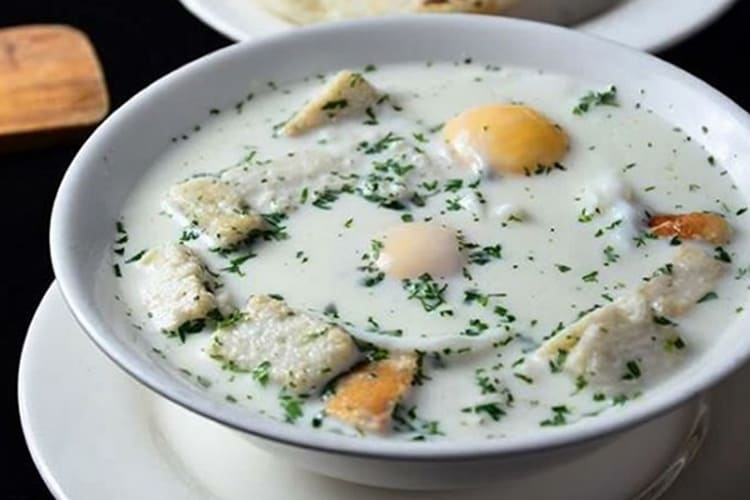

# Changua

*Bogotá's egg-and-milk breakfast soup: a hot broth of milk, water, salt and chopped scallions, in which whole eggs are poached briefly till the whites set and the yolks stay soft, served over torn pieces of stale bread with fresh cilantro and a small spoonful of butter. The Andean Colombian breakfast that warms cold Bogotá mornings, a 10-minute vegetarian one-bowl meal.*

**Serves:** 4 (1 egg per bowl)

**Prep Time:** 10 minutes

**Cook Time:** 12 minutes

## Overview
Changua is Bogotá's most iconic breakfast and one of Colombia's most distinctive dishes: a simple, surprising hot soup of milk, water, finely sliced scallions and salt, into which whole eggs are slipped to poach briefly till the whites set and the yolks stay soft-runny. Ladled over torn pieces of slightly stale bread at the bottom of each bowl, finished with fresh chopped coriander and a small spoonful of butter melting on top. Bogotá sits at 2,640 m, where mornings are genuinely cold even in summer, and changua is the dish Bogotanos reach for to warm the body before heading out. Ten minutes from cold milk to bowl. Equal parts milk and water gives the proper texture; pure milk is too rich, pure water too thin. The egg goes in whole, not beaten; the soft-poached whole yolk floating in the broth is the heart of the dish. Eat it before the bread gets too soggy.

## Ingredients

### Broth
- 800 ml whole milk
- 800 ml water
- 6 spring onions (finely sliced; whites and greens separate)
- 1 ½ teaspoons fine sea salt
- ½ teaspoon ground black pepper

### Eggs
- 4 large eggs

### To serve
- 8 slices stale bread (Colombian pan de queso, sourdough, or any sturdy bread; torn into pieces)
- 4 tablespoons unsalted butter (one per bowl)
- 1 small bunch fresh coriander (chopped)
- 1 fresh red chilli (sliced, optional)

## Method

### Stage 1 - Prepare the bowls
1. Tear 2 slices of bread into pieces; place in the bottom of each of 4 deep bowls.

### Stage 2 - Build the broth
1. In a wide saucepan, combine the milk, water, the white parts of the spring onions, salt and pepper.
2. Bring to a low simmer over medium heat (don't boil; the milk can scald).
3. Cook 5 minutes till the broth is fragrant and the scallions soft.

### Stage 3 - Poach the eggs
1. Reduce the heat so the broth is barely simmering.
2. Crack one egg into a small cup.
3. Gently slip the egg into the broth.
4. Repeat with the other 3 eggs, spacing them in the broth.
5. Cover with a lid; cook 3-4 minutes till the whites are set but the yolks are still soft-runny.

### Stage 4 - Assemble
1. Use a slotted spoon to carefully lift one egg into each prepared bowl (over the bread).
2. Ladle the hot broth (with onions) generously over each egg.
3. The bread soaks up the broth; the egg sits warm in the centre.

### Stage 5 - Finish
1. Top each bowl with a tablespoon of butter (which melts into the hot broth).
2. Scatter the chopped coriander and the green parts of the spring onions over.
3. Add a slice of fresh chilli if using.

### Stage 6 - Serve immediately
1. Eat hot with a spoon; cut into the egg so the soft yolk runs into the broth.
2. The bread soaks up the broth and butter; the egg gives protein and richness.

## Notes
- **Don't boil the milk:** scald the milk and you get a sour off-flavour. Keep at low simmer.
- **Equal parts milk and water:** the traditional Colombian ratio.
- **Slip in eggs gently:** crack into a cup first, then transfer to the broth, to keep them intact.
- **Use stale bread:** fresh bread goes soggy too quickly. Day-old or 2-day-old is right.
- **Eat immediately:** the egg keeps cooking in the hot broth; serve straight away.

## Variations
- **With cheese (changua con queso):** crumble 50 g of fresh white cheese (queso fresco, feta, or ricotta salata) into each bowl with the egg; gives extra protein and richness.
- **Spicy changua:** add a finely chopped fresh chilli to the broth in stage 2; gives a properly warming version.
- **With more vegetables:** add finely diced potato (cooked separately and added at the end); makes the dish more substantial.
- **Coconut milk version:** swap half the milk for coconut milk; gives a richer Caribbean-leaning version (less traditional Bogotano but works).

## Serving
- In deep bowls with the egg in the centre, the broth ladled over the bread, butter melting on top, coriander scattered. As breakfast on a cold morning. Drink: cafe Colombiano (strong sweet Colombian coffee) or hot chocolate (Bogotá-style with cheese melted in, yes, cheese in hot chocolate is Colombian).

## Storage
- Best eaten immediately; the broth and bread don't reheat well.
- The broth alone (without the egg) keeps refrigerated 2 days; reheat and poach fresh eggs each time.
- Don't freeze.
