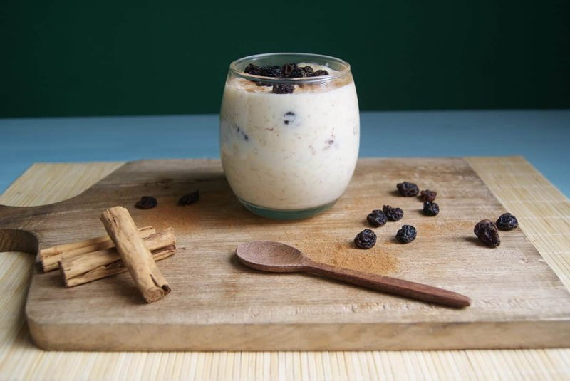

# Arroz Con Leche Colombiano

*Colombia's after-school rice pudding: rice simmered slow in whole milk with cinnamon, lemon zest and sugar till creamy. Topped with raisins.*

**Serves:** 6

**Prep Time:** 5 minutes

**Cook Time:** 50 minutes

## Overview
Short-grain rice rinses, then simmers in water with a cinnamon stick and lemon peel for 15 minutes until just-tender and the water is mostly absorbed. Whole milk pours in along with sweetened condensed milk (the Colombian shortcut) and more sugar. Simmers another 25 minutes, stirring more frequently as it thickens, until the rice is soft and the texture is loose-creamy. Raisins fold in. Cinnamon dusts on top.

## Ingredients
- 200 g short-grain pudding rice (or arborio)
- 600 ml water
- 1 cinnamon stick
- 1 strip lemon peel
- 1 pinch salt
- 1 litre whole milk
- 1 tin (400 g) sweetened condensed milk
- 80 g caster sugar (adjust to taste)
- 80 g raisins
- 1 teaspoon vanilla extract

### To finish
- 1 tablespoon ground cinnamon
- A handful of extra raisins

## Method

### Stage 1 - Par-cook rice
1. Rinse the rice in 2 changes of cold water.
1. In a heavy saucepan, combine the rice, water, cinnamon stick, lemon peel and salt.
1. Bring to a boil; reduce to a simmer; cover loosely.
1. Cook 15 minutes until the water is mostly absorbed and the rice is just-tender.

### Stage 2 - Add milks
1. Pour in the whole milk and condensed milk.
1. Stir; bring back to a gentle simmer.
1. Add the caster sugar.

### Stage 3 - Slow cook
1. Cook on low heat 25-30 minutes, stirring every few minutes (more frequently in the last 10 minutes).
1. The mixture will thicken slowly - the rice swells; the milk reduces; the texture becomes creamy.
1. Aim for loose-creamy, not stiff (it firms up as it cools).

### Stage 4 - Finish
1. Stir in the raisins and vanilla in the last 5 minutes.
1. Remove the cinnamon stick and lemon peel.

### Stage 5 - Serve
1. Spoon into bowls.
1. Dust generously with ground cinnamon.
1. Sprinkle a few extra raisins.
1. Eat warm, or cool fully and refrigerate to serve chilled.

## Notes
- **Short-grain rice is essential:** long-grain stays distinct; you want grains that release some starch and break down slightly to give creaminess.
- **Sweetened condensed milk is the Colombian shortcut:** gives both sweetness and creaminess. Don't try to replicate with just sugar + cream - the texture is different.
- **Stop while loose:** the pudding thickens as it cools. Cooking till stiff in the pan = bricklike rice pudding when cold.
- **Cinnamon at the end, not the start:** the topping cinnamon is what makes it Colombian. Ground cinnamon in the cooking goes muddy.

## Storage
- Keeps 4 days refrigerated.
- Thickens significantly cold; loosen with a splash of milk when reheating.
- Doesn't freeze well.
