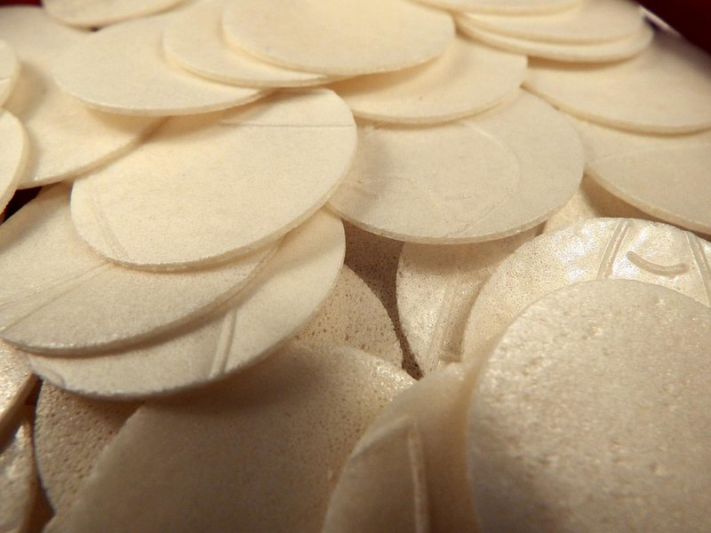

# Obleas

*Colombia's street-cart wafer sandwich: paper-thin wafers slathered with arequipe and crowned with cheese, jam, coconut or chopped peanuts.*

**Serves:** Makes 6 wafer sandwiches

**Prep Time:** 15 minutes (assembly only - wafers are bought, arequipe is pre-made)

**Cook Time:** 0 minutes

## Overview
This isn't a from-scratch wafer recipe (obleas wafers require a specialised iron and are bought ready-made from Colombian / Latin grocers). The dish is the assembly: take one wafer, spread with arequipe, add toppings, top with another wafer. The recipe captures the technique and combinations.

## Ingredients

### Base
- 12 obleas wafers (large, thin, round - from a Colombian / Latin grocer; substitute: large Italian wafer biscuits if obleas are not available)

### Filling
- 300 g arequipe (Colombian dulce de leche / manjar) - see our `manjar-chileno` recipe to make from scratch; or use any commercial dulce de leche

### Topping options (choose 2-3 per sandwich)
- 80 g grated mozzarella (or queso fresco)
- 4 tablespoons strawberry jam (or guava paste, sliced)
- 4 tablespoons shredded sweetened coconut
- 4 tablespoons chopped roasted peanuts
- 4 tablespoons sweetened condensed milk (extra-sweet variant)
- 2 tablespoons rainbow sprinkles
- 80 g lemon curd (modern variant)

## Method

### Stage 1 - Lay out
1. Set out 12 wafers on the work surface in pairs (6 base + 6 lid).

### Stage 2 - Spread arequipe
1. Spread a generous 2 tablespoons of arequipe on each base wafer.
1. Don't go all the way to the edge - leave a 5 mm border so it doesn't squish out everywhere.

### Stage 3 - Customise
1. Per sandwich, scatter 2-3 of the toppings: a little grated cheese here, a spoonful of jam there, a sprinkle of coconut, etc.
1. The Colombian street-cart move: cheese + arequipe is a non-obvious classic; sweet + salty + sticky.

### Stage 4 - Lid and press
1. Place a second wafer on top of each filled base.
1. Press very gently - too firm and the wafers crack.

### Stage 5 - Eat
1. Eat IMMEDIATELY. Obleas wafers absorb moisture from the filling and go from crisp to chewy within 30 minutes.

## Notes
- **Don't make ahead:** obleas wafers go soft and chewy within 20 minutes of assembly. The crisp-meets-sticky contrast is the whole appeal - eat as soon as built.
- **Cheese + arequipe sounds wrong, tastes right:** the salty cheese cuts through the deep caramel of arequipe and gives the iconic Colombian flavour. Try at least once.
- **Improvise with biscuits:** if you can't find proper obleas wafers, two large thin Italian fan wafer biscuits sandwiched together is the closest substitute. Most western supermarkets sell them.

## Storage
- Don't store assembled obleas - the wafers absorb moisture and go chewy.
- Components keep separately: wafers 6 weeks in a sealed tin; arequipe 6 weeks refrigerated.
- Make to order at the table for a party - it's a fun assemble-your-own snack.
