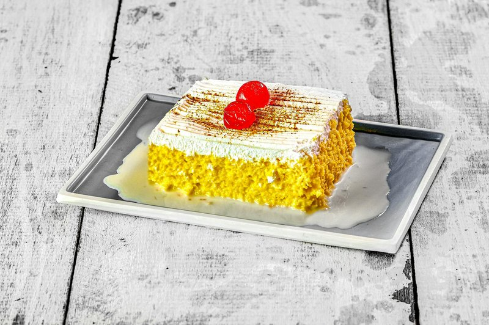

# Tres Leches Colombiano

*Colombia's three-milks cake: a light sponge soaked overnight in evaporated milk, condensed milk and cream, topped with whipped cream.*

**Serves:** 12

**Prep Time:** 30 minutes

**Cook Time:** 30 minutes (plus overnight chilling)

## Overview
A whisked sponge, beaten egg whites for lift, yolks-and-sugar base, flour folded in, bakes in a 30 × 20 cm tin until pale gold. Cooled to room temp. Three milks (evaporated, condensed, whole) whisk together. Cake gets pierced all over with a fork or skewer. Milk slurry pours over slowly so it absorbs evenly. Chills overnight. Whipped cream tops at service; dusting of cinnamon.

## Ingredients

### Sponge
- 6 eggs (large, separated)
- 200 g caster sugar
- 200 g plain flour
- 1 ½ teaspoons baking powder
- ½ teaspoon salt
- 80 ml whole milk
- 1 teaspoon vanilla extract

### Three milks
- 1 tin (400 g) sweetened condensed milk
- 1 tin (400 ml) evaporated milk
- 250 ml whole milk

### Topping
- 400 ml double cream (chilled)
- 50 g icing sugar
- 1 teaspoon vanilla extract
- 1 teaspoon ground cinnamon (for dusting)

## Method

### Stage 1 - Sponge
1. Heat the oven to 175°C (155°C fan).
1. Butter a 30 × 20 cm tin; line with parchment.
1. Whisk the egg whites to stiff peaks; gradually add 100 g of the sugar; continue whisking till glossy.
1. In another bowl, whisk the yolks with the remaining 100 g sugar 3 minutes till pale and thick.
1. Fold the whites into the yolk mixture in 3 additions.
1. Sift the flour, baking powder and salt over; fold gently.
1. Whisk milk and vanilla together; fold in.
1. Pour into the tin; smooth the top.
1. Bake 25-30 minutes until a skewer comes out clean and the top springs back.

### Stage 2 - Cool
1. Cool in the tin on a rack for 30 minutes.
1. The sponge needs to be at room temperature before soaking.

### Stage 3 - Soak
1. Whisk the condensed milk, evaporated milk and whole milk in a jug.
1. Pierce the cooled sponge ALL OVER with a fork or skewer (don't be shy - dozens of holes).
1. Pour the milk slurry slowly and evenly over the cake.
1. Most of the liquid will look like too much - that's correct. The cake will absorb it.
1. Cover; refrigerate overnight (or at least 6 hours).

### Stage 4 - Whipped cream
1. In a chilled bowl, whip the cream with icing sugar and vanilla to soft peaks.

### Stage 5 - Serve
1. Spread or pipe the whipped cream over the entire surface.
1. Dust with cinnamon.
1. Cut into squares; serve cold.

## Notes
- **Overnight soak is non-negotiable:** under-soaked tres leches is dry. The cake needs 6-12 hours to drink the milk through.
- **Pierce thoroughly:** the fork holes are how the milk gets through. Aim for one piercing every 2 cm.
- **Don't pour too fast:** even distribution prevents puddles at one end and dryness at the other.
- **Pure whipped cream, no buttercream:** Colombian tres leches uses simple whipped cream. Stabilised or fancy frostings overpower the milk.

## Storage
- Keeps 3 days refrigerated, covered.
- The milk continues absorbing; day 2 is arguably the peak texture.
- Doesn't freeze well - texture goes spongy-wet.
