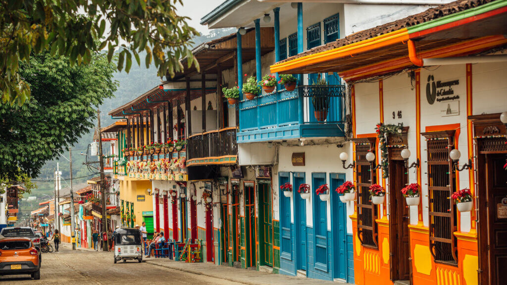

# Colombian Cuisine

Colombian cooking is regional and varied: bandeja paisa from Antioquia, ajiaco from Bogotá, sancocho along the coasts. Maize is foundational - arepas at every meal, mazamorra at breakfast, tamales for celebrations. Plantain (green and ripe), beans, rice, beef and chicken anchor most plates; aji (a coriander-and-chilli table sauce) and arequipe (Colombian dulce de leche) sit at opposite ends of the meal. Hogao (the tomato-onion sofrito) starts nearly every savoury dish.
