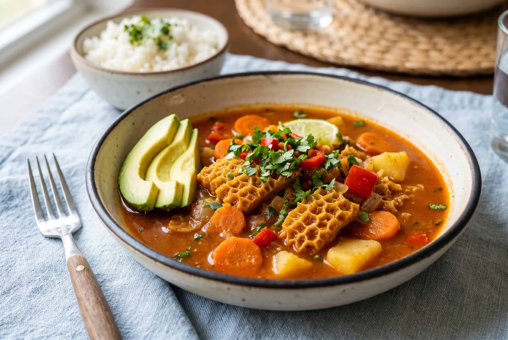

# Mondongo Colombiano

*Colombia's tripe soup: honeycomb tripe slow-cooked with chorizo, beef ribs, hogao, plantain, potato, yuca, corn, carrot and the traditional Colombian "guisado" base till everything is fork-tender and the broth thickens to a deeply savoury orange stew. The Antioqueño hangover-cure classic, served in deep bowls with avocado, banana, rice and arepa on the side.*

**Serves:** 6-8

**Prep Time:** 30 minutes (plus tripe pre-cooking)

**Cook Time:** 3 hours 30 minutes

## Overview
Mondongo is one of Colombia's most beloved soup-stews and the traditional Antioqueño paisa-region tripe specialty. Honeycomb tripe is first thoroughly cleaned, blanched and pre-cooked in flavoured water till tender (the labour-intensive step; skipping it gives a rubbery off-tasting soup), then slow-cooked with chorizo, beef ribs, the traditional Colombian hogao, cubed plantain, potato, cassava, corn on the cob, carrot and a generous handful of fresh coriander till everything is fork-tender and the broth thickens to a deeply savoury orange stew. The dish has a serious reputation across Colombia as Sunday family food and as the traditional hangover cure; paisas swear by it. Served in deep bowls with sliced avocado and sliced banana on top (yes, banana, the Colombian twist), with plain white rice on the side and a fresh arepa for mopping. The banana-avocado finish is what distinguishes Colombian mondongo from a Spanish callos.

## Ingredients

### Tripe pre-cook
- 800 g honeycomb tripe (cleaned at the butcher; check it's properly bleached/cleaned)
- Juice of 2 lemons
- 2 tablespoons fine sea salt
- 1 large onion (quartered)
- 6 garlic cloves
- 1 tablespoon dried oregano
- 1 tablespoon ground cumin
- 2 bay leaves
- 2 litres water

### Meats
- 400 g beef short ribs (or beef shanks)
- 200 g chorizo (sliced)

### Cooking base
- 4 tablespoons olive oil
- 1 large onion (chopped)
- 1 medium green bell pepper (chopped)
- 1 medium red bell pepper (chopped)
- 6 garlic cloves (crushed)
- 6 tablespoons hogao
- 3 tablespoons tomato paste
- 4 medium tomatoes (chopped)
- 1 tablespoon achiote
- 2 tablespoons ground cumin
- 2 tablespoons dried oregano
- 1 ½ teaspoons fine sea salt
- 1 teaspoon ground black pepper

### Vegetables
- 2 medium green plantains (peeled and cubed)
- 3 medium potatoes (peeled and cubed)
- 400 g cassava/yuca (peeled and cubed)
- 3 medium carrots (peeled and sliced into rounds)
- 2 ears corn on the cob (cut into 3 cm rounds)

### Liquid
- 2 litres hot beef stock (or the reserved tripe cooking liquid)

### To finish
- 1 large bunch fresh coriander (chopped)
- 1 small bunch fresh culantro/recao (chopped)
- 6 spring onions (sliced)
- Lime wedges

### To serve
- Plain white rice
- Arepas
- Sliced avocado
- Sliced ripe banana (the traditional Colombian touch)
- Ají picante
- Lime wedges

## Method

### Stage 1 - Clean and pre-cook the tripe
1. Rinse the tripe thoroughly under cold running water for several minutes.
2. Place in a wide bowl with the lemon juice and 1 tablespoon of salt; rub thoroughly; rinse again.
3. Cut into 2-3 cm pieces.
4. Place in a large pot with 2 litres of water, the quartered onion, garlic cloves, oregano, cumin, bay leaves and the remaining 1 tablespoon salt.
5. Bring to a boil; reduce to a simmer.
6. Cook 90 minutes till the tripe is tender (a fork should slide through easily).
7. Drain; reserve the cooking liquid for use in the stew.

### Stage 2 - Build the base
1. Heat the olive oil in a very large heavy pot over medium heat.
2. Brown the beef ribs 4 minutes per side; lift out.
3. Brown the chorizo briefly; lift out.
4. Add the chopped onion and bell peppers; cook 8 minutes till soft.
5. Add the crushed garlic; cook 30 seconds.
6. Add the hogao, tomato paste, chopped tomatoes; cook 5 minutes till thick.
7. Add the achiote, cumin, oregano, salt and pepper; cook 1 minute.

### Stage 3 - Add meats and liquid
1. Return the beef ribs and chorizo to the pot.
2. Add the pre-cooked tripe.
3. Pour in the hot beef stock (or reserved tripe liquid).
4. Bring to a simmer; cover; reduce to low.
5. Cook 60 minutes till the beef ribs are tender.

### Stage 4 - Add vegetables
1. Add the plantain, potato, yuca, carrots and corn.
2. Continue cooking 30-35 minutes till the vegetables are tender and the broth has thickened.

### Stage 5 - Finish
1. Take off the heat.
2. Lift out the bay leaves.
3. Stir in most of the chopped coriander, culantro and spring onions.
4. Taste; adjust salt.

### Stage 6 - Serve
1. Ladle generously into deep bowls; make sure each bowl gets some tripe, some beef, some vegetables and plenty of broth.
2. Scatter the remaining coriander and spring onions.
3. Place a pile of white rice on a side plate.
4. Add sliced avocado and sliced banana to each bowl.
5. Arepa for mopping.
6. Lime wedges and ají picante on the table.

## Notes
- **Clean the tripe properly:** lemon-salt scrub, multiple rinses, then 90-minute pre-cook. Skipping gives off-flavours.
- **Multiple meats are traditional:** tripe + beef ribs + chorizo for proper depth.
- **The banana topping:** the Colombian touch. Sounds odd, works beautifully, sweet creamy banana against the savoury soup.
- **Don't lift the lid much:** the long simmer needs covered conditions.
- **Make a day ahead:** mondongo is famously better the next day. Make ahead and reheat.

## Variations
**Without tripe (vegetarian-friendlier):** swap the tripe for double the beef ribs and 200 g of mushrooms; less traditional but accessible.
**Antioqueño-style with pig's feet:** add 2 pig's feet to the meat in stage 2; gives an even richer broth.
**Spicier:** add 2 chopped fresh chillies to the base; properly paisa.
**Without yuca:** skip the cassava; use extra potatoes; common variation.

## Serving
In deep bowls at the centre of a Sunday family table. White rice, arepa, avocado, banana, lime, ají. Drink: Club Colombia beer, agua de panela (panela water), or aguardiente. As a Sunday lunch or the traditional hangover cure on a Sunday morning.

## Storage
- Keeps refrigerated 5 days; flavour deepens significantly overnight.
- Reheat in a covered pot over low heat with a splash of stock if needed.
- Freezes 3 months.
- Day-after mondongo is famously the best.
