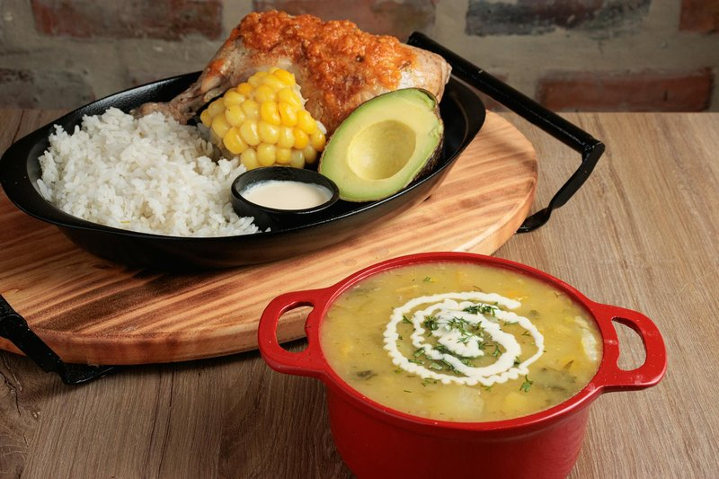

# Sancocho de Gallina

*Colombia's celebration soup: a stewing hen slow-cooked with cassava, plantain, corn, potato and sweet potato in an onion-tomato-ají sofrito broth.*

**Serves:** 6

**Prep Time:** 25 minutes

**Cook Time:** 2 hours 30 minutes

## Overview
Sancocho is the soup-stew Colombians make on Sundays for big gatherings, a wide pot of hen and tubers that simmers slowly enough for everyone to stand around the kitchen talking while it does its work. A whole hen (or chicken thighs and drumsticks if you can't get a stewing bird) goes in first with aromatics and simmers for ninety minutes until the meat is tender enough to fall away. Cassava and plantain join for half an hour, soaking up the broth and softening to creamy chunks. Potato, sweet potato and corn-on-the-cob get the last twenty minutes so they hold their shape. Coriander folds in at the very end. Serve in deep bowls with rice on the side, the broth poured over the rice and the meat eaten alongside; nothing is wasted.

## Ingredients

- 1.4 kg whole stewing chicken (jointed) or 1 kg bone-in chicken thighs and drumsticks
- 2 ½ litres water
- 1 onion (large, halved)
- 1 small bunch fresh coriander (stems for the boil; leaves for the finish)
- 4 garlic cloves (crushed)
- 1 tablespoon ground cumin
- 1 teaspoon dried oregano
- 1 ½ teaspoons salt
- 1 teaspoon ground black pepper
- 2 bay leaves
- 3 onions (medium, 1 added later, chopped)
- 2 fresh tomatoes (grated)
- 1 tablespoon ground annatto (achiote)
- 2 tablespoons vegetable oil
- 800 g yuca (peeled, cut into 5 cm chunks)
- 2 green plantains (large, peeled, cut into 5 cm chunks)
- 4 potatoes (medium, peeled, halved)
- 2 sweet potatoes (medium, peeled, cut into 5 cm chunks)
- 2 corn-on-the-cob (cut into 4 pieces each)
- 1 lime (juice)

### To serve
- 4 servings cooked white rice
- A small bowl of hogao
- Sliced ripe avocado
- Lime wedges

## Method

### Stage 1 - Stock and chicken
1. Place chicken pieces in a wide deep pot with water, halved onion, coriander stems, garlic, cumin, oregano, salt, pepper, bay.
1. Bring to a simmer; skim scum.
1. Cover; cook on low 1 hour to 1 hour 30 minutes until the meat falls off the bone (stewing hen) or is tender (regular chicken).
1. Lift the meat out; strain the broth into a jug.

### Stage 2 - Sofrito and finish broth
1. Wipe the pot; heat the oil.
1. Soften the chopped onion 8 minutes.
1. Add grated tomato and annatto; cook 4 minutes.
1. Pour the strained broth back in.

### Stage 3 - Vegetables
1. Add cassava and plantain; simmer covered 25 minutes.
1. Add potatoes, sweet potato and corn; cook 20 more minutes until everything is tender.

### Stage 4 - Combine
1. Return the chicken to the pot; warm through 5 minutes.
1. Stir in lime juice; taste; adjust salt.
1. Scatter coriander leaves.

### Stage 5 - Serve
1. In wide deep bowls: a portion of rice, then a piece of each vegetable, a piece of chicken, and broth ladled over.
1. Hogao, avocado, lime on the side.

## Notes
- **Stewing hen if you can:** Older birds give a deeper broth and stand up to long simmering. A regular chicken works but cuts the cook to about an hour.
- **Don't pre-dice everything small:** The vegetables are eaten in big chunks - that's the dish.
- **Rice on the side:** Don't cook rice in the broth. Plain rice goes in the bowl with broth poured over.

## Storage
- Refrigerate 4 days. Better the next day.
- Freezes 3 months.
