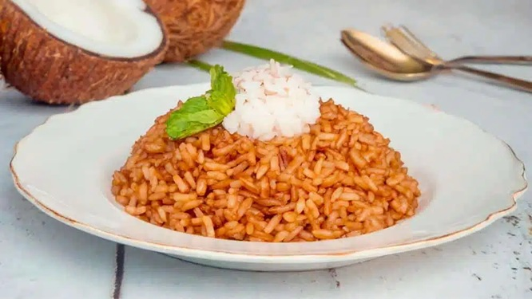

# Arroz Con Coco

*Coconut rice from Colombia's Caribbean coast (Cartagena, Santa Marta): long-grain rice cooked in coconut milk with a small handful of raisins and a final golden crust on the bottom (called "titoté"). Sweet-savoury, glossy, with the raisins plumping in the steam. Eaten alongside fried fish, ropa vieja or shrimp.*

**Serves:** 4

**Prep Time:** 5 minutes

**Cook Time:** 35 minutes

## Overview
Arroz con coco is the Caribbean-coast Colombian rice dish that turns a humble grain into something rich, dark and faintly sweet, the side that pairs naturally with grilled fish or slow-cooked stews on the coast. The technique is the whole point: coconut milk reduces hard in a heavy pot until the cream splits and turns to a dark caramel called titoté, that's the toasted-coconut flavour that defines the dish, and it takes fifteen minutes of patience. Then rice, more coconut milk, water and raisins go in. Cook absorption-style: lid on, the lowest heat, eighteen minutes without lifting the lid. Rest for five more minutes off the heat, then fluff with a fork. The finished rice is the colour of dark gold with raisins folded through.

## Ingredients

- 1 (400 ml) tin coconut milk (full-fat)
- 200 ml coconut milk (or coconut cream)
- 300 g long-grain rice (basmati or jasmine - rinsed)
- 300 ml warm water
- 50 g raisins
- 1 teaspoon caster sugar
- 1 ½ teaspoons salt

## Method

### Stage 1 - Titoté
1. In a heavy pot, pour the 400 ml tin of coconut milk.
1. Bring to a simmer over medium heat.
1. Cook 12-15 minutes, stirring occasionally, until the milk reduces, the cream solids brown and turn a deep caramel colour, and the oil splits to the surface. This is the titoté - don't let it burn black.

### Stage 2 - Rice
1. Add the rinsed rice; toast 1 minute, stirring to coat in the dark coconut oil.
1. Pour in the additional coconut milk and warm water; sprinkle with sugar and salt.
1. Add the raisins.

### Stage 3 - Cook
1. Bring to a boil; stir once; reduce heat to the absolute lowest.
1. Cover tightly; cook 18 minutes undisturbed.

### Stage 4 - Rest
1. Remove from heat (lid on); rest 5 minutes.
1. Fluff gently with a fork - the caramel pieces should be folded through.

### Stage 5 - Serve
1. Tip into a warm bowl. Eat alongside fried fish, grilled shrimp, or any Colombian Caribbean meal.

## Notes
- **Titoté is the dish:** Skipping the caramelisation step makes plain coconut rice. The dark caramel pieces are the signature.
- **Watch the caramel:** Stir often in the final minutes - it goes from gold to black in 30 seconds. The colour you want is deep mahogany.
- **Raisins plump:** They suck up moisture during the cook and end up sweet and juicy. Don't substitute fresh fruit.

## Storage
- Refrigerate 3 days; reheat covered with a splash of water.
- Don't freeze.
