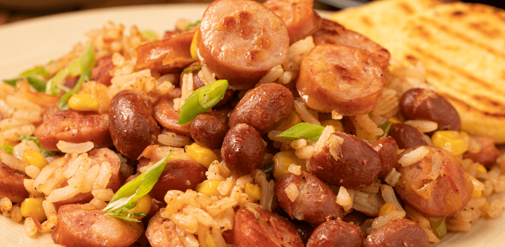

# Calentado Paisa

*Colombia's Antioqueño breakfast hash: a pan-fried mixture of leftover rice and beans crisped in oil with sliced sausage, scallions and hogao, topped with a fried egg and served with arepas. The paisa region's answer to the "what to do with last night's leftovers" question - the canonical Sunday morning hangover cure.*

**Serves:** 4

**Prep Time:** 10 minutes

**Cook Time:** 15 minutes

## Overview
Calentado paisa is the Antioqueño breakfast hash that turns last night's leftover rice and beans into the most beloved Colombian Sunday breakfast: cold leftover white rice and cold leftover frijoles paisas (the canonical Colombian red beans) are pan-fried in oil with sliced chorizo (or sausage), scallions, garlic and a spoonful of hogao till the rice goes crispy at the edges, the beans heat through, and the whole pan reduces to a one-pan hash; finished with a fried egg on top per person and served with an arepa and ají picante. The dish takes 15 minutes once the leftovers are in hand and is one of the canonical Colombian hangover cures (along with mondongo and caldo de costilla). The point is to use leftovers in a way that's actually delicious - the second-day rice crisps beautifully in the pan; the second-day beans deepen in flavour. Three details define proper calentado paisa. First, leftover rice and beans. Made fresh, the dish lacks the proper texture. Day-old refrigerated rice (which has firmed up) and day-old beans (which have thickened) give the proper result. Second, plenty of oil. Don't be timid; the rice needs to crisp at the edges, which requires generous oil. Third, the fried egg on top. Sunny-side up with a runny yolk. The yolk runs into the rice-and-beans when broken.

## Ingredients

### Rice and beans
- 500 g cold cooked white rice (day-old refrigerated; about 250 g uncooked weight)
- 500 g cold cooked frijoles paisas (red beans; or any cooked red kidney beans / pinto beans)

### Cooking
- 4 tablespoons vegetable oil
- 200 g chorizo or sausage (sliced)
- 1 medium onion (finely chopped)
- 6 spring onions (finely sliced)
- 4 garlic cloves (crushed)
- 4 tablespoons hogao
- 1 tablespoon ground cumin
- 1 tablespoon dried oregano
- 1 ½ teaspoons fine sea salt (taste; the beans and chorizo are salty)
- 1 teaspoon ground black pepper
- 1 teaspoon achiote/turmeric

### Eggs
- 4 large eggs
- 1 tablespoon vegetable oil (for frying eggs)

### To finish
- 1 small bunch fresh coriander (chopped)
- Spring onion greens (sliced; for garnish)

### To serve
- Arepas
- Sliced avocado
- Ají picante
- Lime wedges

## Method

### Stage 1 - Brown the sausage
1. Heat 2 tablespoons of the oil in a wide heavy pan over medium-high heat.
2. Add the sliced sausage; cook 3-4 minutes till browned and the fat is rendered.
3. Add the chopped onion and the white parts of the spring onions; cook 4 minutes till soft.
4. Add the crushed garlic; cook 30 seconds.

### Stage 2 - Add the rice
1. Add the remaining 2 tablespoons of oil.
2. Add the cold leftover rice; break up any clumps with a wooden spoon.
3. Press the rice down into the pan; cook 3-4 minutes without stirring so the bottom crisps.
4. Stir; press down again; cook another 3 minutes.

### Stage 3 - Add the beans and seasonings
1. Add the cold leftover beans.
2. Add the hogao, cumin, oregano, salt, pepper and achiote.
3. Toss gently to combine everything.
4. Cook 3-4 minutes till the beans are heated through and the whole pan is fragrant.

### Stage 4 - Fry the eggs
1. In a separate pan, heat the 1 tablespoon oil over medium heat.
2. Crack 4 eggs into the pan; fry sunny-side up for 3-4 minutes till the whites are set but the yolks are still soft-runny.

### Stage 5 - Plate
1. Divide the calentado into 4 deep plates.
2. Place a fried egg over each portion (yolk side up).
3. Scatter chopped coriander and spring onion greens over.

### Stage 6 - Serve
1. Arepa alongside.
2. Avocado slices.
3. Ají picante and lime on the table.

## Notes
- **Leftover rice and beans:** essential. Day-old is the proper texture.
- **Generous oil for crisping:** don't skimp.
- **Press the rice down:** lets the bottom crisp.
- **Fried egg on top:** the canonical Colombian touch.
- **Hogao for proper flavour:** don't skip.

## Variations
**Carne calentado (with leftover beef):** add 200 g of chopped leftover beef (sobrebarriga or steak) along with the rice; gives a more substantial hash.
**Vegetarian:** skip the sausage; use vegetable hogao; double the beans.
**With cheese:** crumble 100 g of queso fresco on top before serving; melts slightly.
**With patacones:** crush a few patacones and toss through; gives extra crunch.

## Serving
On wide plates with the egg on top, arepa, avocado, ají on the side. Drink: tinto (Colombian black coffee), café con leche, or hot chocolate. Sunday breakfast or hangover cure.

## Storage
- Best eaten immediately.
- The base (no egg) refrigerated 2 days; reheat in a pan with fresh egg on top.
- Don't freeze.
