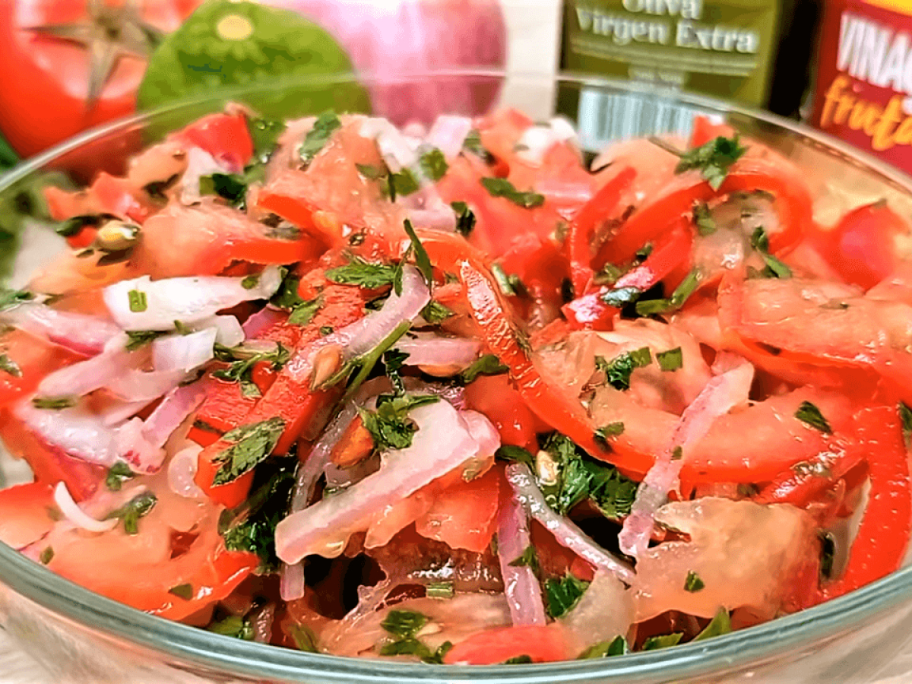

# Ensalada de Tomate y Cebolla

*Colombia's simple tomato-onion salad: thinly sliced tomato and onion with chopped fresh coriander, dressed with olive oil, lime juice and salt. The Colombian table standard that turns up beside every main course, deliberately simple, made in 5 minutes.*

**Serves:** 4

**Prep Time:** 10 minutes

**Cook Time:** 0 minutes

## Overview
Colombia's simplest and most pervasive table salad: thinly sliced ripe tomato, thinly sliced raw onion (red or white), chopped fresh coriander, dressed with olive oil, lime juice, salt and black pepper. That's the entire dish. No lettuce, no avocado, no embellishment beyond the traditional four ingredients. The salad anchors the Colombian plate the way kachumber anchors the Indian one or pico de gallo anchors the Mexican: a small bowl of fresh sharpness alongside whatever rich heavy main has come out of the kitchen (sancocho, posta negra, lechona, bandeja paisa). The dish lives or dies by tomato quality; greenhouse winter tomatoes give bland results, and the salad needs peak-season ripe tomatoes to taste like anything. Some Colombian cooks soak the raw onion in cold water for 10 minutes to mellow the sharpness; others leave it raw and assertive. Both are correct.

## Ingredients

- 4 large ripe tomatoes (sliced into rounds, or wedges)
- 1 medium red onion (or white onion; thinly sliced)
- 1 small bunch fresh coriander (chopped)
- 4 tablespoons extra virgin olive oil
- Juice of 2 limes
- 1 teaspoon fine sea salt
- ½ teaspoon ground black pepper
- 1 teaspoon dried oregano (optional)

## Method

### Stage 1 - Soak the onion (optional)
1. If using assertive raw onion, soak the sliced onion in cold water 10 minutes; drain.
2. Skip if you like raw onion sharpness.

### Stage 2 - Arrange
1. Layer the sliced tomatoes on a serving platter or in a wide bowl.
2. Scatter the sliced onion over.
3. Scatter the chopped coriander.

### Stage 3 - Dress
1. Whisk together the olive oil, lime juice, salt, pepper and oregano.
2. Drizzle over the salad just before serving.

### Stage 4 - Serve immediately
1. Serve at room temperature.

## Notes
- **Ripe tomatoes only:** the salad depends on tomato quality.
- **Dress just before serving:** salt and lime leach moisture.
- **No leaves:** the traditional Colombian ensalada has no lettuce.
- **Adjust onion soaking to taste:** sharp or mild.

## Variations
- **With avocado:** add 1 sliced ripe avocado on top.
- **With cucumber:** add thinly sliced cucumber.
- **With queso fresco:** crumble 80 g of fresh white cheese over the top.
- **Spicier:** add 1 sliced fresh chilli.

## Serving
- Alongside any Colombian main. With sancocho, bandeja paisa, lechona, posta negra. Drink: water, agua de panela, or fresh limonada.

## Storage
- Best eaten immediately; goes soggy quickly.
- Components separately for 2 days; assemble fresh.
- Don't refrigerate dressed.
