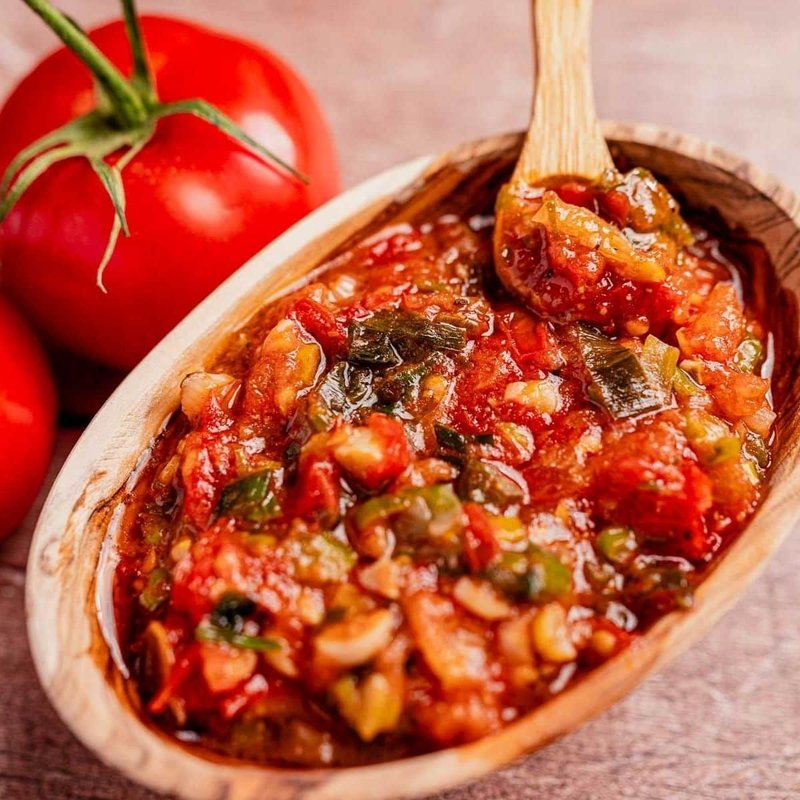

# Hogao

*Colombia's national table sauce / sofrito: tomato, spring onion (cebolla larga), onion, garlic, ground cumin and annatto stewed down slow into a deep red-orange paste-sauce. Spooned over grilled meats, fried plantains, arepas and rice. Appears in almost every savoury Colombian dish, on the table at every meal.*

**Serves:** 8 (small jar)

**Prep Time:** 10 minutes

**Cook Time:** 25 minutes

## Overview
Long spring onion (cebolla larga) and white onion are softened in oil; garlic, cumin and annatto come in; grated tomato cooks down 15 minutes until thick and sticky. Seasoned and rested. The texture is somewhere between a sauce and a paste, spoonable but coating.

## Ingredients

- 4 tablespoons vegetable oil
- 6 spring onions (white and green parts, finely chopped - cebolla larga substitute)
- 1 onion (large, very finely chopped)
- 4 garlic cloves (crushed)
- 1 teaspoon ground cumin
- 1 teaspoon ground annatto (or smoked paprika)
- 6 ripe tomatoes (grated, skins discarded)
- 1 tablespoon tomato puree
- 1 teaspoon salt (to taste)
- ½ teaspoon ground black pepper

## Method

### Stage 1 - Soften aromatics
1. Heat the oil in a wide heavy pan over medium heat.
1. Add the chopped spring onion and onion.
1. Cook 12-15 minutes, stirring often, until very soft and pale gold. Don't rush - long slow cooking is the dish.

### Stage 2 - Spices
1. Add garlic, cumin, annatto; cook 1 minute.

### Stage 3 - Tomato
1. Add the grated tomato and tomato puree.
1. Cook 12-15 minutes on medium-low, stirring occasionally, until thickened to a sauce-paste that coats a spoon and the oil splits to the surface.

### Stage 4 - Season
1. Stir in salt and pepper; cook 1 minute more.
1. Taste; adjust.

### Stage 5 - Cool
1. Tip into a clean jar; cool.
1. Cover with the oil that has risen to the surface for preservation.

### Stage 6 - Use
1. Spoon over grilled meats, rice, beans, plantain, arepas, eggs - anything savoury.
1. Also use as a base for stews and rice dishes.

## Notes
- **Cebolla larga:** Long Colombian green onion, somewhere between leek and spring onion. UK spring onions are the closest substitute.
- **Tomato consistency:** The hogao is finished when the oil pools on the surface and the sauce holds a spoon-mark. Wet hogao isn't hogao.
- **Make ahead:** Like sofrito everywhere, hogao improves overnight. Make a jar and use through the week.

## Storage
- Refrigerate 1 week in a sealed jar with a layer of oil on top.
- Freezes 3 months in small portions.
