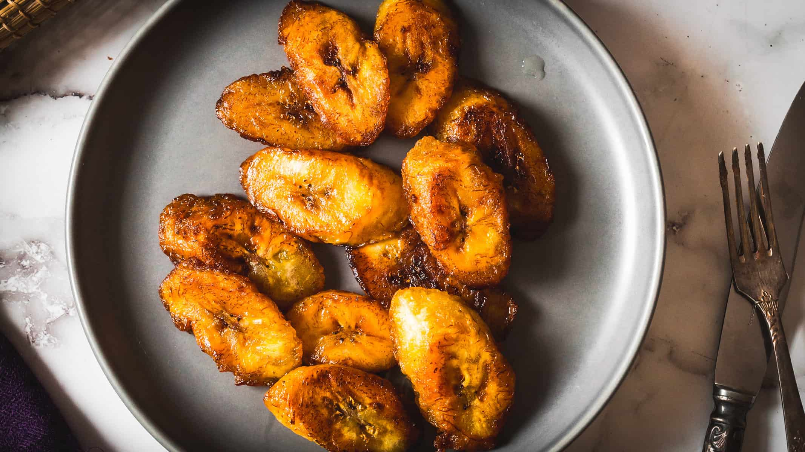

# Maduros Colombianos

*Colombia's sweet fried plantains: ripe black-spotted plantains sliced lengthwise into long strips, pan-fried in oil till the cut surfaces caramelise to deep mahogany and the inside turns soft, sweet and creamy. The Colombian sweet side that turns up on every "bandeja paisa" platter and alongside every traditional Andean meal.*

**Serves:** 4

**Prep Time:** 10 minutes

**Cook Time:** 10 minutes

## Overview
Maduros (also called plátanos maduros) is Colombia's sweet fried plantain side and a fundamental component of the bandeja paisa platter. Ripe plantains (very yellow with black spots) peel, slice lengthwise into long flat strips, then pan-fry in oil at moderate heat till the cut surfaces caramelise to deep mahogany-brown and the inside turns soft, sweet and almost creamy. They're the sweet counterpoint to the savoury meats, rice and beans on the plate. Closely related to but distinct from Caribbean maduros, which slice on the bias into rounds; the Colombian style of lengthwise slicing gives longer caramelised strips that fit naturally on a bandeja. Properly ripe plantains matter: the more black on the skin, the sweeter the result. Under-ripe gives bland starchy maduros. Moderate heat matters too, because plantains are sugary and high heat burns the sugars before the inside softens.

## Ingredients

- 3 large ripe plantains (yellow-with-significant-black-spotting; about 600 g total)
- 4 tablespoons vegetable oil (or coconut oil)
- A small pinch of fine sea salt
- A small pinch of ground cinnamon (optional)

## Method

### Stage 1 - Peel and slice
1. Cut off both ends of each plantain.
2. Make a shallow cut along the length of the skin.
3. Peel back the skin.
4. Slice each plantain lengthwise into 4-5 long flat strips, each about 1 cm thick.

### Stage 2 - Heat the pan
1. Heat the vegetable oil in a wide heavy frying pan over medium heat till shimmering.

### Stage 3 - Pan-fry
1. Add the plantain strips to the pan in a single layer (work in batches if needed).
2. Cook 3-4 minutes on the first side without moving so the cut surface caramelises to deep mahogany.
3. Flip with a thin spatula; cook 3-4 minutes on the second side.
4. The plantains should be properly soft when pressed; the cut surfaces deeply browned.

### Stage 4 - Drain and finish
1. Lift onto a warm plate lined with kitchen paper.
2. Sprinkle with a tiny pinch of salt.
3. Add a dust of cinnamon if using.

### Stage 5 - Serve
1. Arrange on a serving platter or as part of the bandeja paisa platter.
2. Serve warm immediately.

## Notes
- **Ripeness is everything:** properly ripe (yellow-black) plantains give the best caramelisation.
- **Lengthwise slicing for Colombian style:** distinguishes from Caribbean rounds.
- **Moderate heat:** medium-low to medium; sugary plantains burn at high heat.
- **Don't overcrowd:** in batches for proper caramelisation.

## Variations
- **Honey-glazed maduros:** drizzle with honey just before serving.
- **Cinnamon-sugar maduros:** dust with cinnamon-sugar after cooking; gives a more dessert-like result.
- **Caramelised with butter:** swap oil for butter in the last 30 seconds of cooking; gives a richer browned-butter finish.

## Serving
- On a bandeja paisa platter alongside the carne asada, beans, rice, egg and arepa. As a side at any Colombian meal. Children love them.

## Storage
- Best eaten warm.
- Refrigerated 2 days; reheat in a hot pan or under a grill briefly.
- Don't microwave or freeze; texture suffers.
