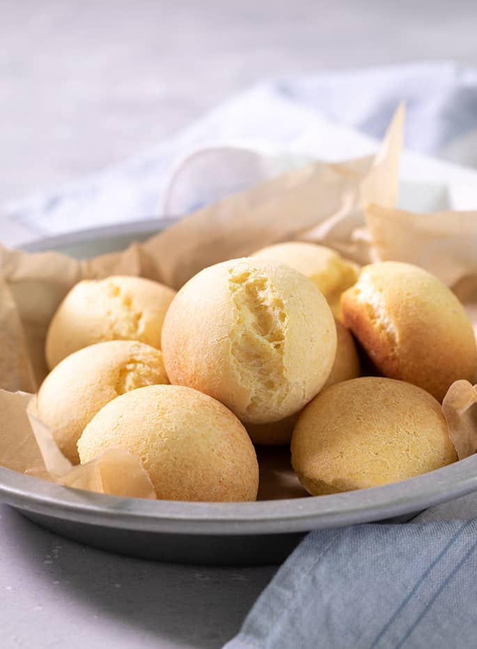

# Pan de Bono

*Colombia's breakfast bread: small dense rings of yuca flour and fresh cheese, crusty outside and intensely chewy within. Eaten with hot chocolate.*

**Serves:** 4 (makes 12 small rings)

**Prep Time:** 20 minutes (plus 30 minutes resting)

**Cook Time:** 18 minutes

## Overview
Yuca flour (sour cassava flour, almidón agrio), masarepa (white-corn flour), salt and sugar mix; cheese grates fine; the egg and a small amount of milk bind. The dough is dense, slightly sticky. Shape into small rings (or balls); rest for 15-30 minutes; bake at 220°C until deep gold and puffed.

## Ingredients

- 300 g yuca (cassava) flour
- 100 g masarepa (white pre-cooked corn flour, P.A.N. or similar)
- 250 g feta (or fresh white cheese - queso costeño, ricotta salata, or salted ricotta)
- 100 g mature cheddar cheese (finely grated, optional - adds richness)
- 1 egg (large)
- 1 tablespoon caster sugar
- ½ teaspoon salt (taste - depends on the cheese saltiness)
- 80 ml whole milk (more as needed)

## Method

### Stage 1 - Dry mix
1. Whisk yuca flour, masarepa, sugar and salt in a wide bowl.

### Stage 2 - Cheese
1. Crumble the feta very fine (or pulse in a processor).
1. Add the feta and cheddar to the flour; rub with fingers until evenly distributed.

### Stage 3 - Wet
1. Beat the egg with 60 ml of milk in a small bowl.
1. Add to the bowl; mix to a soft dough.
1. Add more milk by the tablespoon as needed - the dough should be soft, slightly tacky, but hold a shape.

### Stage 4 - Rest
1. Cover; rest 15 minutes.

### Stage 5 - Shape
1. Divide into 12 portions (about 60 g each).
1. Roll each into a 14 cm rope; pinch the ends together to form a small ring (or just shape into a ball).
1. Place on a lined baking tray, spaced 3 cm apart.

### Stage 6 - Bake
1. Heat oven to 220°C (200°C fan).
1. Bake 14-18 minutes until deep gold and slightly cracked.

### Stage 7 - Serve
1. Eat warm. Best within an hour of baking.

## Notes
- **Yuca flour types:** Sour cassava flour (almidón agrio) is fermented and gives the classic puff and chew. Sweet cassava flour (almidón dulce) is the everyday alternative; texture is slightly less stretchy.
- **Cheese saltiness:** Feta is salty; queso costeño is saltier still. Taste before adding the optional ½ teaspoon of salt.
- **Eat warm:** Pan de bono goes hard within a couple of hours. Best within 60 minutes of leaving the oven.

## Storage
- Best fresh. Refresh briefly in a 200°C oven 3 minutes.
- Freeze unbaked shaped rings up to 2 months; bake from frozen adding 4 minutes.
