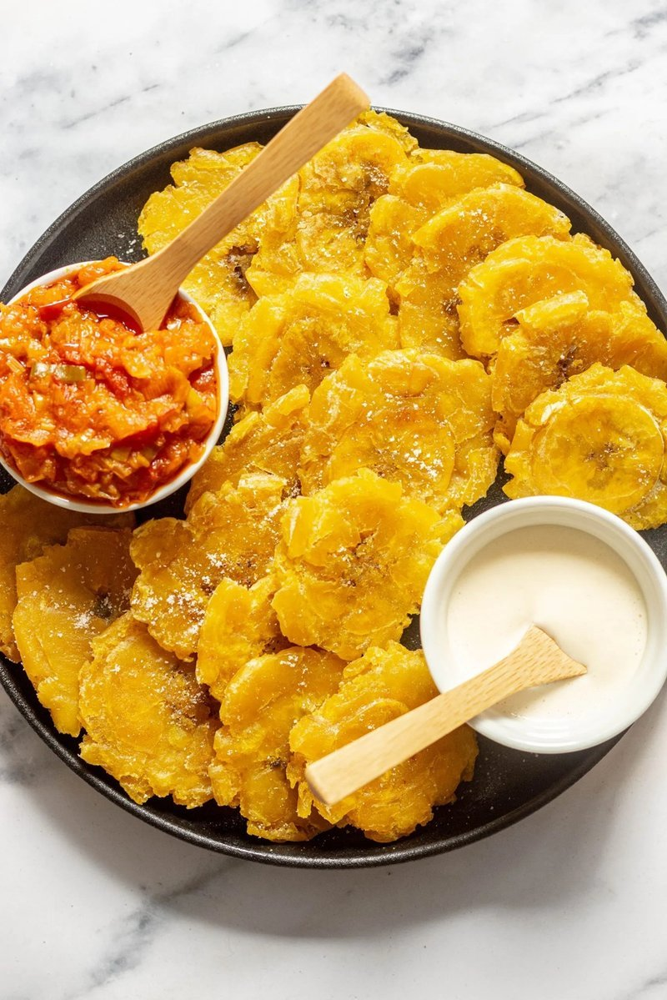

# Patacones

*Twice-fried green plantain rounds - sliced thick, fried, smashed flat, fried again, salted hard. Crisp outside, starchy-soft inside, served as a side, a vehicle for shrimp ceviche, or topped with hogao. Different to ripe-plantain tajadas (sweet); patacones are savoury, crunchy, salty.*

**Serves:** 4 as a side

**Prep Time:** 8 minutes

**Cook Time:** 15 minutes

## Overview
Patacones are the twice-fried green plantain rounds that turn up on plates across the Caribbean coast of Colombia, salty, crisp, and quietly addictive. Green (unripe) plantains peel and slice into thick 3 cm rounds. The first fry is at 160°C for five minutes a side, just to soften the inside and turn the outside pale gold. You lift each round out and smash it flat with the back of a flat measuring cup or a wooden tostonera until it's about a centimetre thick. The second fry is at 180°C for three minutes a side, deep gold and audibly crisp. Salt while still hot from the oil. Eat as a side, or as a snack with hogao and a beer.

## Ingredients

- 3 green plantains (totally unripe, dark green or yellowish-green skin)
- 800 ml vegetable oil for frying
- 1 teaspoon salt

## Method

### Stage 1 - Peel
1. Cut off the top and tail of each plantain.
1. Score the skin lengthways in three places; peel off each strip with the help of a paring knife.

### Stage 2 - First fry
1. Slice each plantain into 3 cm thick rounds.
1. Heat the oil to 160°C in a wide deep pan.
1. Fry plantain rounds in batches, 4-5 minutes per side, until pale gold and softening inside (you can pierce easily with a fork).
1. Lift onto a tray.

### Stage 3 - Smash
1. While still warm, smash each round flat to about 8 mm thick.
1. Tools: the back of a measuring cup, a small cutting board pressed down with palm, or a tostonera (the dedicated tool).

### Stage 4 - Second fry
1. Raise the oil to 180°C.
1. Briefly dip each smashed patacón in lightly salted water (helps the surface crisp).
1. Fry in batches, 2-3 minutes per side, until deep gold and crisp.
1. Drain on kitchen paper.

### Stage 5 - Salt
1. Sprinkle generously with salt while hot.

### Stage 6 - Serve
1. Eat immediately with hogao, suero (Colombian sour cream), or top with shrimp ceviche.

## Notes
- **Truly green plantains:** Skin should be solidly green. Yellow / spotted plantains turn sweet and won't crisp.
- **Smash thin enough:** 8 mm is right. Thicker stays starchy; thinner breaks apart.
- **Salt-water dip:** Optional but improves the crunch. Don't soak - a 1-second dip.

## Storage
- Eat immediately. Cooked patacones go soft within an hour.
- Re-crisp at 200°C 4 minutes if needed.
