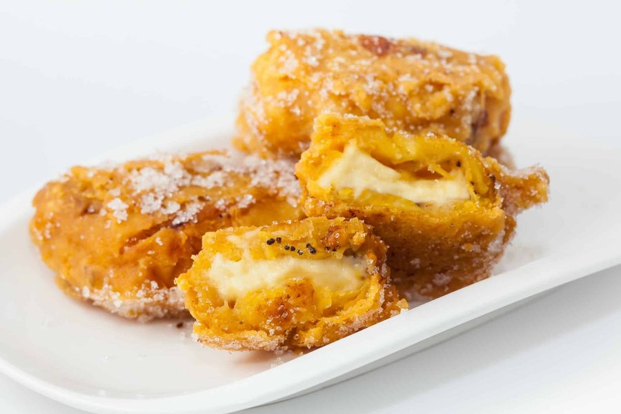

# Aborrajados

*Ripe sweet plantain stuffed with melting cheese, then dipped in a sweet batter and deep-fried until the outside crackles. The Valle del Cauca (south-western Colombia) snack par excellence - sweet, savoury, gooey, all in one bite. Eats hot, the cheese pulling in long strings when you tear it open.*

**Serves:** 4 (makes 8 aborrajados)

**Prep Time:** 25 minutes

**Cook Time:** 15 minutes

## Overview
Very ripe (almost black-skinned) plantains peel and slice in half lengthways, then in half crossways, four pieces per plantain. Each piece pan-fries briefly in oil to soften, then mashes between two pieces of parchment with a flat saucepan to flatten to a disc. A cube of cheese sits between two flattened discs, sandwiching the cheese. The whole package dips in a sweet batter of flour, egg, sugar and milk, then deep-fries golden.

## Ingredients

### Plantain
- 4 very ripe plantains (black-spotted skin - almost black)
- 4 tablespoons neutral oil (for the first fry)

### Filling
- 200 g mozzarella (or queso fresco, cut into 8 cubes about 2 × 2 × 1 ½ cm)

### Batter
- 100 g plain flour
- 2 eggs (large)
- 100 ml whole milk
- 2 tablespoons caster sugar
- ½ teaspoon salt
- 1 teaspoon vanilla extract
- ½ teaspoon baking powder

### Frying
- 600 ml neutral oil

## Method

### Stage 1 - Soften plantain
1. Peel the plantains; halve lengthways, then halve crossways (16 pieces total).
1. Heat 4 tablespoons oil in a wide pan over medium heat.
1. Fry the plantain pieces 2 minutes per side till tender and lightly browned.
1. Lift onto paper.

### Stage 2 - Flatten and stuff
1. Place a piece of plantain between two sheets of parchment.
1. Press flat with the bottom of a heavy saucepan to a disc about 5 mm thick.
1. Place a cube of cheese on one flattened plantain.
1. Top with another flattened plantain to sandwich the cheese.
1. Press the edges gently to seal.
1. Repeat for 8 sandwiches total.

### Stage 3 - Batter
1. Whisk flour, sugar, salt and baking powder in a wide bowl.
1. Whisk in eggs, milk and vanilla until smooth.
1. The batter should be like thick double cream.

### Stage 4 - Fry
1. Heat the oil to 175°C.
1. Dip each plantain sandwich into the batter to coat.
1. Lower into the oil 2-3 at a time.
1. Fry 3 minutes per side till deep amber-gold and crisp.
1. Lift onto a wire rack.

### Stage 5 - Serve
1. Eat immediately, hot - the cheese needs to be molten.

## Notes
- **Very ripe plantain or fail:** under-ripe plantains are starchy and bland. Black-skinned plantains have the deep banana sweetness aborrajados need.
- **Seal the edges:** loose-edged sandwiches leak cheese into the oil. Press the edges firmly when stacking.
- **Sweet batter is correct:** Colombian aborrajados use a faintly sweet batter (the sugar amount is small but noticeable). It contrasts with the savoury cheese inside.

## Storage
- Best within 10 minutes of frying.
- Reheats poorly - the cheese turns rubbery on reheat. Fry to order.
- Prepared (unfried) sandwiches keep 1 day refrigerated; batter and fry from cold.
