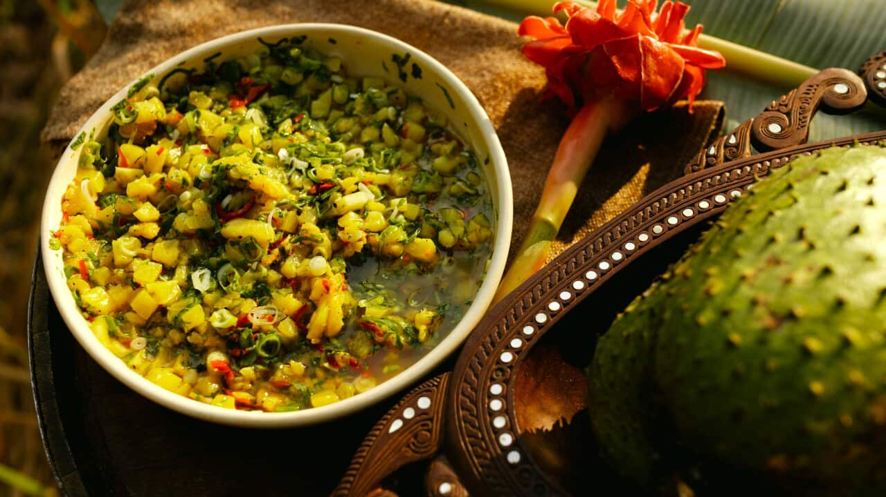

# Ají de Piña

*Colombia's pineapple-chilli relish: fresh ripe pineapple finely diced and combined with chopped onion, scallions, coriander, fresh chilli, lime and a pinch of salt into a sweet-spicy-tangy table condiment. The Caribbean-coast variation of ají picante, particularly good with grilled fish and roast pork.*

**Serves:** Makes about 400 ml

**Prep Time:** 15 minutes

**Cook Time:** 0 minutes

## Overview
Ají de piña is the fruity Caribbean-coast variation of Colombia's foundational ají picante hot sauce: finely diced fresh ripe pineapple combined with finely chopped white onion, scallions, fresh coriander, fresh hot chillies, lime juice, a small splash of vinegar, and salt and pepper, mixed together and rested briefly for the flavours to marry. The result is a sweet-spicy-tangy chunky relish that's particularly good as a condiment for grilled fish, roasted pork (lechona), grilled chicken, or empanadas. The dish is especially popular along the Colombian Caribbean coast (Cartagena, Barranquilla, San Andrés) where pineapple is plentiful and a sweet-fruity element is welcomed in the heat. Three details define proper ají de piña. First, fresh ripe pineapple. The salsa lives and dies by pineapple quality. Use the ripest yellow-fleshed pineapple you can find; under-ripe gives starchy bland results. Second, fine dice. The pineapple, onion and chilli should all be cut to similar small pieces. Third, eat fresh. The pineapple breaks down within a day in the fridge; best within 2-3 days of making.

## Ingredients

- 400 g fresh ripe pineapple (peeled, cored, finely diced into 5 mm pieces)
- 1 small white onion (finely chopped)
- 6 spring onions (whites and greens, finely sliced)
- 1 large bunch fresh coriander (chopped)
- 2-4 fresh hot chillies (ají amarillo or serrano or jalapeño; finely chopped)
- 1 small red bell pepper (deseeded, finely chopped; optional; for sweetness)
- 4 tablespoons fresh lime juice
- 2 tablespoons white vinegar
- 2 tablespoons olive oil
- 1 teaspoon fine sea salt
- ½ teaspoon ground black pepper
- 1 teaspoon ground cumin
- 1 teaspoon dried oregano

### Optional additions
- 2 tablespoons fresh culantro/recao
- 1 tablespoon honey or panela (gives extra sweetness)

## Method

### Stage 1 - Prep the pineapple
1. Cut the top and bottom off the pineapple.
2. Stand it upright; cut down the sides to remove the skin.
3. Cut out the woody core.
4. Dice into 5 mm pieces.

### Stage 2 - Prep the other ingredients
1. Finely chop the onion, spring onions, coriander, chillies and red pepper.

### Stage 3 - Combine
1. In a wide bowl, combine all chopped ingredients.
2. Add the lime juice, vinegar, olive oil, salt, pepper, cumin and oregano.
3. Mix thoroughly.

### Stage 4 - Rest
1. Cover and refrigerate at least 30 minutes; the flavours marry and the pineapple releases more juice.

### Stage 5 - Serve
1. Stir before serving (the juice settles at the bottom).
2. Transfer to a serving bowl with a spoon.

## Notes
- **Ripe pineapple is essential:** dish depends on quality.
- **Fine dice for proper texture:** all ingredients to similar small size.
- **Eat within 2-3 days:** pineapple breaks down quickly.
- **Adjust chilli to taste:** moderate to fierce.
- **Cumin gives Colombian character:** don't skip.

## Variations
**With mango:** swap half the pineapple for fresh mango; gives a more tropical fruity version.
**With papaya:** add 100 g of finely diced papaya; common Cartagena variation.
**With cucumber:** add 1 finely diced cucumber; gives crunch and freshness.
**Spicier:** add 1 chopped habanero; properly Caribbean fierce.

## Serving
With grilled fish, roast pork (lechona), grilled chicken, empanadas, arepas. Particularly good on the Colombian Caribbean coast with seafood. Drink: cold Club Colombia beer or fresh agua de coco.

## Storage
- Keeps refrigerated 3 days; pineapple breaks down after that.
- Don't freeze.
- Make fresh in small batches.
