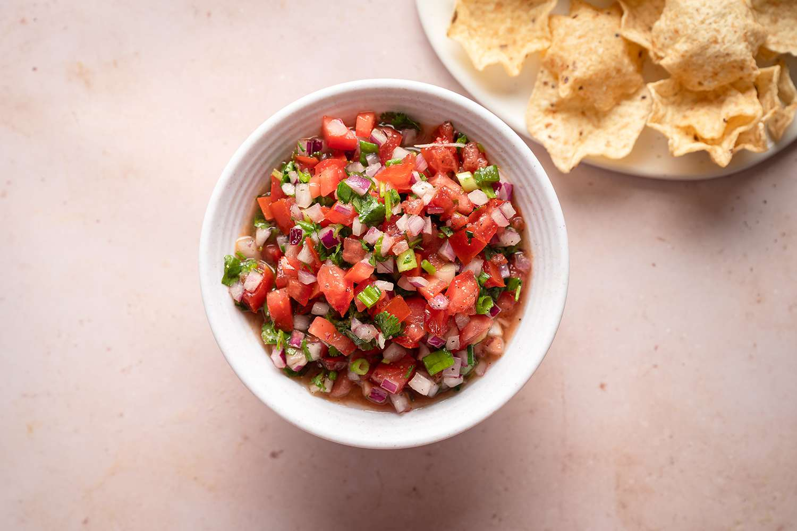

# Ají Picante Colombiano

*Colombia's foundational hot sauce: finely chopped tomato, onion, scallion, coriander, fresh chillies, lime juice and vinegar combined into a fresh chunky table-condiment. The traditional Colombian condiment that turns up alongside every meal - the salsa criolla equivalent across the country.*

**Serves:** Makes about 400 ml

**Prep Time:** 15 minutes

**Cook Time:** 0 minutes

## Overview
Ají picante (or simply "ají") is Colombia's most pervasive table condiment and the foundational Colombian hot sauce: a fresh chunky relish-like condiment made from finely chopped tomato, white onion, scallions, fresh coriander, fresh hot chillies (typically ají amarillo or any small green/red hot chilli), lime juice, white vinegar and salt, mixed together and rested briefly for the flavours to marry. The dish appears at every Colombian table - alongside arepas at breakfast, with empanadas as a dipping sauce, drizzled over bandeja paisa, sopped up with patacones, ladled into sancocho. Unlike commercial bottled hot sauces, ají picante is meant to be made fresh and eaten within a few days; the freshness is the point. The chunkiness is intentional; finely chopped by knife, not blended. Both lime and vinegar go in: lime for brightness, vinegar for keeping power and a different tang. Fresh hot chillies (Colombian ají amarillo if you can; serrano or jalapeño substitute).

## Ingredients

- 2 medium ripe tomatoes (very finely diced; about 200 g)
- 1 small white onion (very finely chopped)
- 8 spring onions (whites and greens, finely sliced)
- 1 large bunch fresh coriander (about 40 g; finely chopped, stems and leaves)
- 1 small bunch fresh culantro/recao (optional; finely chopped)
- 4-6 fresh hot chillies (ají amarillo if available; or serrano, jalapeño, or bird's eye; finely chopped; deseed for milder)
- 1 small green pepper (deseeded; finely chopped; gives sweetness)
- 4 tablespoons fresh lime juice (from 2-3 limes)
- 3 tablespoons white vinegar
- 2 tablespoons olive oil (optional)
- 1 ½ teaspoons fine sea salt
- ½ teaspoon ground black pepper
- 1 teaspoon ground cumin
- ½ teaspoon dried oregano

## Method

### Stage 1 - Chop the ingredients
1. Very finely dice the tomatoes (small 3-4 mm pieces).
2. Very finely chop the onion.
3. Finely slice the spring onions.
4. Finely chop the coriander and culantro (if using).
5. Finely chop the chillies (with seeds for fiery; without for milder).
6. Very finely chop the green pepper.

### Stage 2 - Combine
1. In a wide bowl, combine the tomato, onion, spring onions, coriander, culantro, chillies and green pepper.

### Stage 3 - Add seasoning
1. Add the lime juice, vinegar, olive oil (if using), salt, pepper, cumin and oregano.
2. Mix thoroughly.

### Stage 4 - Rest
1. Cover and rest at room temperature 30 minutes (or refrigerate 1 hour).
2. The flavours marry and the vegetables soften slightly.

### Stage 5 - Serve
1. Transfer to a small serving bowl or jar.
2. Place on the table with a spoon for diners to drizzle/dollop onto their food.

## Notes
- **Finely chopped, not blended:** the proper texture is chunky.
- **Lime + vinegar:** both essential.
- **Adjust chilli to taste:** the traditional version is moderately hot; reduce for milder, increase for fierce.
- **Eat fresh:** best within a week.
- **Cumin gives the Colombian profile:** distinguishes from Mexican salsa.

## Variations
**Aji con aguacate (with avocado):** add 1 finely diced ripe avocado in the last 5 minutes; gives a creamier version.
**Aji de mango:** add 1 ripe mango (finely diced); gives a fruity tropical version.
**Aji con pimienta de cayena:** add 1 teaspoon of cayenne pepper to the seasoning; properly fierce.
**Smoky aji:** add 1 chopped smoked chipotle in adobo; gives a smoky depth.

## Serving
With everything Colombian: arepas, empanadas, bandeja paisa, patacones, sancocho, sudado de pollo. Always at the table as a help-yourself condiment.

## Storage
- Keeps refrigerated 1 week in a sealed jar; flavour deepens for 2 days then starts to lose freshness.
- Don't freeze; the vegetables suffer.
- Make fresh in small batches.
