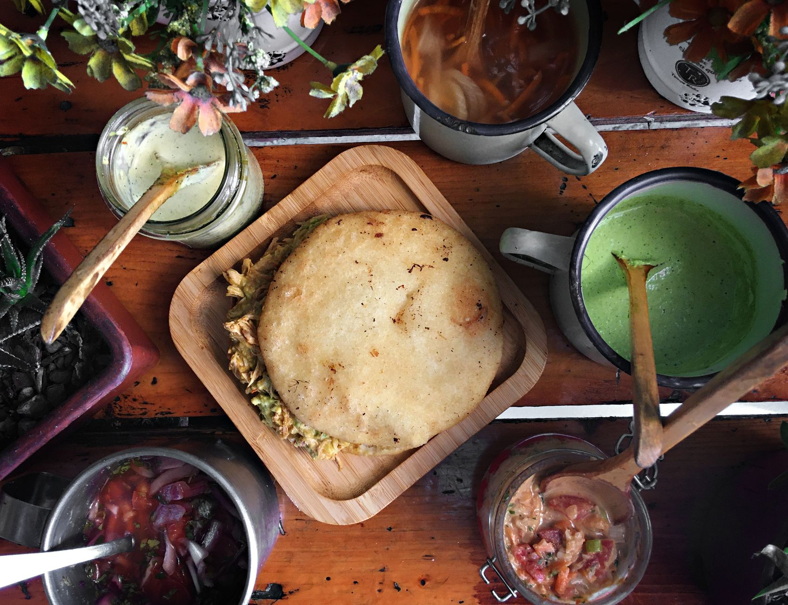

# Arepa de Huevo

*Colombia's Cartagena-Costa stuffed arepa: a pre-fried corn-flour arepa is opened with a small slit and a raw egg cracked inside, then deep-fried again till the egg sets and the arepa puffs golden. The Caribbean-coast street-food classic, eaten standing up at beach kiosks with aji picante and a cold beer.*

**Serves:** 4 (4 arepas de huevo)

**Prep Time:** 20 minutes

**Cook Time:** 15 minutes

## Overview
Arepa de huevo is one of Colombia's most iconic street snacks and a signature specialty of the Caribbean coast (Cartagena, Barranquilla, Santa Marta): a thin corn-flour arepa (made from masarepa pre-cooked corn flour, the Colombian equivalent of masa harina) is first pre-fried briefly to puff it slightly and create an air pocket inside, then opened with a small slit on one edge, a raw egg is cracked into the air pocket, the slit is pinched closed, and the arepa is fried again till the egg sets and the arepa is deeply golden. The result: a golden arepa with a soft cooked egg inside, eaten while hot - bite through the crispy exterior and find the soft yolk surrounded by the corn-flour shell. Served from beachside kiosks across the Colombian Caribbean coast as a street-food breakfast or mid-morning snack, with ají picante for dipping. Three details define proper arepa de huevo. First, the masarepa (pre-cooked corn flour for arepas, sold as "masarepa" or "Areparina" or "P.A.N." brand) is essential. Don't confuse with Mexican masa harina (made for tortillas, different processing). Second, the two-step fry. First fry to puff; cool slightly; cut, fill with egg, seal, second fry. Third, the egg must be cracked while the arepa is still warm-soft enough to seal. Once it cools, the dough firms up and can't be re-sealed.

## Ingredients

### Arepa dough
- 300 g masarepa (pre-cooked corn flour; "Masarepa" or "P.A.N." brand)
- 1 teaspoon fine sea salt
- 400 ml warm water

### Eggs
- 4 large eggs (1 per arepa)

### Frying
- Vegetable oil for deep-frying (about 1 litre; or enough for 5 cm depth)

### To serve
- Ají picante
- Suero costeño (Colombian Caribbean sour cream; or Mexican crema; or sour cream as substitute)
- Lime wedges
- Sliced avocado

## Method

### Stage 1 - Make the arepa dough
1. In a wide bowl, whisk together the masarepa and salt.
2. Gradually add the warm water, stirring with a spoon, then your hands once it comes together.
3. Knead the dough briefly (1-2 minutes); it should be soft and smooth, not sticky.
4. If too dry, add 1 tablespoon water at a time; if too sticky, add 1 tablespoon masarepa.
5. Let rest 5 minutes (the corn flour absorbs the water).

### Stage 2 - Shape the arepas
1. Divide the dough into 4 equal pieces (about 175 g each).
2. Working between two pieces of parchment (or in your wet hands), flatten each ball into a thin round about 15 cm across and 5 mm thick.
3. Smooth any cracked edges.

### Stage 3 - Heat the oil
1. Pour vegetable oil into a deep heavy pot to a depth of 5 cm.
2. Heat to 175°C (350°F).

### Stage 4 - First fry (to puff)
1. Slide one arepa into the hot oil.
2. Fry 1 minute; it should rise to the surface and begin to puff slightly.
3. Spoon hot oil over the top to help it puff fully.
4. Once it's puffed (about 90 seconds in), lift out with a slotted spoon onto kitchen paper.
5. Repeat with the other 3 arepas.

### Stage 5 - Open and fill with egg
1. Quickly (while still warm - about 30 seconds after lifting out), use a small sharp knife to cut a 3 cm slit along one edge of each puffed arepa.
2. Carefully open the slit with the knife to widen the air pocket.
3. Crack one egg into a small cup; gently pour into the slit.
4. Tilt the arepa to let the egg slip inside.
5. Pinch the slit closed firmly (the dough should still be soft enough to seal).
6. Move quickly; if the arepa cools, it won't seal.

### Stage 6 - Second fry
1. Lower the egg-filled arepa back into the hot oil (still at 175°C).
2. Fry 2-3 minutes, turning gently, till the egg has set inside (you'll feel it firm up if you press gently) and the arepa is deeply golden all over.
3. Lift out; drain on kitchen paper.
4. Repeat with the remaining arepas, working one at a time.

### Stage 7 - Serve immediately
1. Serve hot; the egg inside should be just cooked through (whites set, yolk soft).
2. Provide ají picante, suero costeño, lime and avocado for dipping/topping.
3. Eat with hands; bite through to find the egg inside.

## Notes
- **Masarepa, not masa harina:** the pre-cooked corn flour for arepas is different from Mexican tortilla flour.
- **Two-step fry is essential:** the first fry creates the air pocket; the second cooks the egg.
- **Work quickly with the egg:** the arepa must still be warm/soft to seal.
- **Don't cut the slit too big:** smaller is easier to seal.
- **Eat immediately:** the egg inside continues to cook from residual heat; serve while just cooked.

## Variations
**With cheese (arepa de huevo y queso):** add a tablespoon of crumbled queso costeño into the slit along with the egg.
**With ham:** add a small piece of thinly sliced ham along with the egg.
**Without egg (just stuffed arepa):** skip the egg; fill with a tablespoon of cheese or picadillo before sealing and second-frying.
**Spicy arepa de huevo:** add a slice of fresh chilli to the slit alongside the egg.

## Serving
Hot from the fryer with ají picante, suero costeño, lime and avocado. At beach kiosks, breakfast carts, or as a snack any time. Drink: agua de panela con limón (panela water with lime), cold Club Colombia beer, or fresh jugo de mango.

## Storage
- Best eaten immediately; the egg cooks from residual heat.
- Don't refrigerate or freeze; the texture suffers completely.
- Pre-shaped arepa dough keeps refrigerated 24 hours; fry fresh each time.
