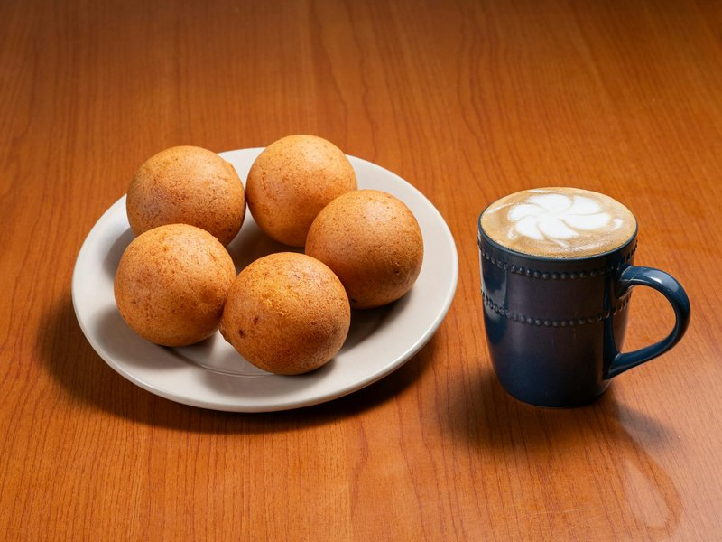

# Buñuelos Colombianos

*Colombia's Christmas snack: cheese-and-cornstarch dough balls deep-fried into golden orbs with a slightly crisp shell and a chewy cheesy interior.*

**Serves:** Makes about 20 buñuelos

**Prep Time:** 15 minutes

**Cook Time:** 15 minutes

## Overview
Queso costeño (or feta-style salty cheese) mixes with cornstarch flour (almidón), an egg, a pinch of sugar, and just enough water to form a smooth firm dough. Rolls into walnut-sized balls. Drops into oil at a lower-than-usual temperature (160°C) so the inside cooks through before the outside burns. Fries 5-6 minutes turning constantly until amber-gold and puffed.

## Ingredients
- 250 g queso costeño (or substitute: 200 g feta + 50 g mature cheddar, both finely crumbled / grated)
- 250 g cornstarch flour (almidón de yuca / tapioca starch / mandioca flour)
- 50 g cornmeal (fine)
- 1 large egg
- 1 ½ tablespoons caster sugar
- 1 teaspoon baking powder
- ½ teaspoon salt (less if your cheese is very salty)
- 4-5 tablespoons water (as needed)
- 1 litre neutral oil (for frying)

## Method

### Stage 1 - Dough
1. In a wide bowl, mix the cheese, cornstarch flour, cornmeal, sugar, baking powder and salt.
1. Add the egg; mix.
1. Add water 1 tablespoon at a time, kneading, until the dough comes together as a smooth firm ball (not sticky, not crumbly).
1. Rest 10 minutes.

### Stage 2 - Shape
1. Divide the dough into 20 walnut-sized portions (~25 g each).
1. Roll each between palms into a smooth ball.

### Stage 3 - Fry
1. Heat the oil to **160°C** (lower than typical fry temperature - buñuelos need the inside to cook through before the outside burns).
1. Drop 5-6 balls in at a time.
1. Turn constantly with a slotted spoon to ensure even colouring.
1. Cook 5-7 minutes per batch - they should puff slightly, develop tiny cracks (a sign the inside is steaming through), and turn deep amber-gold.
1. Lift onto a wire rack.

### Stage 4 - Serve
1. Eat hot, traditionally with natillas (Colombian Christmas custard) or just on their own.

## Notes
- **Cornstarch flour (almidón), not corn flour:** Colombian buñuelos use almidón de yuca (tapioca starch - sometimes labelled mandioca flour). Plain corn flour (maizena) gives a softer, less crisp result. Latin / Caribbean groceries stock it.
- **LOWER oil temperature than other frying:** 160°C is correct. Hot oil burns the surface before the interior cooks.
- **Tiny cracks signal doneness:** as the balls fry, small fissures appear on the surface - that's the steam escaping. Without those, the inside is still doughy.
- **Cheese matters:** queso costeño is salty and firm. Feta + mature cheddar is the closest substitute outside Colombia.

## Storage
- Best within 30 minutes of frying.
- Day-old buñuelos lose their crisp; refresh briefly in a 200°C oven 4 minutes.
- Don't refrigerate - they go rubbery.
