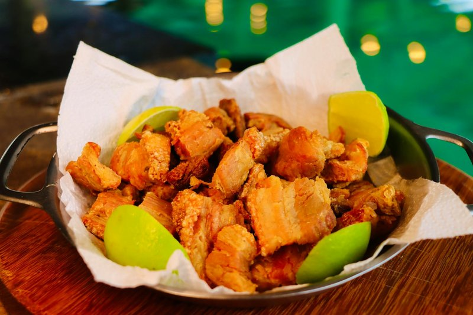

# Chicharrón Colombiano

*Colombia's pork crackling: thick strips of pork belly with skin on, simmered tender then fried in their own fat till the skin puffs and crackles.*

**Serves:** 4 as a snack

**Prep Time:** 10 minutes

**Cook Time:** 1 hour 15 minutes

## Overview
Pork belly cuts into thick strips (5 cm wide × 3 cm thick) with skin on. Simmers in water seasoned with cumin, salt, garlic and a bay leaf for 45 minutes, this tenderises the meat and renders some fat. Lifts out; pats dry. The same pan (with rendered fat) heats hot; strips return skin-side-down; fry for 15-20 minutes until the skin blisters and puffs into the crackling crust. Drains briefly. Eats hot.

## Ingredients
- 1 kg pork belly with skin (cut into strips 5 cm wide × 3 cm thick)
- 1 tablespoon salt
- 2 teaspoons ground cumin
- 4 garlic cloves (smashed)
- 2 bay leaves
- 1.5 litres water (or just enough to cover)

### To serve
- Lime wedges
- Sliced avocado
- Hot arepas
- Hogao (Colombian tomato-onion sauce, optional)

## Method

### Stage 1 - Simmer
1. Lay the pork belly strips in a wide heavy pan, skin-side-up.
1. Add the salt, cumin, garlic and bay leaves.
1. Pour water to just cover.
1. Bring to a simmer; cook 45 minutes, partly covered, until the meat is tender.

### Stage 2 - Reduce
1. After 45 minutes, uncover; turn the heat up.
1. Boil 15 minutes more - the water mostly evaporates and the pork starts to fry in its own rendered fat at the bottom of the pan.

### Stage 3 - Fry the skin
1. As the liquid disappears, the strips start to sizzle.
1. Turn the strips skin-side-down.
1. Cook 15-20 minutes more on medium heat, occasionally pressing the skin against the pan with a spatula to ensure even contact.
1. The skin will gradually puff, blister and turn a deep amber-gold with raised crackled ridges.

### Stage 4 - Test
1. The chicharrón is done when the skin is shatter-crisp (tap it with a knife - should clack) and the meat is tender.

### Stage 5 - Drain and serve
1. Lift the strips onto kitchen paper or a wire rack.
1. Eat immediately, hot.
1. Serve with lime wedges, sliced avocado, hot arepas, and optionally hogao for spooning over.

## Notes
- **Skin-on belly is non-negotiable:** the puffy crackling skin is the entire point. Skinless pork belly gives chicharrón that's just fatty pork.
- **Two-stage cook - simmer then fry:** simmering tenderises the meat through; frying crisps the skin. Skip the simmer and the meat is tough; skip the fry and the skin is rubbery.
- **Press the skin during frying:** uneven contact gives uneven crackling. A heavy spatula or a small saucepan lid pressed on top guarantees full surface contact.
- **The rendered fat is a bonus:** strain the leftover fat into a jar - it's amazing for frying eggs, potatoes, or the next batch of chicharrón.

## Storage
- Best within 30 minutes of finishing.
- Reheats poorly - the crackling goes chewy. Better to render fresh.
- Keep raw cut pork belly 2 days refrigerated; cook to order.
