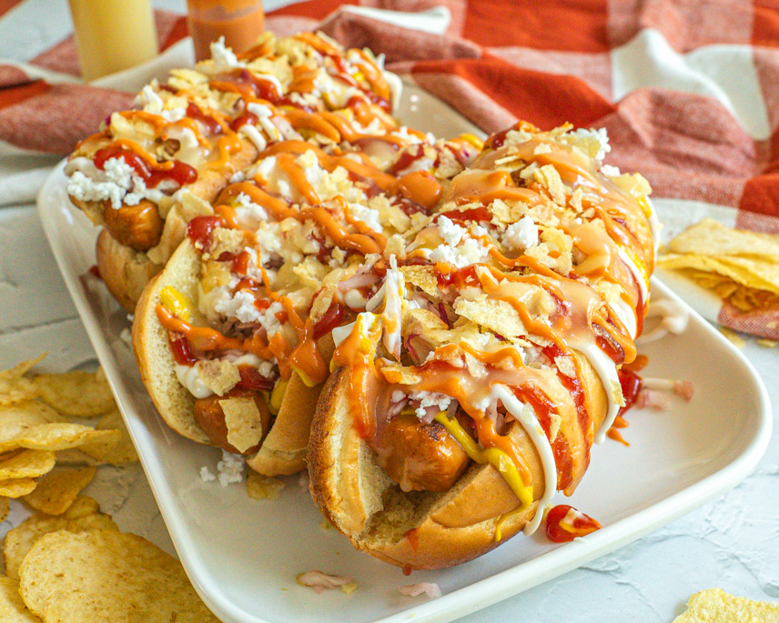

# Perro Caliente Colombiano

*Colombia's loaded hot dog: a hot dog in a soft bun absolutely smothered with chopped pineapple, crushed potato chips, pink cocktail sauce, mustard, ketchup, melted cheese, crispy onions, and a drizzle of garlic mayo. The Bogotá street-cart classic; the most extravagantly topped hot dog in the world.*

**Serves:** 4

**Prep Time:** 25 minutes

**Cook Time:** 15 minutes

## Overview
The Colombian perro caliente ("hot dog") is the maximalist answer to the American hot dog and a staple of Colombian street-cart vendors in Bogotá, Medellín and Cali: a standard frankfurter (canonically pork-and-beef; Bavaria sausage brand is the local favourite) in a soft white bun, then absolutely buried under a tower of toppings that pile higher than the hot dog itself: chopped fresh pineapple (the sweet-sharp counterpart that distinguishes Colombian hot dogs from any other), crushed potato chips or "papas amarillas" for crunch, a drizzle of pink cocktail sauce (mayo + ketchup), a separate drizzle of yellow mustard, a drizzle of garlic mayo, a sprinkle of grated mozzarella, crispy fried shallots, chopped pickles and finally fresh chopped coriander on top. The result: every bite has crunchy + soft + sweet + tangy + salty + creamy in one mouthful, the kind of impossible-to-eat-neatly street food that Colombian late-night-out tradition demands. Three details: chopped pineapple is essential (not optional), crushed chips on top (not just on the side), at least three different sauces (the more the better).

## Ingredients

### Hot dogs
- 8 quality pork-and-beef frankfurters
- 8 soft hot-dog buns
- 1 tablespoon vegetable oil
- 2 tablespoons butter (for toasting buns)

### Toppings
- 200 g fresh pineapple (very finely chopped)
- 100 g potato chips (the salted kettle-cut variety; crushed coarsely)
- 100 g grated mozzarella (or grated mild cheese)
- 100 g crispy fried shallots or onions (shop-bought)
- 4 dill pickles (finely chopped; or sweet gherkins)
- 1 small red onion (very finely chopped)
- 1 small bunch fresh coriander (chopped)
- Fresh chopped chilli (optional, for heat)

### Sauces
- 8 tablespoons mayonnaise (for garlic mayo + pink sauce)
- 4 tablespoons ketchup
- 4 tablespoons yellow mustard
- 4 garlic cloves (crushed; for garlic mayo)
- Juice of ½ lemon (for garlic mayo)
- 1 teaspoon Tabasco (optional)

### To serve
- Crispy fries on the side
- Cold Colombian beer (Aguila or Club Colombia) or chicha (purple corn drink)

## Method

### Stage 1 - Mix sauces
1. **Pink cocktail sauce:** whisk 4 tbsp mayo + 4 tbsp ketchup. Set aside.
2. **Garlic mayo:** whisk 4 tbsp mayo + crushed garlic + lemon juice + a pinch of salt. Set aside.
3. **Mustard:** straight from the bottle; have a squeezy bottle ready.

### Stage 2 - Prep toppings
1. Finely chop the pineapple (cubes about 5mm).
2. Crush the chips coarsely in their bag (not too fine; you want recognizable shards).
3. Grate the cheese.
4. Chop the pickles, red onion, fresh coriander.

### Stage 3 - Cook hot dogs
1. Bring a wide pan of water to a gentle simmer.
2. Add the hot dogs; warm through 6 minutes (don't boil hard; they split).
3. Or grill over medium heat 5 minutes turning, for slight char marks.

### Stage 4 - Toast buns
1. Spread the butter on the bun cut sides.
2. Toast cut-side-down in a wide pan 60 seconds till golden.

### Stage 5 - Build the perro (sequence matters)
1. Open the toasted bun.
2. Drizzle a stripe of mustard down the inside.
3. Place the hot dog in the bun.
4. Drizzle pink cocktail sauce over the hot dog.
5. Drizzle garlic mayo over.
6. Drizzle more mustard (yes, twice).
7. Sprinkle a heap of chopped pineapple over.
8. Sprinkle a heap of crushed chips over.
9. A scatter of grated cheese (the warmth of the hot dog softens it).
10. A scatter of crispy onions.
11. Chopped pickles and red onion.
12. Fresh coriander on top.
13. The toppings should now tower over the bun; that's the look.

### Stage 6 - Serve
1. Eat immediately while everything is layered and crispy.
2. With a plate of fries.
3. Cold beer.

## Notes
- **Chopped pineapple essential:** the distinguishing Colombian ingredient. Without it, you have a generic loaded hot dog.
- **Crushed chips, not whole:** the texture is part of the experience.
- **At least three sauces:** mustard + pink + garlic mayo is the canonical minimum.
- **Eat fast:** the chips lose crunch quickly once they soak up sauce.
- **Mess is part of the experience:** trying to eat tidily is a fool's errand.

## Variations
**With quail eggs:** add 2 small fried quail eggs on top (the Bogotá-bus-station deluxe version).
**With papas amarillas:** the crushed potato strings sold in Colombian shops; even crunchier than chips.
**With pineapple-papaya:** add chopped papaya for tropical lean.
**With ranchera dressing (a Colombian creamy-spicy):** instead of garlic mayo.
**With chorizo:** swap the frankfurter for grilled Colombian chorizo for the perro-chorizo variant.
**With bacon-wrapped hot dog:** wrap each dog in 2 strips of bacon and grill before assembling.

## Serving
At a street cart in Bogotá at midnight. At a backyard BBQ. At a casual lunch with fries and beer.

## Storage
- Best immediately; assembled hot dogs go soggy within minutes.
- Sauces keep refrigerated 1 week.
- Cooked hot dogs refrigerate 3 days.
- Chips: keep in sealed bag; don't refrigerate.
