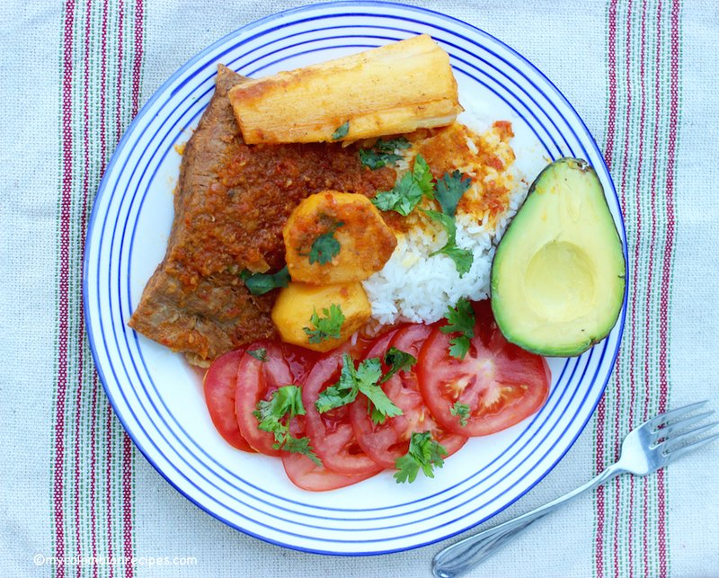

# Sobrebarriga

*Slow-cooked beef flank Bogotá-style: a whole flank steak simmered hours in stock with onion, garlic, tomato and beer, then finished under the grill until the surface crusts dark. Sliced against the grain, served over a deep tomato-onion gravy with white rice or papa salada (salt-cooked potatoes) on the side.*

**Serves:** 4

**Prep Time:** 15 minutes

**Cook Time:** 2 hours 30 minutes

## Overview
Sobrebarriga is the Colombian Sunday cut, a thick whole flank slow-braised until tender and then grilled hard so the outside takes on a dark caramelised crust. Whole flank (or skirt, if flank is hard to find) simmers in stock with aromatics for two hours until the fibres pull apart easily under a fork but the cut still holds shape. Lift it out, let it cool slightly. The cooking liquid reduces with sofrito (onion, tomato, garlic) and a splash of beer into a thick mahogany gravy. The cooled meat lifts onto a grill tray, gets brushed with the gravy, and goes under high heat for five to seven minutes until the brushed surface caramelises dark and crackly. Slice across the grain into thick pieces; ladle the rest of the gravy over the top.

## Ingredients

- 1200 g beef flank (or skirt, whole piece)
- 2 ½ litres water
- 1 onion (large, halved)
- 6 garlic cloves (smashed)
- 1 teaspoon dried oregano
- 1 teaspoon ground cumin
- 1 ½ teaspoons salt
- 2 bay leaves

### Sofrito and finishing gravy
- 3 tablespoons vegetable oil
- 2 onions (medium, chopped)
- 4 garlic cloves (crushed)
- 4 fresh tomatoes (grated) or 1 (400 g) tin chopped tomatoes
- 1 tablespoon tomato puree
- 1 teaspoon ground annatto (or smoked paprika)
- 1 teaspoon ground cumin
- 200 ml lager beer
- 1 teaspoon salt (to taste)

### To serve
- White rice
- Papa salada (small whole potatoes boiled in heavily salted water until the salt crystallises on the skin, optional)
- Sliced ripe avocado
- Chopped fresh parsley

## Method

### Stage 1 - Boil the flank
1. Place flank in a wide deep pot with water, halved onion, garlic, oregano, cumin, salt, bay.
1. Bring to a simmer; skim.
1. Cover; simmer 1 hour 45 minutes to 2 hours until tender to a fork but still intact.
1. Lift the flank out onto a tray; reserve 600 ml of the cooking liquid.

### Stage 2 - Gravy
1. In a wide pan, heat the oil.
1. Soften the chopped onion 10 minutes until deep gold.
1. Add the 4 crushed garlic cloves; cook 30 seconds.
1. Stir in annatto and cumin; toast 30 seconds.
1. Add tomato and tomato puree; cook 6 minutes to a thick sauce.
1. Pour in the beer; simmer 4 minutes to cook off the alcohol.
1. Add 500 ml of reserved cooking liquid; simmer 8-10 minutes until reduced to a sauce that coats a spoon.
1. Season; keep warm.

### Stage 3 - Grill
1. Heat the grill to its highest setting.
1. Place the cooked flank on a foil-lined tray.
1. Brush generously with the gravy.
1. Grill 5-7 minutes until the surface is crackling dark and crisp.

### Stage 4 - Slice
1. Rest 5 minutes.
1. Slice across the grain into 1 cm strips.

### Stage 5 - Serve
1. Pile sliced flank on a warm platter; ladle the rest of the gravy over.
1. Scatter parsley.
1. Serve with rice, papa salada and avocado.

## Notes
- **Don't overcook the boil:** 2 hours max, pushing further gives shredded meat that won't slice cleanly. Target: tender enough to push with a fork but holds shape.
- **Annatto colour:** Gives the gravy its deep red-orange. Smoked paprika is the everyday substitute.
- **Beer adds depth:** Don't substitute red wine; the lager is the Bogotá signature.

## Storage
- Refrigerate 3 days; reheat sliced flank in the gravy on low.
- Freezes 2 months.
