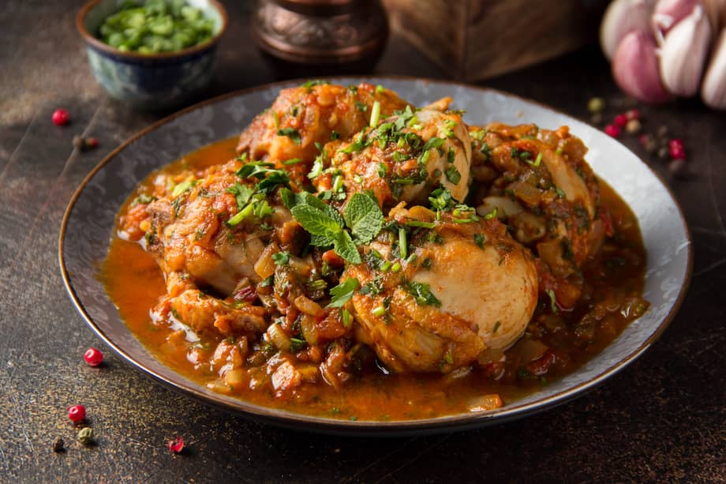

# Sudado de Pollo

*Colombia's stewed chicken: bone-in chicken pieces slow-cooked with onion, garlic, tomato, hogao (the Colombian onion-tomato sauce), potato, cassava and carrot till the meat falls from the bone and the broth reduces into a thick savoury orange stew. The Colombian everyday family dinner, ladled over white rice with maduros and aji on the side.*

**Serves:** 4-6

**Prep Time:** 25 minutes

**Cook Time:** 1 hour 15 minutes

## Overview
Sudado de pollo means "sweated chicken", slow-cooked in its own juices. Colombia's everyday stewed chicken and one of the most beloved staples of Bogotá-paisa home cooking. Bone-in chicken pieces (typically thighs and drumsticks) brown briefly in oil, then cook covered low and slow with onion, garlic, tomato, hogao, cumin and oregano. The chicken releases its juices and braises itself; midway through, cubed potatoes, cassava and carrots join, soaking up the broth and giving the pot body. Less liquid than a typical stew is what distinguishes the technique from Spanish or Caribbean braises; sweat, don't simmer, and add stock only if the pot looks dry. Hogao is essential; without it you have generic chicken stew. Seventy-five minutes from a cold pot to dinner. Served over plain white rice with sweet plantains (maduros), avocado, ají picante and lime wedges on the side. The weeknight dinner Colombian families lean on.

## Ingredients

### Chicken
- 1200 g bone-in chicken pieces (thighs and drumsticks)
- 1 tablespoon ground cumin
- 1 tablespoon dried oregano
- 1 tablespoon paprika
- 1 ½ teaspoons fine sea salt
- 1 teaspoon ground black pepper
- Juice of 1 lime

### Cooking base
- 3 tablespoons olive oil
- 1 large onion (chopped)
- 1 medium green bell pepper (chopped)
- 6 garlic cloves (crushed)
- 4 medium tomatoes (chopped); or 1 tin (400 g) chopped tomatoes
- 4 tablespoons hogao (Colombian onion-tomato sauce; or use 2 extra tomatoes + 1 extra onion if hogao unavailable)
- 2 tablespoons tomato paste
- 1 tablespoon achiote/turmeric

### Vegetables (added partway through)
- 3 medium potatoes (peeled and cubed; traditional Colombian variety is criolla potato, but any potato works)
- 300 g cassava/yuca (peeled and cubed)
- 2 medium carrots (peeled and sliced into rounds)
- 1 small bunch fresh coriander (chopped; reserve some for garnish)
- 1 small bunch fresh culantro/recao (or extra coriander)

### Liquid
- 400 ml hot chicken stock (or water)
- 2 bay leaves
- 1 teaspoon ground cumin (additional)
- 1 ½ teaspoons fine sea salt
- 1 teaspoon ground black pepper

### To finish
- 1 small bunch fresh coriander (chopped)
- Spring onions (finely sliced)
- Lime wedges

### To serve
- Plain white rice
- Sweet plantains (maduros)
- Avocado slices
- Ají picante
- Lime wedges
- Arepas

## Method

### Stage 1 - Season the chicken
1. Pat dry; sprinkle with cumin, oregano, paprika, salt, pepper and lime juice.
2. Rub thoroughly.

### Stage 2 - Brown the chicken
1. Heat the olive oil in a heavy pot over medium-high heat.
2. Brown the chicken pieces 4 minutes per side till golden.
3. Lift out.

### Stage 3 - Build the base
1. Reduce heat to medium.
2. Add the chopped onion and bell pepper; cook 6 minutes till soft.
3. Add the crushed garlic; cook 30 seconds.
4. Add the chopped tomatoes; cook 4-5 minutes till they break down.
5. Add the hogao and tomato paste; cook 3 minutes till deepened.
6. Add the achiote/turmeric.

### Stage 4 - Return chicken and start sweat
1. Return the chicken to the pot.
2. Add the chicken stock, bay leaves, additional cumin, salt and pepper.
3. Bring to a simmer.
4. Cover with the lid; reduce to lowest heat.
5. Cook 30 minutes; the chicken should release its juices.

### Stage 5 - Add the vegetables
1. Add the cubed potatoes, cassava and carrots.
2. Add the chopped culantro/coriander.
3. If the pot looks dry, add a splash of stock; otherwise no additional liquid needed.
4. Cover; cook 25-30 more minutes till the chicken and vegetables are tender.

### Stage 6 - Finish
1. Take off the heat.
2. Lift out the bay leaves.
3. Stir in most of the fresh coriander; reserve some for garnish.
4. Taste; adjust salt.

### Stage 7 - Serve
1. Spoon hot white rice into deep bowls.
2. Ladle generous portions of sudado de pollo over.
3. Scatter the reserved coriander and spring onions.
4. Sliced avocado, lime wedges, ají picante on the side.
5. Maduros and arepas alongside.

## Notes
- **Hogao for proper Colombian flavour:** without it, generic chicken stew.
- **Sweat low and slow:** less liquid than a typical stew. The chicken juices do most of the cooking.
- **Yuca + potato + carrot:** the three roots are traditional.
- **Bone-in chicken for flavour:** bones release flavour into the broth.
- **Don't lift the lid much:** the steam needs to do the cooking.

## Variations
- **With ñame (Colombian yam):** add 200 g of ñame instead of yuca; common variation.
- **Spicier:** add 1 chopped fresh chilli to the base.
- **With sliced sausage:** add 100 g of sliced chorizo to the base for a richer version.
- **Chicken-and-beef sudado:** combine chicken with 300 g of beef chuck; cook 90 minutes total.

## Serving
- Over white rice with maduros, avocado, arepas. Drink: Club Colombia beer, agua de panela (panela water), or fresh limonada.

## Storage
- Keeps refrigerated 4 days; flavour deepens overnight.
- Reheat gently with a splash of water.
- Freezes 3 months in portions.
- Day-old sudado is excellent for lunch.
