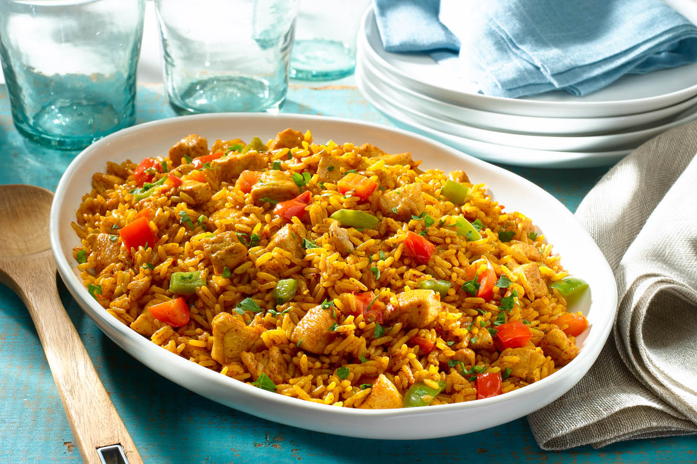

# Arroz con Pollo

*Costa Rican one-pot chicken rice, the rice stained turmeric-yellow by achiote and broth, studded with peas, sweet pepper and pimento, with shredded chicken folded through.*

**Serves:** 6

**Prep Time:** 20 minutes

**Cook Time:** 45 minutes

## Overview
Arroz con pollo is the dish a Tica cook makes when there is a birthday, a christening or a Sunday family lunch. The Costa Rican version is its own thing: the rice is dyed a deep yellow by achiote (annatto), folded through with shredded poached chicken, sweet peppers, peas and chopped pimento-stuffed olives, and finished with a slick of mayonnaise stirred in off the heat. The mayonnaise is the surprise. It is not Spanish, it is not Cuban, it is Costa Rican, a layer of richness that softens the rice and ties everything together. The dish is served from a wide platter with a side of small french fries (papas a la francesa) or a fresh green salad, and a stack of corn tortillas on the table. It is a family-event dish, generous and bright.

## Ingredients

- 1 whole chicken (1.5 kg), cut into 8 pieces
- 1.5 litres water
- 1 onion, halved
- 1 carrot, halved
- 2 celery sticks
- 1 large bunch coriander stalks
- 1 tbsp salt
- 1 tsp black peppercorns
- 3 tbsp vegetable oil
- 1 large white onion, finely diced
- 1 red sweet pepper, finely diced
- 1 green sweet pepper, finely diced
- 4 garlic cloves, finely chopped
- 1 tbsp achiote (annatto) paste, or 1 tsp ground turmeric
- 500 g long-grain white rice, rinsed
- 200 g frozen peas
- 100 g pimento-stuffed green olives, sliced
- 2 tbsp Salsa Lizano
- 3 tbsp mayonnaise
- 1 large handful coriander leaves, chopped
- Lime wedges, to serve

## Method

### Stage 1 - Poach the chicken
1. Place the chicken pieces in a large pot with the water, halved onion, carrot, celery, coriander stalks, salt and peppercorns.
2. Bring to a boil, drop to a simmer, cover loosely and cook for 35 minutes until the chicken is cooked through.
3. Lift out the chicken; let it cool enough to handle, then pull the meat off the bones and shred into thumb-length pieces. Strain and reserve 1 litre of the cooking broth.

### Stage 2 - Build the sofrito
1. Heat the oil in a wide heavy pan over medium heat.
2. Add the diced onion and both sweet peppers; cook for 8 minutes until soft.
3. Add the garlic and the achiote paste; stir for 1 minute until the oil runs bright orange-yellow.

### Stage 3 - Cook the rice
1. Stir the rinsed rice into the sofrito; coat every grain in the orange oil for 1 minute.
2. Pour in 1 litre of the reserved chicken broth; add the Salsa Lizano and stir once.
3. Bring to a boil, drop to a low simmer, cover and cook for 18 minutes until the liquid is absorbed and the rice is tender.

### Stage 4 - Finish
1. Off the heat, fold in the shredded chicken, peas (still frozen, the residual heat thaws them) and sliced olives.
2. Cover and rest for 5 minutes.
3. Stir through the mayonnaise and chopped coriander; check salt.
4. Tip onto a wide platter, scatter more coriander, serve with lime wedges.

## Notes
- **The mayonnaise twist:** Folding in mayonnaise off the heat is the signature Costa Rican move. It softens the rice and adds a creamy lift. Skipping it makes the dish merely Caribbean, not Tica.
- **Achiote for colour:** Achiote paste gives the right deep marigold-yellow. Turmeric is the substitute; saffron is too floral.
- **Reserve the broth:** Cooking the rice in chicken broth (not water) is what builds depth.
- **Frozen peas at the end:** Stirring frozen peas into the just-cooked rice keeps them bright green; cooked-in peas go grey.

## Variations
- **Arroz con pollo en lata:** A weeknight shortcut version uses a tin of mixed vegetables and a tin of red pepper strips; pour them in at the end.
- **Arroz con pollo de cumpleaños:** The birthday party version is topped with small fried potato sticks (papitas) and a row of red pepper strips for colour.
- **Arroz con pollo y maíz:** Add a tin of sweetcorn kernels with the peas for a sweeter, richer plate.
- **Arroz con pollo caribeño:** Cook the rice in half coconut milk, half broth, for the Limón-coast version.

## Serving
- Serve hot from a wide platter · a small bowl of papas a la francesa (small fries) on the side · a fresh tomato-and-avocado salad · Salsa Lizano on the table · lime wedges

## Storage
- Arroz con pollo keeps 3 days refrigerated
- Reheat in a covered pan with a splash of broth or water over low heat
- The mayonnaise can split on reheating; stir gently
- Freezes 1 month but the rice texture softens
