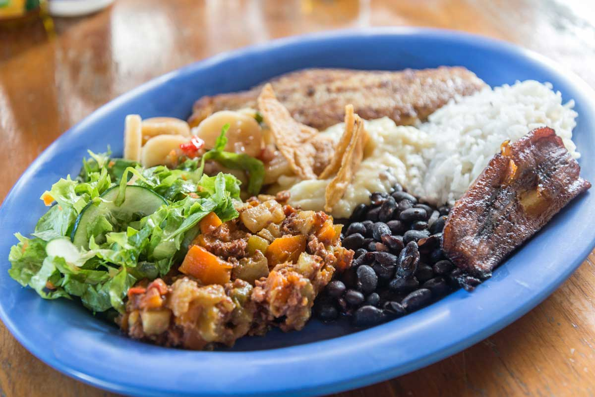

# Casado

*The Costa Rican plate-lunch: a mound of white rice, a ladle of black beans, sweet fried plantain, a small fresh salad and a protein, all laid out together on one wide plate at the country's soda counters.*

**Serves:** 4

**Prep Time:** 20 minutes

**Cook Time:** 35 minutes

## Overview
Casado means "married", a wry name for the everyday lunch plate that brings rice, beans, plantain, salad and a protein together as one settled household. It is the most ordered dish in Costa Rica, the workhorse of every soda from the city to the smallest village. The composition is fixed: white rice on one half, black beans alongside, a piece of grilled or fried protein, two slices of sweet fried plantain, a small fresh-cabbage salad and sometimes a spoon of picadillo de papa to round it out. Nothing is fancy and nothing is fussy. The skill is in the timing: every element hot, the rice fluffy, the beans glossy, the plantain caramelised at the edges. This is the assembled plate.

## Ingredients

- 400 g long-grain white rice
- 750 ml water
- 1 tsp salt
- 2 tbsp vegetable oil
- 400 g cooked black beans with their liquid
- 1 small onion, finely diced
- 1 garlic clove, chopped
- 1/2 tsp cumin
- 2 tbsp Salsa Lizano
- 4 chicken thighs (skin-on, bone-in) or 4 thin beef steaks
- 2 tsp salt for the meat
- 1 tsp ground cumin
- 2 large ripe (yellow-black) plantains, peeled and sliced 1 cm thick on the bias
- 60 ml oil for frying plantains
- 1/4 small white cabbage, finely shredded
- 1 tomato, diced
- 1 small handful coriander leaves
- 1 lime, juiced

## Method

### Stage 1 - Cook the rice
1. Rinse the rice in cold water until it runs clear.
2. Heat 1 tbsp oil in a heavy pan; toast the rice for 1 minute.
3. Add the water and 1 tsp salt; bring to a boil, cover, drop the heat to low and cook for 18 minutes. Rest off the heat 5 minutes, then fluff.

### Stage 2 - Stew the beans
1. Heat 1 tbsp oil in a small pan over medium heat; soften the onion and garlic for 5 minutes.
2. Add the cumin and Salsa Lizano; stir for 30 seconds.
3. Tip in the beans with their liquid; simmer 10 minutes until glossy and slightly thickened. Season with salt.

### Stage 3 - Cook the protein
1. Season the chicken thighs (or beef) with salt and cumin.
2. Heat a heavy pan over medium-high heat with a splash of oil; cook the chicken skin-side down for 7 minutes until crisp, flip and cook 6 minutes more, until the juices run clear.
3. Rest 3 minutes before serving.

### Stage 4 - Fry the plantain
1. Heat the oil in a frying pan over medium heat.
2. Lay the plantain slices in a single layer; fry 3 minutes per side until deeply golden and caramelised at the edges. Drain on paper.

### Stage 5 - Build the salad and plate
1. Toss the cabbage, tomato, coriander and lime juice with a pinch of salt.
2. On each wide plate, mound a quarter of the rice, ladle a quarter of the beans alongside, place the protein next to the rice, lay two plantain slices on the side and finish with a small heap of the cabbage salad. Eat warm.

## Notes
- **The plate composition:** Each element sits separately, not mixed. The eater combines bites as they like.
- **Plantain ripeness:** The plantains must be yellow-black, almost overripe, for the sugars to caramelise. Yellow-only plantains stay starchy.
- **The protein swap:** Casado is a frame, not a recipe. Grilled chicken, beef, pork chop, fried fish or a slab of fresh white cheese all qualify.
- **Salsa Lizano is the table sauce:** A bottle goes on the table for the eater to splash over the beans or the rice as they wish.

## Variations
- **Casado de pescado:** A fillet of fresh fish (snapper, tilapia) pan-fried with garlic and lime in place of the chicken.
- **Casado vegetariano:** Replace the protein with a slab of fresh white cheese (queso palmito) pan-fried until golden, or with a fried egg.
- **Casado caribeño:** Cook the beans and rice in coconut milk (rice-and-beans-with-coconut) for the Limón-coast version.
- **Casado con picadillo:** Add a small mound of picadillo de papa or picadillo de chayote alongside the plantain for the soda-counter version.
- **Casado completo:** Add a slice of soft white cheese and an over-easy egg on top of the rice for the hungry-worker version.

## Serving
- Serve warm with all five elements separate on one wide plate · a bottle of Salsa Lizano on the table · a wedge of lime on the rim · iced fresco de cas or fresco de tamarindo

## Storage
- Each component stores separately, refrigerated 3 days
- Reheat rice and beans in a covered pan with a splash of water
- Fry plantain fresh (it loses its crisp edge when reheated)
- Do not freeze the assembled plate
