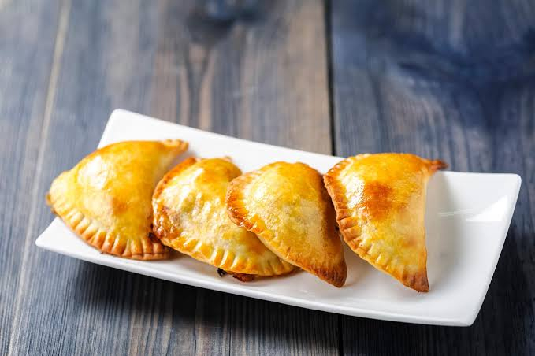

# Empanadas de Chiverre

*The Costa Rican Holy Week pastry: half-moon empanadas filled with a long-cooked sweet jam made from chiverre, a stringy white-fleshed squash, spiced with cinnamon, clove and panela.*

**Serves:** 12 empanadas

**Prep Time:** 40 minutes (plus 24 hours for the jam)

**Cook Time:** 30 minutes

## Overview
Chiverre is a hard-shelled white-fleshed squash with stringy pulp, native to Central America, and in Costa Rica it is the Holy Week ingredient. The flesh is roasted, the strings pulled out, rinsed in water, and then cooked down with panela (unrefined cane sugar), cinnamon and clove into a long-keeping sweet jam called dulce de chiverre. The jam fills small half-moon pastries with a flaky lard-and-flour dough, brushed with egg-wash and baked until golden. Every Tica grandmother makes a tub of dulce de chiverre at the start of Lent and the empanadas appear on Holy Thursday and Good Friday. The flavour is warm-spiced, mellow and uniquely Costa Rican. Tinned chiverre jam (sold as "dulce de chiverre") works as a shortcut.

## Ingredients

For the filling:
- 500 g dulce de chiverre jam (or 500 g spaghetti squash strands cooked down with 300 g panela, 1 cinnamon stick, 4 cloves and 100 ml water for 1 hour, then chilled overnight)

For the dough:
- 350 g plain flour
- 50 g caster sugar
- 1 tsp salt
- 150 g cold lard (or butter), cut into cubes
- 1 egg
- 100 ml cold milk

For finishing:
- 1 egg, beaten
- 2 tbsp caster sugar, for sprinkling

## Method

### Stage 1 - Make the dough
1. Rub the flour, sugar, salt and cold lard together with your fingertips until the texture is like coarse breadcrumbs.
2. Whisk the egg and milk together; pour into the flour and bring together with a wooden spoon, then your hands.
3. Knead briefly to a smooth dough (do not overwork). Wrap in cling film and rest in the fridge for 30 minutes.

### Stage 2 - Shape the empanadas
1. Preheat the oven to 180 C. Line a baking tray with parchment.
2. Roll the dough out on a lightly floured surface to 3 mm thick.
3. Cut 12 discs of 12 cm diameter (use a saucer as a guide).
4. Spoon a heaped tablespoon of dulce de chiverre into the centre of each disc.
5. Brush the edge with a little beaten egg; fold over into a half-moon and press the edge with the tines of a fork to seal.

### Stage 3 - Bake
1. Place the empanadas on the lined tray; brush each with beaten egg.
2. Sprinkle a pinch of caster sugar over the tops.
3. Bake for 22 to 25 minutes until deep golden brown.
4. Cool on the tray for 10 minutes before lifting; the filling is volcanic-hot at first.

## Notes
- **Make the filling ahead:** Dulce de chiverre takes 90 minutes of stove-time. Make a batch the day before and refrigerate.
- **Keep the dough cold:** Cold lard gives a flaky bake. If the dough warms while you roll, return it to the fridge for 10 minutes.
- **Seal the edges firmly:** A bad seal lets the jam leak out and burn on the tray. Press with the fork and brush the edge with egg to glue.
- **Cool before eating:** The filling holds intense heat. 10 minutes on the rack before lifting.

## Variations
- **Empanadas de piña:** Use pineapple jam in place of the chiverre, for the year-round version.
- **Empanadas de mora:** Costa Rican blackberry jam (mora) is the central-valley alternative.
- **Empanadas de leche:** Dulce de leche filling for a richer pastry.
- **Empanadas fritas:** Deep-fry the empanadas in oil at 170 C for 4 minutes per side instead of baking, for a crisp shell.
- **Empanadas de cajeta:** Mexican-style goat-milk caramel filling for a darker, deeper flavour.

## Serving
Serve warm or at room temperature with strong black coffee · or with a glass of cold milk · or as part of a Holy Week dessert platter alongside arroz con leche

## Storage
- Baked empanadas keep 3 days in an airtight tin at room temperature
- Reheat in a 160 C oven for 6 minutes
- Freeze unbaked (after shaping); bake from frozen, adding 5 minutes
- The chiverre jam keeps 1 month refrigerated
