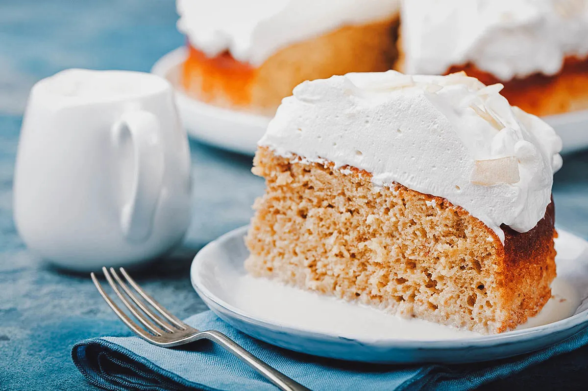

# Tres Leches

*The Costa Rican milk-soaked sponge: a light butter-free vanilla cake drenched in a mixture of evaporated milk, condensed milk and double cream, chilled overnight and topped with whipped cream and a dusting of cinnamon.*

**Serves:** 10

**Prep Time:** 25 minutes (plus overnight chill)

**Cook Time:** 30 minutes

## Overview
Tres leches (three milks) is the Latin-American milk-soaked sponge cake claimed by Mexico, Nicaragua, Costa Rica and half a dozen others. The Costa Rican version is the standard build: a light vanilla sponge baked without butter so it stays porous enough to drink the milk soak, drenched while still warm with a mixture of evaporated milk, sweetened condensed milk and double cream, then chilled overnight so the soak permeates every crumb. The top is finished with sweetened whipped cream and a dusting of cinnamon, sometimes with a glacé cherry on each slice for a birthday version. A glug of dark rum stirred into the milk soak is a common Tica add-on at family parties. The cake comes out cold, custardy-wet, and ridiculously rich.

## Ingredients

For the sponge:
- 6 eggs, separated
- 200 g caster sugar
- 1 tsp vanilla extract
- 200 g plain flour
- 2 tsp baking powder
- 60 ml whole milk

For the soak:
- 400 ml tin evaporated milk
- 397 g tin sweetened condensed milk
- 250 ml double cream
- 1 tsp vanilla extract
- 2 tbsp dark rum, optional

For the topping:
- 300 ml double cream, cold
- 3 tbsp icing sugar
- 1 tsp vanilla extract
- 1 tsp ground cinnamon, for dusting

## Method

### Stage 1 - Make the sponge
1. Preheat the oven to 175 C. Butter and line a 23 x 33 cm baking tin.
2. Whisk the egg whites to stiff peaks; gradually add half the caster sugar and whisk to a glossy meringue.
3. In a second bowl, whisk the egg yolks with the rest of the sugar and the vanilla for 3 minutes until pale and ribboned.
4. Sift the flour and baking powder into the yolks; fold in with the milk.
5. Fold the meringue in gently in three additions, keeping as much air as possible.
6. Pour into the prepared tin; bake for 28 minutes until golden and springy.

### Stage 2 - Soak the warm cake
1. While the sponge is still warm in its tin, prick the top all over with a skewer.
2. Whisk the evaporated milk, condensed milk, double cream, vanilla and rum (if using) until smooth.
3. Pour the milk mixture slowly over the cake in three passes, letting each pass soak in before the next.
4. Cover and chill for at least 8 hours, ideally overnight.

### Stage 3 - Whip and finish
1. The next day, whip the cold double cream with the icing sugar and vanilla to soft peaks.
2. Spread the whipped cream over the chilled cake in soft swirls.
3. Dust the top with ground cinnamon.
4. Slice into squares and serve cold.

## Notes
- **The sponge has no butter:** A butter-rich sponge will not absorb the soak. The fat-free egg-and-flour sponge is essential.
- **Soak while warm:** A warm sponge drinks the milk; a cold sponge sheds it. Pour the soak within 20 minutes of removing from the oven.
- **Overnight chill is non-negotiable:** The soak needs at least 8 hours to permeate every crumb. Skipping this gives a wet top and dry bottom.
- **Three passes for the soak:** Pouring all the milk in at once causes the liquid to run off the edges. Three slow passes let the cake drink it in.

## Variations
- **Tres leches con coco:** Replace 100 ml of the double cream in the soak with coconut milk and dust with toasted coconut flakes on top.
- **Tres leches de chocolate:** Add 30 g cocoa powder to the flour and 50 g grated dark chocolate to the soak.
- **Tres leches con caramelo:** Drizzle dulce de leche over the whipped cream on top.
- **Tres leches con frutas:** Top each square with sliced strawberries and a mint leaf.
- **Cuatro leches:** Add a fourth milk to the soak: 100 g dulce de leche stirred into the warm milk mixture until dissolved.

## Serving
- Serve cold from the fridge in 8 cm squares · with a glacé cherry on top for a birthday version · with a thimble of dark rum on the side · or sliced strawberries alongside

## Storage
- Tres leches keeps 4 days refrigerated, covered
- Improves over the first 24 hours as the soak settles
- Does not freeze (the whipped cream collapses and the sponge goes spongy)
