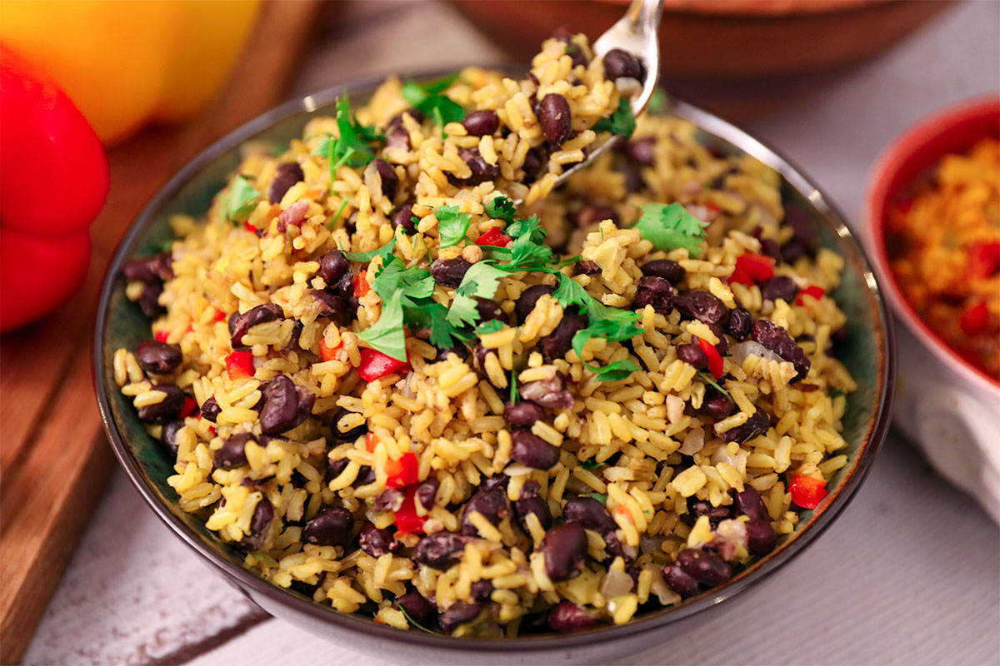

# Gallo Pinto

*Costa Rica's national breakfast: day-old black beans and rice fried together with onion, sweet pepper and coriander, then darkened with a long pour of Salsa Lizano just before serving.*

**Serves:** 4

**Prep Time:** 10 minutes

**Cook Time:** 15 minutes

## Overview
Gallo pinto means "spotted rooster", a reference to the speckled look of black beans against white rice. Every Tica household has a version, and the fight between the Costa Rican and Nicaraguan claim to its invention has been running for a hundred years. The Costa Rican line is non-negotiable: the beans are black, the rice is leftover from yesterday, the aromatics are onion, sweet pepper and a fistful of fresh coriander, and the seasoning that pulls the dish together is Salsa Lizano, the country's tangy brown table sauce. Eat it with scrambled eggs, sour cream, fried plantain, soft white cheese and a tortilla on the side. This is breakfast at every soda from San José to Puerto Viejo.

## Ingredients

- 3 tbsp vegetable oil
- 1 medium white onion, finely diced
- 1 red sweet pepper, finely diced
- 3 garlic cloves, finely chopped
- 400 g cooked black beans, drained (reserve 4 tbsp cooking liquid)
- 500 g cooked long-grain white rice (cold, day-old)
- 4 tbsp Salsa Lizano
- 1 tsp salt
- 1 large handful fresh coriander, finely chopped
- Freshly ground black pepper

## Method

### Stage 1 - Build the sofrito
1. Heat the oil in a wide heavy pan over medium heat.
2. Add the onion and sweet pepper; cook for 6 minutes until soft and translucent.
3. Add the garlic; cook for 1 minute until fragrant.

### Stage 2 - Add the beans
1. Tip in the drained black beans with the reserved 4 tbsp cooking liquid.
2. Stir through the sofrito and cook for 3 minutes so the beans pick up the aromatics.
3. Pour in the Salsa Lizano and stir; the liquid will turn dark and glossy.

### Stage 3 - Fold in the rice
1. Add the cold rice in two batches, breaking up any clumps with the back of the spoon.
2. Stir gently to coat every grain, letting the rice catch a little at the base of the pan for 4 minutes.
3. Salt to taste, grind in black pepper, and fold through the chopped coriander off the heat.

## Notes
- **The rice must be cold:** Fresh hot rice goes mushy. Day-old fridge-cold rice fries cleanly into separate grains.
- **The Salsa Lizano is the signature:** No substitute really works. Worcestershire sauce gets close on the funk but misses the sweet pepper note. Buy a bottle if you can.
- **Bean liquid matters:** A few tablespoons of the bean cooking liquid keeps the pinto moist instead of dry-fried.
- **Coriander goes in last:** Stir it through off the heat so it stays bright green and fragrant.

## Variations
- **Caribbean pinto:** Cook the beans in coconut milk first, then fry the pinto in coconut oil; add a slice of scotch bonnet to the sofrito.
- **Vegetarian breakfast:** Serve with a fried egg, sliced avocado and fresh white cheese instead of the usual side of bacon or sausage.
- **Pinto con chorizo:** Brown 200 g crumbled chorizo in the pan before the sofrito; use the rendered fat instead of the oil.
- **Pinto guanacasteco:** Skip the Salsa Lizano and use only salt and cumin, the dry-side Guanacaste province version.

## Serving
- Serve hot with scrambled or fried eggs · soft white cheese (queso fresco) · sour cream (natilla) · fried plantain slices · a warm corn tortilla · strong black coffee

## Storage
- Leftover gallo pinto keeps 3 days refrigerated
- Reheat in a dry pan over medium heat with a splash of water
- Do not freeze (the rice texture goes glassy)
