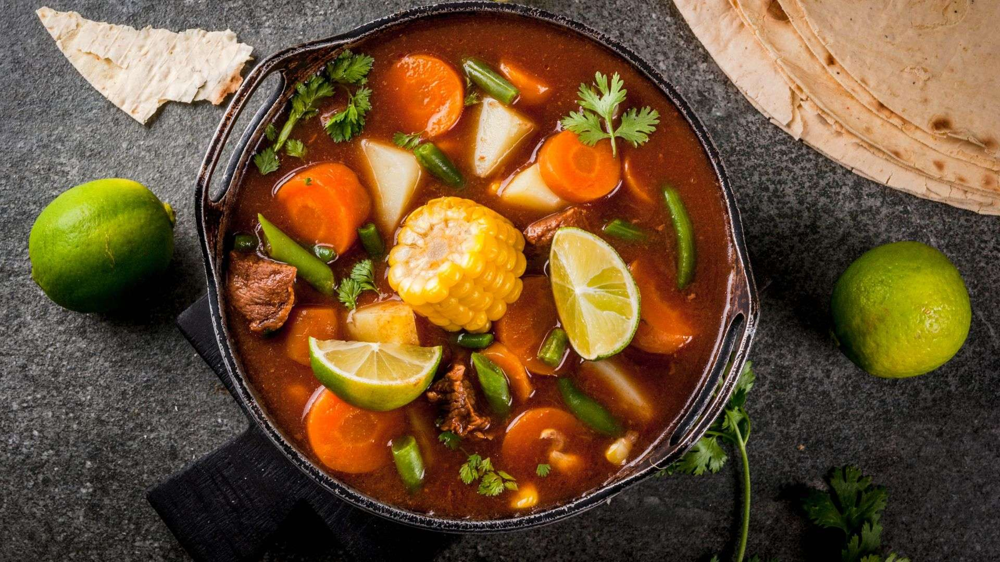

# Olla de Carne

*The Costa Rican Sunday boil-up: beef shin simmered for hours with yuca, ñampi, chayote, corn-on-the-cob and plantain, until the broth runs sweet and the meat falls off the bone.*

**Serves:** 6

**Prep Time:** 25 minutes

**Cook Time:** 3 hours

## Overview
Olla de carne is the Sunday lunch of the Costa Rican highlands, a single pot of beef shin and shoulder simmered slowly with the country's full root-vegetable cabinet: yuca (cassava), ñampi (a starchy yam-cousin), chayote (a pale-green squash), plantain, sweet potato and a length of corn-on-the-cob cut into rings. The broth runs clear and sweet from the roots, with depth from the beef bones, and is served first as a soup with a squeeze of lime, then the meat and vegetables come as a second course alongside white rice. It is honest country cooking, the kind of dish a Tica mother makes on a Sunday morning and feeds three generations from. The cure for everything from a hangover to a heartbreak.

## Ingredients

- 1.2 kg beef shin (with bone) and shoulder, cut into large chunks
- 2.5 litres cold water
- 1 large white onion, halved
- 1 red sweet pepper, halved and seeded
- 4 garlic cloves, smashed
- 2 sticks celery
- 1 large bunch coriander stalks (reserve leaves)
- 2 bay leaves
- 1 tbsp salt
- 2 tsp cumin seeds
- 500 g yuca (cassava), peeled and cut into large chunks
- 400 g ñampi (or use sweet potato), peeled and cut into chunks
- 2 chayote, halved and seeded
- 1 large green plantain, peeled and cut into thick rings
- 2 corn-on-the-cob, cut into 4 cm rings
- 2 carrots, cut into thick rings
- Fresh coriander leaves and lime wedges, to serve
- White rice, to serve

## Method

### Stage 1 - Start the broth
1. Place the beef shin and shoulder in a large heavy pot; cover with the cold water.
2. Bring to a boil over high heat; skim off the grey scum that rises in the first 10 minutes.
3. Drop the heat to low and add the onion, sweet pepper, garlic, celery, coriander stalks, bay leaves, salt and cumin.
4. Cover loosely and simmer for 2 hours, or until the beef is tender at the prod of a fork.

### Stage 2 - Add the roots
1. Lift out the cooked aromatics (onion, pepper, celery, coriander stalks) and discard.
2. Add the yuca first; simmer 15 minutes.
3. Add the ñampi (or sweet potato), chayote, plantain and carrots; simmer 20 minutes.
4. Add the corn rings; simmer a final 10 minutes, until everything is tender.

### Stage 3 - Serve in two courses
1. Ladle the clear broth into bowls; scatter fresh coriander leaves, squeeze in lime, eat as a first course.
2. Plate up the meat and vegetables on a wide platter, drizzle a little of the broth over, serve with white rice and the table sauce of choice.

## Notes
- **Skim the scum:** The first 10 minutes of grey foam must be skimmed off for a clear broth. After that, the simmer should be gentle.
- **Add roots in order:** Yuca needs the longest cook, corn the shortest. Adding them in stages keeps each vegetable tender but not collapsed.
- **The two-course service:** Tica families serve the broth first with a wedge of lime, then plate the solids with rice. Served as one big bowl, the soup gets clogged.
- **Bone marrow:** Choose beef shin with the marrow-bone intact. The marrow leaches into the broth and gives it body.

## Variations
- **Olla de carne con ayote:** Add a wedge of ayote (Caribbean pumpkin) for the last 20 minutes; it melts into the broth and sweetens it.
- **Olla de carne caribeña:** Add a pinch of allspice and a slice of scotch bonnet to the broth for the Limón-coast version.
- **Olla de pollo:** Use a whole chicken in place of the beef; reduce the first-stage simmer to 45 minutes.
- **Olla con elote tierno:** Add a handful of fresh chickpeas (garbanzos) along with the roots for a denser pot.
- **Slow-cooker version:** Brown the beef first, then cook on low for 6 hours with aromatics; add the roots in the last hour.

## Serving
Serve in two courses: broth first with coriander and lime · then meat and vegetables with white rice · a side of avocado · Salsa Lizano on the table

## Storage
- Olla de carne keeps 4 days refrigerated and improves the second day
- Reheat gently on the stove; add a splash of water if needed
- Freezes 2 months (the broth and meat freeze fine; the chayote and plantain go soft)
