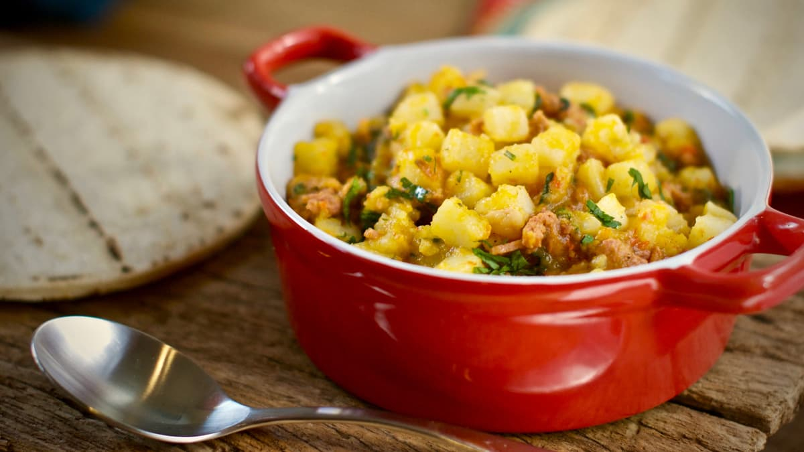

# Picadillo de Papa

*The casado-plate potato hash: small-dice potatoes cooked down in a sofrito of onion, sweet pepper, garlic and coriander, finished with a splash of Salsa Lizano and a fistful of green peas.*

**Serves:** 4

**Prep Time:** 15 minutes

**Cook Time:** 25 minutes

## Overview
Picadillo de papa is the casado plate's quiet helper, a small-dice potato hash that sits next to the rice and beans and rounds out the meal. The dice has to be tiny, about 6 mm cubes, so the potato cooks fast and soaks up the sofrito. Onion, red sweet pepper, garlic, cumin and coriander build the base, with a slug of Salsa Lizano for the country's signature tang and a scatter of green peas at the end for colour. The mix is moist but not wet, soft but not mashed. Every soda in Costa Rica has a pot of this on the back of the stove at lunchtime, ready to be ladled onto a casado plate as the eater orders. It also makes a fine filling for empanadas.

## Ingredients

- 600 g waxy potatoes, peeled and cut into 6 mm dice
- 3 tbsp vegetable oil
- 1 white onion, finely diced
- 1 red sweet pepper, finely diced
- 4 garlic cloves, finely chopped
- 1 tsp ground cumin
- 2 tbsp Salsa Lizano
- 150 ml water
- 100 g frozen green peas
- 1 large handful coriander leaves, chopped
- Salt and black pepper

## Method

### Stage 1 - Build the sofrito
1. Heat the oil in a wide pan over medium heat.
2. Add the diced onion and sweet pepper; cook for 6 minutes until soft and translucent.
3. Add the garlic and cumin; cook 1 minute more.

### Stage 2 - Cook the potatoes
1. Tip in the diced potatoes; stir to coat in the sofrito.
2. Pour in the Salsa Lizano and the water; bring to a gentle simmer.
3. Cover and cook for 12 minutes, stirring every 4 minutes, until the potatoes are tender at the prod of a knife. The liquid should mostly evaporate.

### Stage 3 - Finish
1. Stir in the frozen peas; cook 2 minutes uncovered, until bright green and warmed through.
2. Off the heat, fold in the chopped coriander.
3. Season with salt and freshly ground black pepper.

## Notes
- **The dice has to be small:** 6 mm dice cooks evenly in 12 minutes. Larger pieces cook unevenly and break the texture.
- **Waxy potatoes only:** Floury baking potatoes turn to mash and dissolve into the sofrito. Charlotte, Nicola or Yukon Gold hold their shape.
- **Moist but not wet:** The picadillo should be glossy and just-loose, not soupy. If too much liquid is left, uncover and reduce.
- **Peas at the end:** Frozen peas added at the very end stay bright green; cooked-in peas go grey.

## Variations
- **Picadillo de papa con carne:** Brown 200 g minced beef before the sofrito; use the rendered fat instead of the oil.
- **Picadillo de chayote:** Replace the potato with diced chayote (a pale-green squash); reduces the simmer to 10 minutes.
- **Picadillo de arracache:** Replace the potato with arracacha (a creamy Andean root); the country version in Costa Rica's central valley.
- **Picadillo relleno:** Use the cold picadillo as a filling for empanadas costarricenses.
- **Picadillo con chorizo:** Brown 100 g crumbled chorizo with the sofrito for a richer plate.

## Serving
Serve warm as a casado-plate side · or as an empanada filling · or rolled into a warm tortilla as a soft-taco lunch · with a dab of Salsa Lizano on top

## Storage
- Picadillo de papa keeps 3 days refrigerated
- Reheat in a covered pan with a splash of water
- Freezes 1 month (texture softens slightly on thaw)
