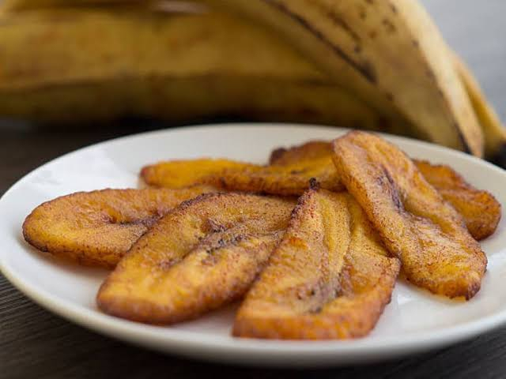

# Plátano Maduro

*The casado plate's sweet edge: thick-cut slices of yellow-black ripe plantain fried in oil until the sugars caramelise at the surface and the inside turns soft and almost custardy.*

**Serves:** 4 (as a side)

**Prep Time:** 5 minutes

**Cook Time:** 10 minutes

## Overview
Plátano maduro is the sweet counterweight on every Costa Rican casado plate. The plantains have to be properly ripe, the skin yellow turning to black with dark patches, so the sugars have developed enough to caramelise in the pan. The slices go in thick (about 2 cm on the diagonal) and fry slowly in shallow oil. The trick is patience: turn them once, let the sugars do their work, and they will come out with a deeply golden caramelised crust and a soft, almost custardy inside that pulls apart with the side of a fork. They are the soft, sweet element that balances the salt of the beans and the savour of the meat on the casado plate. A few slices alongside, and the plate is complete.

## Ingredients

- 4 large ripe plantains (yellow with black patches, soft at the squeeze)
- 60 ml vegetable oil (or coconut oil for a Caribbean version)
- Flaky sea salt, optional

## Method

### Stage 1 - Prep the plantain
1. Cut the tips off each plantain.
2. Score the skin lengthways with a small knife; peel off the skin in strips.
3. Slice each plantain on a long diagonal into pieces about 2 cm thick.

### Stage 2 - Fry slow
1. Heat the oil in a wide heavy pan over medium-low heat.
2. Lay the plantain slices in a single layer (work in batches if needed; do not crowd).
3. Fry for 4 minutes on the first side without moving them, until the surface is deep golden and the sugars have caramelised at the edges.
4. Flip carefully with a spatula and fry the second side for 3 minutes more, until both sides are dark gold and the centre is soft.

### Stage 3 - Drain and serve
1. Lift onto kitchen paper for 30 seconds to blot.
2. Plate up two or three slices per portion; finish with a pinch of flaky sea salt if liked, to lift the sweetness.

## Notes
- **Plantain ripeness is everything:** Yellow plantains with no black spots are still starchy. The skin should be yellow with at least one third black blotches for the sugar to caramelise.
- **Low and slow:** High heat burns the sugars before the inside cooks through. Medium-low heat is the right setting.
- **Turn only once:** The plantains need time on each side to build the caramelised crust. Repeated turning rips the surface.
- **A pinch of salt finishes:** Sweet plantain wakes up with the smallest pinch of flaky salt. Skip it if served with already-salty mains.

## Variations
- **Plátano maduro en gloria:** Layer the fried slices in a baking dish with grated white cheese and a splash of milk; bake until the cheese melts and runs.
- **Plátano maduro con natilla:** Top with a spoonful of natilla (Costa Rican sour cream) for a dessert-style side.
- **Plátano flameado:** Splash with a tablespoon of rum at the end of frying; flame off the alcohol for a darker caramel.
- **Plátano al horno:** Bake whole unpeeled ripe plantains at 200 C for 30 minutes for a fat-free version; split open and serve.
- **Plátano frito caribeño:** Fry in coconut oil instead of vegetable oil for the Limón-coast version.

## Serving
- Serve warm as a casado plate side · alongside gallo pinto for breakfast · as a side to roast pork or grilled chicken · with a spoonful of natilla and a wedge of fresh white cheese

## Storage
- Fried plantain eats best fresh and loses its crisp edge quickly
- Refrigerate up to 2 days; reheat in a dry pan over medium heat or in the air fryer for 3 minutes
- Do not freeze (texture goes mushy)
