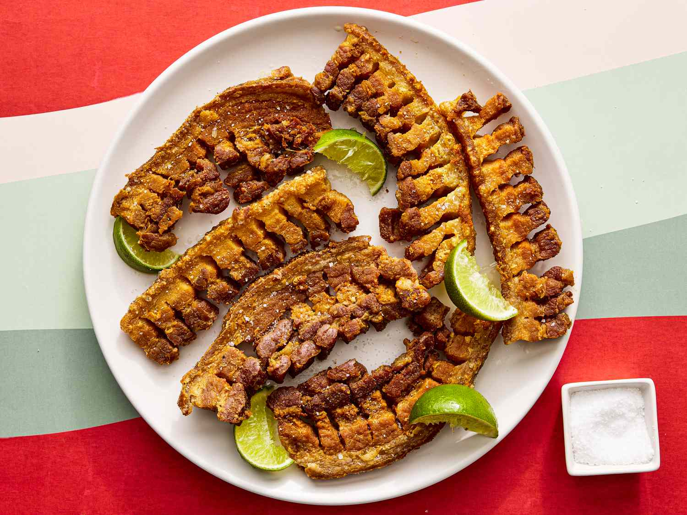

# Chicharrones

*Costa Rican pork-belly chicharrones: cubes of pork belly simmered in their own fat with garlic and bay until tender, then cranked up until the skin blisters and the outside turns crisp and deep gold.*

**Serves:** 6 (as a snack)

**Prep Time:** 15 minutes

**Cook Time:** 1 hour 30 minutes

## Overview
Costa Rican chicharrones are not the puffed pork-skin crisps of the Mexican kind. These are large cubes of pork belly, skin still on, simmered slowly in their own rendered fat with garlic, bay and a splash of sour orange until the meat is fork-tender, then the heat is turned up at the end so the skin blisters and the outside develops a deep-gold crackle. They are the country's classic bar snack, served at every cantina alongside a cold Imperial lager, often with a wedge of lime, a heap of patacones and a small pot of chimichurri or yuca on the side. The Tica version is salty, fatty and addictive, the kind of plate that disappears in fifteen minutes between four people.

## Ingredients

- 1.2 kg pork belly, skin on, cut into 4 cm cubes
- 1 tbsp salt
- 1 tsp cumin
- 8 garlic cloves, smashed
- 4 bay leaves
- 1 tbsp sour-orange juice (or use lime juice mixed with a splash of orange juice)
- 200 ml water
- Lime wedges, to serve
- Flaky sea salt, to finish

## Method

### Stage 1 - Season the belly
1. Pat the pork-belly cubes dry with kitchen paper.
2. Toss in a bowl with the salt, cumin, smashed garlic, bay leaves and sour-orange juice.
3. Let sit at room temperature for 15 minutes.

### Stage 2 - Slow-render
1. Place the seasoned belly in a wide heavy pot with the 200 ml water.
2. Bring to a simmer over medium heat, then cover and cook for 45 minutes. The water steams the meat tender; the fat begins to render.
3. Uncover; cook for 30 minutes more, stirring every 5 minutes. The water evaporates, the meat sits in its own fat, and starts to colour at the edges.

### Stage 3 - Crisp and crackle
1. Crank the heat up to medium-high.
2. Cook for 12 to 15 minutes, turning the cubes every 2 minutes, until the skin blisters and the surface turns deep crackling gold.
3. Lift out with a slotted spoon onto kitchen paper to drain. Discard the bay and most of the rendered fat (save a jar for cooking).

### Stage 4 - Serve
1. Pile the chicharrones onto a plate.
2. Scatter with flaky sea salt while hot.
3. Plate up with lime wedges, patacones on the side and a cold beer.

## Notes
- **Skin-on belly is essential:** The crackling skin is the whole point. Skin-off belly gives soft fatty cubes with no crunch.
- **Two-stage cook:** Slow-cook first (to tender the meat), then high-heat second (to crisp the skin). Skipping the slow phase leaves the meat tough.
- **The fat is gold:** Strain the rendered fat through muslin and keep in a jar in the fridge. It is excellent for cooking eggs, frying potatoes and seasoning beans.
- **Salt at the end:** Salting at the start draws out moisture and hurts the crackle. Flaky salt goes on after the crackle has formed.

## Variations
- **Chicharrones con yuca:** Serve on a bed of boiled-then-fried yuca with chimichurri, the classic cantina plate.
- **Chicharrones costeños:** Add a pinch of allspice and a slice of scotch bonnet for the Caribbean-coast version.
- **Chicharrones de pollo:** Use small chunks of chicken thigh with skin in place of the pork belly; cook in chicken fat with the same aromatics.
- **Carnitas-style:** Add a small piece of orange peel and a stick of cinnamon to the slow-cook stage for a Mexican-style version.
- **Air-fryer finish:** After the slow-cook, finish the cubes in the air fryer at 200 C for 8 minutes for a less greasy crackle.

## Serving
- Serve hot from the pan with lime wedges · a heap of patacones · a small pot of chimichurri or salsa · alongside boiled yuca · with a cold bottle of Imperial lager

## Storage
- Chicharrones eat best fresh and the crackle goes soft on storage
- Refrigerate 3 days in an airtight container
- Reheat in a 200 C oven for 8 minutes to restore the crisp edge
- Freezes 1 month after the slow-cook; finish the crackle phase from defrosted
