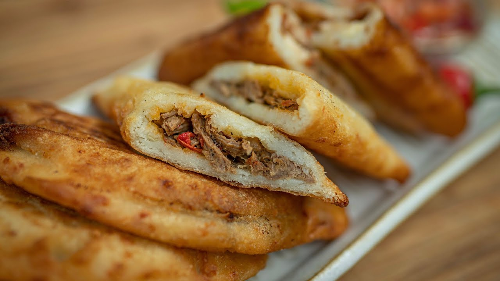

# Empanadas Costarricenses

*Costa Rican empanadas: thick masa-harina pastries (not flour-dough), folded around a beef picadillo of sofrito and minced beef, then pan-fried or shallow-fried until the masa shell goes crisp on the outside and stays soft inside.*

**Serves:** 8 empanadas

**Prep Time:** 30 minutes

**Cook Time:** 25 minutes

## Overview
Costa Rican empanadas are not the Argentinian flour-and-butter pastry version. They are made with masa harina, the same nixtamalised corn flour used for tortillas, so the dough is yellow, soft, slightly sweet, and folded thicker than its South American cousins. The classic filling is a beef picadillo of minced beef cooked down with onion, sweet pepper, garlic, cumin, coriander and a splash of Salsa Lizano, with diced potato folded through. The empanadas are sealed by hand, pan-fried or shallow-fried on both sides until the masa shell crackles and turns deep gold, and served with a small bowl of fresh salsa or sour cream for dipping. They are a market-stall and bus-stop snack, and a weekend-breakfast staple at home.

## Ingredients

For the filling:
- 1 tbsp vegetable oil
- 1 small white onion, finely diced
- 1 red sweet pepper, finely diced
- 3 garlic cloves, finely chopped
- 1 tsp ground cumin
- 300 g minced beef
- 1 medium potato, peeled and diced 5 mm
- 2 tbsp Salsa Lizano
- 100 ml water
- 1 small handful coriander leaves, chopped
- Salt and black pepper

For the dough:
- 300 g masa harina (nixtamalised corn flour)
- 1 tsp salt
- 1/2 tsp ground turmeric (for the yellow colour)
- 450 ml warm water (approximate)
- 2 tbsp vegetable oil

For frying:
- 60 ml vegetable oil

## Method

### Stage 1 - Cook the picadillo
1. Heat the oil in a pan over medium heat; soften the onion and sweet pepper for 6 minutes.
2. Add the garlic and cumin; cook 1 minute.
3. Add the minced beef; break it up with a wooden spoon and brown for 5 minutes.
4. Add the diced potato, Salsa Lizano and the 100 ml water; cover and simmer 10 minutes until the potato is tender and the liquid is gone.
5. Off the heat, stir in the coriander; season and let cool.

### Stage 2 - Make the masa dough
1. In a bowl, mix the masa harina with the salt and turmeric.
2. Pour in the warm water gradually, kneading with your hand, until you have a soft pliable dough (think soft playdough; it should not crack).
3. Knead in the oil for shine and softness.
4. Cover with a damp cloth and rest 10 minutes.

### Stage 3 - Shape the empanadas
1. Divide the dough into 8 balls (about 80 g each).
2. Working with one at a time, press the ball flat between two sheets of baking paper, or in a tortilla press, to a 14 cm disk about 4 mm thick.
3. Place 2 tablespoons of the cooled filling on one half of the disk.
4. Lift the paper to fold the dough over into a half-moon; press the edges with your fingers to seal. Tidy the edge with the rim of a small bowl if liked.

### Stage 4 - Fry to golden
1. Heat the 60 ml frying oil in a wide pan over medium heat.
2. Fry the empanadas in batches for 3 minutes per side, until the masa shell turns deep golden and crackles.
3. Lift out onto kitchen paper.

## Notes
- **The masa dough must be soft:** A dry dough cracks on folding and lets the filling leak. Add water until it feels like soft playdough; cover with a damp cloth while you work.
- **Cool the filling first:** Hot filling melts the dough seam and breaks the seal. Cool to room temperature before shaping.
- **The seal matters:** Press the edges with your fingers, then tidy with the rim of a small bowl. A bad seal means leaked filling and a burnt mess in the pan.
- **Pan-fry, not deep-fry:** A shallow pan-fry (1 cm of oil) gives the right balance of crisp shell and tender inside. Deep-frying makes them too greasy.

## Variations
- **Empanadas de queso:** Fill with grated mozzarella and a few coriander leaves for the cheese-empanada version.
- **Empanadas de picadillo de papa:** Use picadillo de papa as the filling, for a vegetarian variant.
- **Empanadas de pollo:** Shred 200 g cooked chicken into the sofrito in place of the minced beef.
- **Empanadas de frijol y queso:** Mix 200 g refried beans with 100 g grated cheese for a melted-cheese-and-bean filling.
- **Baked version:** Brush with egg wash and bake at 200 C for 20 minutes for a lighter (less greasy) shell.

## Serving
Serve hot with a small bowl of fresh tomato salsa · or natilla (Costa Rican sour cream) · a wedge of lime · with Salsa Lizano on the table

## Storage
- Fried empanadas eat best fresh; the masa shell softens within an hour
- Reheat in a 180 C oven for 8 minutes to restore the crisp
- Freeze unfried (after shaping); fry from frozen, adding 2 minutes per side
- Cooked filling keeps 3 days refrigerated
