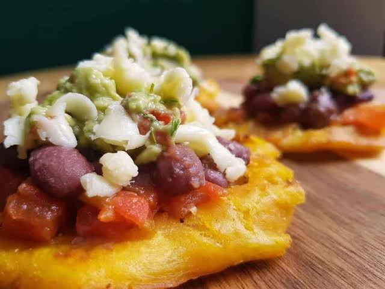

# Patacones

*Twice-fried green plantain disks: pieces of unripe plantain fried soft, smashed flat with the bottom of a glass, then refried until crisp at the edges and topped with a smear of refried black beans.*

**Serves:** 4 (as a snack)

**Prep Time:** 10 minutes

**Cook Time:** 15 minutes

## Overview
Patacones (called tostones in the rest of the Caribbean) are the bar snack of the Costa Rican Pacific coast. Green, starchy plantains are sliced into thick coins, fried once in hot oil until just soft, then smashed flat between two boards or with the bottom of a glass, then fried a second time until the edges crisp and the surface turns crackling gold. The double-fry is what makes them: the first fry softens the inside, the smash flattens them out into wide thin disks, and the second fry crisps every bit of the exposed surface. Tica patacones are topped with a smear of frijoles molidos (refried black beans), a sprinkle of fresh white cheese and a dab of pico de gallo, and served with a wedge of lime. The bar snack that goes with every Imperial lager on the coast.

## Ingredients

- 3 large green plantains (firm, skin still green)
- 500 ml vegetable oil for frying
- 1 tsp salt
- 200 g frijoles molidos or refried black beans, warm
- 100 g fresh white cheese (queso fresco), crumbled
- 1 small tomato, diced
- 1/4 small white onion, finely chopped
- 1 small handful coriander leaves
- 1 lime, cut into wedges

## Method

### Stage 1 - Prep the plantain
1. Cut the tips off each plantain.
2. Score the skin lengthways with a knife; lever and peel off the tough green skin (warm water helps if it sticks).
3. Slice each plantain into 3 cm rounds (you should get 4 to 5 rounds per plantain).

### Stage 2 - First fry
1. Heat the oil in a wide heavy pan to 165 C (a piece of plantain should sizzle gently when dropped in).
2. Fry the plantain rounds in batches for 4 minutes per side until soft and pale gold (the inside should give to a fork).
3. Lift out onto kitchen paper.

### Stage 3 - Smash
1. While still warm, place each round between two sheets of baking paper (or in a tortilla press).
2. Press flat with the bottom of a heavy glass or pan, into thin disks about 8 mm thick and 8 cm across.

### Stage 4 - Second fry
1. Bring the oil back up to 180 C.
2. Fry the smashed disks in batches for 2 minutes per side, until the edges crisp and the surface turns deep gold.
3. Lift out onto fresh kitchen paper; salt immediately while hot.

### Stage 5 - Top and serve
1. Toss the tomato, onion and coriander with a pinch of salt and a squeeze of lime, for a quick pico de gallo.
2. Spread a generous spoonful of warm refried beans on each patacón.
3. Top with a scatter of crumbled fresh white cheese and a small heap of pico de gallo.
4. Serve at once with lime wedges.

## Notes
- **Plantains must be green:** Yellow plantains have too much sugar and will burn before they crisp. The skin should be green and the flesh starchy.
- **Two oil temperatures:** First fry at 165 C (gentle) to soften; second fry at 180 C (hot) to crisp. A thermometer helps.
- **Smash while warm:** Patacones smashed cold crack and break. Press them while still hot from the first fry.
- **Salt fresh from the oil:** Salting straight out of the pan, while the oil-sheen is still on the surface, is when the salt sticks.

## Variations
- **Patacones rellenos:** Serve a stack of patacones with a small bowl of refried beans, cheese and pico for build-your-own at the table.
- **Patacones con guacamole:** Top with mashed avocado, salt and lime in place of (or alongside) the beans.
- **Patacones con ceviche:** Use the patacones as edible spoons for white-fish ceviche, the Pacific-coast version.
- **Patacones gigantes:** Smash into a single large disk (about 20 cm across) and use as a base for a salad of chicken, avocado and tomato.
- **Patacones picantes:** Sprinkle with a pinch of cayenne or chilli powder along with the salt.

## Serving
- Serve hot from the oil topped with warm refried beans · fresh white cheese · pico de gallo · lime wedges · alongside chicharrones · with a cold Imperial lager

## Storage
- Patacones eat best straight from the oil; the crisp goes within an hour
- Pre-fry the disks (first fry only) and refrigerate 1 day; finish the second fry fresh
- Frozen pre-smashed disks fry from frozen in the second-fry stage, no defrost needed
