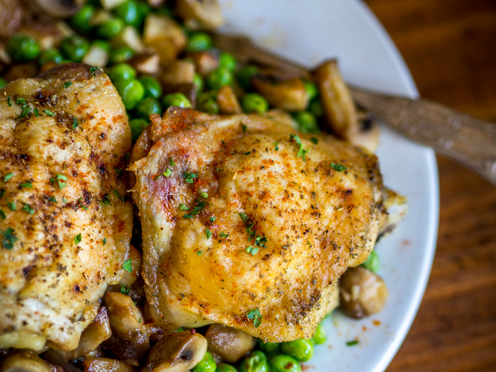

# Chicken Clemenceau

*A New Orleans Creole supper classic: sautéed chicken on the bone tossed at the last minute with brunoise potatoes, peas, mushrooms and a heavy hand of garlic, butter and parsley. Named (apocryphally) for the French statesman Georges Clemenceau, who is said to have eaten this at Antoine's. Light, garlicky, distinctly Creole rather than Cajun.*

**Serves:** 4

**Prep Time:** 20 minutes

**Cook Time:** 35 minutes

## Overview
Chicken pieces brown in oil and butter; finished in the oven 20 minutes. Tiny diced potatoes shallow-fry separately until gold; cremini mushrooms sauté; peas warm through. Everything tosses with chopped garlic, butter, lemon, parsley and a splash of dry sherry, then heaps onto the resting chicken. Eaten with crusty French bread.

## Ingredients

- 8 bone-in chicken thighs and drumsticks (or 1.4 kg jointed chicken)
- 2 tablespoons olive oil
- 3 tablespoons unsalted butter (split)
- 1 ½ teaspoons salt
- 1 teaspoon ground black pepper
- 600 g floury potatoes (peeled, cut into 1 cm dice - brunoise)
- 250 g cremini or button mushrooms (quartered)
- 200 g frozen petits pois
- 6 garlic cloves (crushed)
- 3 tablespoons dry sherry (or dry white wine)
- 4 tablespoons fresh parsley (chopped)
- Juice of ½ lemon
- 200 ml vegetable oil for frying potatoes

## Method

### Stage 1 - Chicken
1. Heat oven to 200°C (180°C fan).
1. Pat chicken dry; season with salt and pepper.
1. Heat olive oil and 1 tablespoon butter in a wide ovenproof pan over medium-high.
1. Brown chicken skin-side down 5 minutes; flip 3 minutes.
1. Transfer the pan to the oven 18-22 minutes until cooked through (internal 75°C).
1. Lift the chicken onto a plate; tent with foil.

### Stage 2 - Potatoes
1. While the chicken roasts, heat the vegetable oil in a separate pan to 175°C.
1. Fry potato dice in batches 4-5 minutes per batch until deep gold.
1. Drain on kitchen paper.

### Stage 3 - Mushrooms and peas
1. In the original chicken pan (drain off excess fat but keep a tablespoon), heat 1 tablespoon butter.
1. Add mushrooms; cook hard 6 minutes until gold and any liquid has evaporated.
1. Add peas; cook 2 minutes.
1. Add garlic; cook 30 seconds.

### Stage 4 - Combine
1. Add the fried potatoes back to the pan.
1. Pour in sherry; let it sizzle off 1 minute.
1. Off the heat, stir in the remaining tablespoon butter, lemon juice and parsley.
1. Taste; adjust salt.

### Stage 5 - Plate
1. Lay the chicken pieces on a wide warm platter.
1. Heap the potato-mushroom-pea mixture over the top.
1. Eat with crusty bread.

## Notes
- **Tiny dice on the potatoes:** 1 cm is right. The Clemenceau is identifiable by the small uniform cubes.
- **Sherry not wine:** Dry sherry brings a nutty depth. Dry white wine is the substitute.
- **Garlic at the end:** Don't burn it - 30 seconds in butter; it should aroma but not colour past pale gold.

## Storage
- Refrigerate 2 days. The potatoes lose their crisp; the dish is best fresh.
