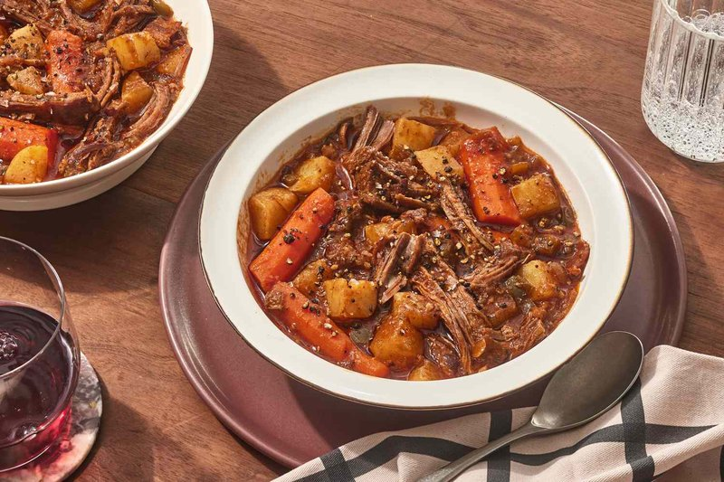

# Creole Daube

*A New Orleans take on French daube: chuck slow-braised in red wine with the Creole holy trinity, tomato, garlic, bay and thyme. Eaten over rice or noodles.*

**Serves:** 6

**Prep Time:** 25 minutes

**Cook Time:** 4 hours

## Overview
Beef chuck cubes brown hard; the trinity (onion, celery, pepper) soften deep in the rendered fat; tomato puree and tinned tomato build a rich base; red wine, stock, herbs and the beef simmer for 3 hours covered. Uncovered for the last 30 minutes to reduce. Serve over rice with chopped parsley.

## Ingredients

- 1 ½ kg beef chuck (cut into 5 cm chunks)
- 4 tablespoons vegetable oil
- 200 g smoked bacon lardons (or chopped pancetta)
- 3 onions (large, chopped)
- 4 sticks celery (chopped)
- 2 green bell peppers (chopped)
- 8 garlic cloves (crushed)
- 4 tablespoons plain flour
- 500 ml dry red wine
- 1 (400 g) tin chopped tomatoes
- 3 tablespoons tomato puree
- 600 ml hot beef stock
- 3 bay leaves
- 3 sprigs fresh thyme
- 1 teaspoon Creole seasoning (or 1 tsp smoked paprika + ½ tsp cayenne + 1 tsp dried oregano)
- 2 teaspoons salt (to taste)
- 1 teaspoon ground black pepper
- 1 tablespoon Worcestershire sauce
- 4 tablespoons fresh parsley (chopped, to finish)

### To serve
- 6 servings cooked white rice (or wide egg noodles)

## Method

### Stage 1 - Brown the beef
1. Pat the beef dry; season with salt and pepper.
1. Heat 2 tablespoons of oil in a wide heavy ovenproof pot over medium-high.
1. Brown the beef in batches, 4-5 minutes per side. Set aside.

### Stage 2 - Bacon and trinity
1. Add the remaining oil and the bacon to the same pot; render 5 minutes.
1. Add the onion, celery and pepper; cook 12 minutes until softened and pale gold.
1. Add garlic; cook 30 seconds.

### Stage 3 - Roux
1. Sprinkle in the flour; stir to coat the vegetables; toast 2 minutes.

### Stage 4 - Liquid
1. Pour in the red wine; scrape the bottom of the pot.
1. Bring to a simmer; cook 4 minutes to cook off the alcohol edge.
1. Add tinned tomato, tomato puree, hot stock, bay, thyme, Creole seasoning, Worcestershire, salt, pepper.

### Stage 5 - Braise
1. Return the beef with any juices.
1. Bring to a gentle simmer.
1. Cover; transfer to a 150°C (130°C fan) oven 3 hours. The meat should shred easily.

### Stage 6 - Reduce
1. Uncover; cook a further 25-30 minutes (on the stovetop or in the oven) - the gravy thickens to coat a spoon.
1. Lift out the bay and thyme stems.
1. Taste; adjust salt.

### Stage 7 - Serve
1. Spoon over rice or noodles; scatter parsley.
1. Crusty bread on the side.

## Notes
- **Trinity not mirepoix:** Green pepper instead of carrot is the Creole signature. Don't substitute carrot.
- **Make a day ahead:** Daube is better next-day. Skim the surface fat after refrigerating overnight if needed.
- **Chuck not silverside:** Connective tissue is the secret. Chuck has it; leaner cuts go dry.

## Storage
- Refrigerate 5 days; better day 2 and 3.
- Freezes 3 months.
