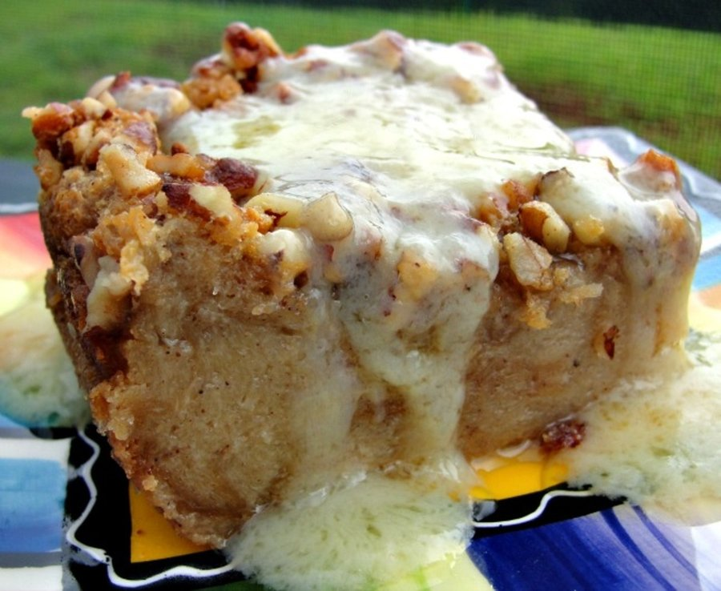

# Bread Pudding (Creole)

*New Orleans bread pudding: stale French bread soaked in a cinnamon-raisin custard, baked golden and drenched in warm bourbon whiskey sauce.*

**Serves:** 8

**Prep Time:** 20 minutes (plus 30 minutes soaking)

**Cook Time:** 50 minutes

## Overview
Stale French bread (a day-old baguette is perfect) tears into 3 cm chunks. Custard: whole milk, eggs, sugar, vanilla, cinnamon, nutmeg, lemon zest. Raisins steep in 4 tablespoons bourbon for plump. Bread soaks in custard 30 minutes; raisins fold in. Tips into a buttered 25 × 18 cm dish; dots with butter. Bakes 45-50 minutes at 175°C till the top is bronzed and the centre is set but still custardy. Whiskey sauce: butter melts with sugar; cream and bourbon stir in; warmed but not boiled. Pours over the pudding at the table.

## Ingredients

### Bread pudding
- 400 g stale French bread or baguette (cubed into 3 cm pieces)
- 700 ml whole milk
- 4 large eggs
- 150 g caster sugar
- 100 g raisins
- 4 tablespoons bourbon (or rum) - for steeping the raisins
- 2 teaspoons vanilla extract
- 1 teaspoon ground cinnamon
- ½ teaspoon ground nutmeg
- Zest of 1 lemon
- ½ teaspoon salt
- 30 g unsalted butter (for dotting on top)

### Whiskey sauce
- 100 g unsalted butter
- 200 g caster sugar
- 200 ml double cream
- 1 large egg (lightly beaten)
- 3 tablespoons bourbon
- 1 teaspoon vanilla extract

## Method

### Stage 1 - Soak raisins
1. Pour the bourbon over the raisins in a small bowl; rest 20 minutes (or up to overnight) for the raisins to plump.

### Stage 2 - Custard
1. In a wide bowl, whisk the milk, eggs, sugar, vanilla, cinnamon, nutmeg, lemon zest and salt until smooth.

### Stage 3 - Soak bread
1. Tip the bread cubes into a large bowl.
1. Pour the custard over; press gently with a spatula so all cubes soak.
1. Rest 30 minutes - the bread absorbs the custard and softens.

### Stage 4 - Assemble
1. Heat the oven to 175°C (155°C fan).
1. Butter a 25 × 18 cm baking dish.
1. Stir the bourbon-soaked raisins (and any unabsorbed bourbon) into the bread mixture.
1. Tip into the buttered dish; level lightly.
1. Dot with the 30 g butter, broken into pieces.

### Stage 5 - Bake
1. Bake 45-50 minutes until the top is deep golden and a knife inserted in the centre comes out clean of custard (some moist crumbs are fine).
1. Rest 10 minutes after baking.

### Stage 6 - Whiskey sauce
1. While the pudding bakes, combine butter and sugar in a saucepan over medium heat.
1. Stir till the butter melts and the sugar dissolves; cook 2 minutes till just amber.
1. Whisk in the cream slowly (it'll bubble - be careful).
1. Off heat; whisk in the beaten egg slowly (tempers, doesn't scramble).
1. Stir in the bourbon and vanilla.
1. Return to LOW heat 1 minute to thicken slightly (don't simmer hard; the egg curdles).
1. Strain into a serving jug.

### Stage 7 - Serve
1. Spoon hot bread pudding into bowls.
1. Pour generous warm whiskey sauce over each serving at the table.
1. Eat immediately.

## Notes
- **Stale bread is essential:** fresh bread turns to mush; stale bread absorbs custard while keeping structure. A day-old baguette is the gold standard.
- **Don't over-soak:** 30 minutes is plenty. Longer and the bread disintegrates.
- **Whiskey sauce strained:** the egg-temper step can leave tiny lumps. Straining gives the silky pour-able sauce.
- **Bourbon is iconic but rum works:** dark rum gives a different but equally rich result. Some NOLA restaurants use rum.

## Storage
- Pudding keeps 3 days refrigerated; reheat in a 160°C oven 15 minutes.
- Sauce keeps 1 week refrigerated; reheat gently in a small pan or microwave (don't boil).
- Freezes 2 months; thaw overnight; reheat.
