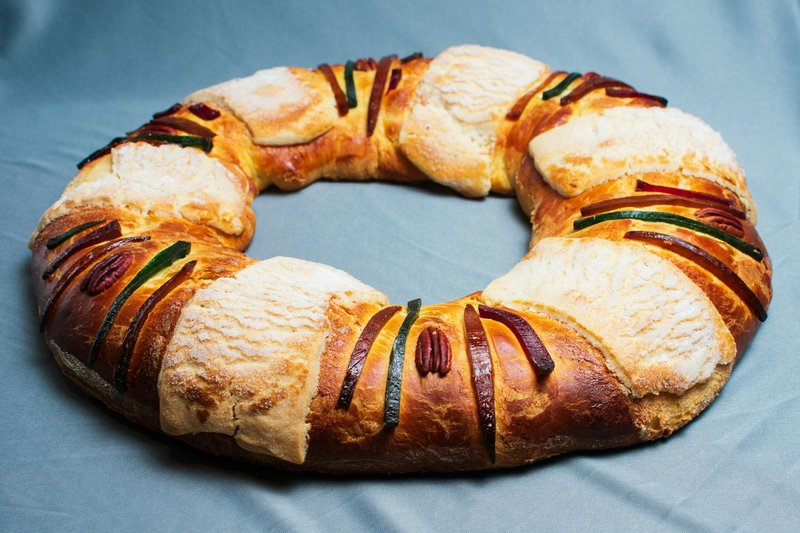

# King Cake

*Mardi Gras' official cake: a sweet brioche ring filled with cinnamon and brown sugar, iced and dusted with purple, green and gold sugar.*

**Serves:** Makes 1 large king cake (serves 12)

**Prep Time:** 30 minutes (plus 2 hours rising)

**Cook Time:** 30 minutes

## Overview
King cake is the Mardi Gras cake of New Orleans, an enriched cinnamon-swirled ring that lands on the breakfast table from the Epiphany through to the Tuesday before Lent. A rich enriched dough (flour, yeast, butter, milk, eggs, sugar) rises for an hour into something silky and pale gold. A cinnamon-sugar-butter filling spreads across the rolled-out rectangle; you roll it up like a Swiss roll, bend it into an oval ring, and pinch the ends together. After a second rise of forty-five minutes, twenty-five minutes in the oven turns it deep gold. While still warm, an icing of icing sugar, milk and vanilla drizzles over, and bands of coloured sugar (purple for justice, green for faith, gold for power) dust on in alternating stripes. A small plastic baby (or a dried bean) hides somewhere inside; whoever gets the slice with the baby hosts the next king cake party.

## Ingredients

### Dough
- 500 g strong white bread flour (plus extra for dusting)
- 7 g instant yeast
- 80 g caster sugar
- 1 ½ teaspoons salt
- 2 teaspoons ground cinnamon
- 180 ml warm milk
- 80 g unsalted butter (melted)
- 2 eggs (large)
- 1 lemon (zest)

### Cinnamon filling
- 100 g unsalted butter (softened)
- 150 g dark brown sugar
- 2 tablespoons ground cinnamon
- ½ teaspoon ground nutmeg

### Icing
- 200 g icing sugar
- 3-4 tablespoons whole milk
- 1 teaspoon vanilla extract

### Coloured sugar topping
- 60 g caster sugar
- Purple, green and gold food colourings (paste preferred; liquid works)
- (OR: buy pre-coloured Mardi Gras sugar from a baking-supply shop)

### Surprise
- 1 plastic baby (small, or a dried bean / a small marzipan ball as a substitute)

## Method

### Stage 1 - Dough
1. In a stand mixer or wide bowl, combine flour, yeast, sugar, salt and cinnamon.
1. Pour in warm milk, melted butter, eggs and lemon zest.
1. Knead 8 minutes (or 10 minutes by hand) till smooth, elastic and slightly tacky.
1. Rest in a lightly oiled bowl, covered, 1 hour till doubled.

### Stage 2 - Coloured sugars
1. Divide the 60 g sugar into 3 portions of 20 g each in small bowls.
1. Add a tiny dab of food colour paste to each (purple, green, gold); rub with the back of a spoon to distribute.
1. Spread on parchment to dry while you work.

### Stage 3 - Filling
1. Cream the soft butter with brown sugar, cinnamon and nutmeg to a smooth paste.

### Stage 4 - Shape
1. Knock back the risen dough.
1. Roll on a floured surface to a rectangle 40 × 25 cm.
1. Spread the filling evenly, leaving a 1 cm border at the long edges.
1. Roll up tightly from one long edge into a cylinder.
1. Pinch the seam to seal.
1. Bend the cylinder into an oval ring; pinch the ends together so the seam is invisible.
1. Place on a parchment-lined baking tray.

### Stage 5 - Second rise
1. Cover loosely with a damp tea towel; rise 45 minutes till puffy.

### Stage 6 - Bake
1. Heat the oven to 180°C (160°C fan).
1. Brush the king cake with a little beaten egg or milk for shine.
1. Bake 25-30 minutes till deep golden.
1. Cool 15 minutes on the tray.

### Stage 7 - Hide the baby
1. From underneath, push a small plastic baby (or substitute) into the dough. Don't bake the plastic, slip it in after baking.

### Stage 8 - Icing
1. Whisk icing sugar with milk and vanilla to a thick pourable glaze.
1. Drizzle generously over the warm cake in zigzag bands.

### Stage 9 - Colour
1. While the icing is still wet, sprinkle alternating bands of purple, green and gold sugar around the cake.
1. Each colour gets its own segment of about a third of the cake.

### Stage 10 - Serve
1. Cool fully before slicing.
1. Warn diners about the plastic baby.
1. Tradition: whoever gets the slice with the baby hosts / buys the next king cake.

## Notes
- **Yeast dough, not cake batter:** king cake is essentially a brioche-style yeasted bread shaped into a ring. Don't expect a sponge texture.
- **Don't pre-bake the plastic:** plastic babies don't survive 180°C ovens. Hide AFTER baking by pushing up from underneath.
- **Three colours, three bands:** the Mardi Gras tradition is purple-green-gold in distinct sections, not mixed sprinkles. Use food-colour paste rather than liquid for vibrant colour.
- **Eat within 2 days:** fresh king cake is bouncy and tender; day 3 it dries out.

## Storage
- Keeps 2 days at room temperature in a sealed container.
- Day 3 onwards, French toast it (turning stale king cake into bread pudding is itself a NOLA tradition).
- Freezes 1 month unsliced; thaw at room temp 3 hours.
