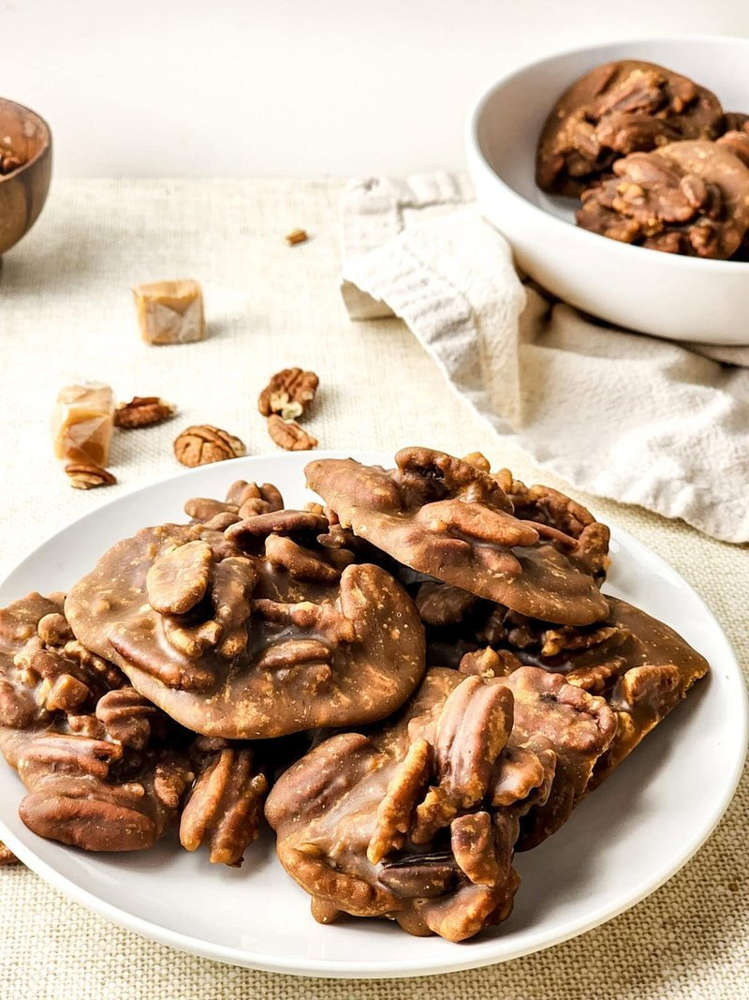

# Pecan Pralines

*A New Orleans candy: brown sugar, butter, cream and toasted pecans cooked to soft-ball, beaten till it sugars, dropped onto parchment.*

**Serves:** Makes about 20 pralines

**Prep Time:** 10 minutes

**Cook Time:** 25 minutes

## Overview
Pecan halves toast in a dry pan till fragrant. Brown sugar, caster sugar, double cream, butter and a pinch of salt simmer together in a heavy saucepan, fitted with a candy thermometer, until they reach 116°C (soft-ball stage). Off heat; vanilla and pecans stir in. The mixture is beaten with a wooden spoon for 30-60 seconds till it begins to thicken and lose its gloss (this is the crystallisation point). Drops by tablespoons onto parchment immediately. Sets in 15 minutes.

## Ingredients
- 200 g pecan halves
- 200 g light brown sugar
- 100 g caster sugar
- 180 ml double cream
- 60 g unsalted butter
- 1 teaspoon vanilla extract
- ¼ teaspoon fine sea salt

### Equipment
- Candy thermometer
- Parchment-lined tray
- Heavy-bottomed 2-3 L saucepan
- Wooden spoon (essential for the final beat)

## Method

### Stage 1 - Toast pecans
1. Spread the pecans in a dry skillet over medium heat.
1. Toast 4-5 minutes, tossing, until fragrant and a shade darker.
1. Tip onto a plate to cool.

### Stage 2 - Syrup
1. In a heavy 2-3 litre saucepan, combine the brown sugar, caster sugar, cream and butter.
1. Place over medium heat; stir until the butter melts and the sugar dissolves.
1. Clip on a candy thermometer.
1. Bring to a simmer; stop stirring.
1. Cook to 116°C (soft-ball stage - about 6-8 minutes from the simmer).
1. Add the salt during this time.

### Stage 3 - Off heat
1. The moment 116°C is reached, remove from heat.
1. Add the toasted pecans and the vanilla.
1. With a wooden spoon, beat vigorously and continuously for 30-60 seconds.
1. The mixture transforms: glossy → matte; thin → thick; ready when it loses its shine and starts to feel resistant.

### Stage 4 - Drop
1. Working FAST (the mixture continues to set), drop heaped tablespoons of the mixture onto a parchment-lined tray.
1. Aim for flat discs about 6 cm across.
1. If the mixture seizes before you've finished, add 1-2 tablespoons of hot cream and beat again briefly to loosen.

### Stage 5 - Set
1. Pralines set in 10-15 minutes at room temperature.
1. Peel off the parchment.

## Notes
- **Soft-ball stage is non-negotiable:** lower temperatures give pralines that don't set; higher give brittle ones. A candy thermometer is essential.
- **The beating step is the trick:** beating after taking off the heat causes controlled crystallisation. This is what gives NOLA pralines their iconic matte, slightly grainy texture. Skip beating and you get a glossy fudge instead.
- **Work fast at the drop stage:** the mixture goes from pourable to seized in about 90 seconds. Have your parchment and spoon ready before you start beating.
- **Humid days are pralines' enemy:** sugar candies absorb moisture from the air. Make pralines on a dry day; they'll set glossier and store better.

## Storage
- Keeps 2 weeks in an airtight tin at room temperature.
- Don't refrigerate - the sugar absorbs moisture and they go sticky.
- Wrap individually in cellophane for gifts.
