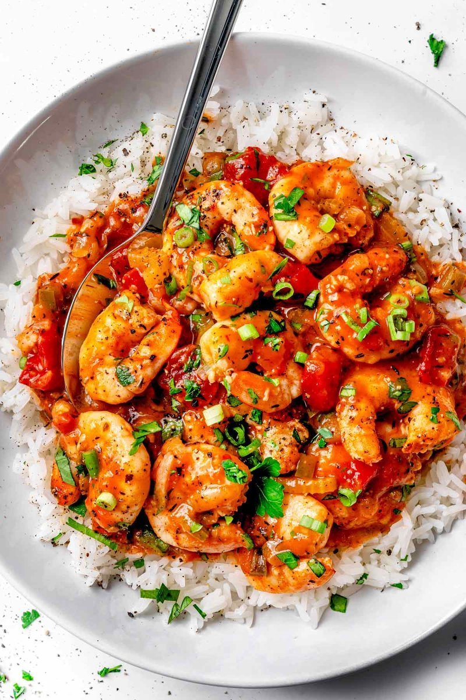

# Shrimp Creole

*Louisiana Creole's signature shrimp dish: prawns simmered in a tomato-based holy-trinity sauce with garlic, herbs and Creole spice. Served over white rice.*

**Serves:** 4

**Prep Time:** 15 minutes

**Cook Time:** 35 minutes

## Overview
Shrimp Creole is the dish that announces you're in New Orleans, a tomato-rich stew built on the Holy Trinity and finished with prawns that go in last and cook for exactly three minutes. The trinity (onion, celery, green pepper) softens slowly in butter, picking up sweetness; garlic, Creole seasoning and herbs (thyme, bay) join in to bloom in the heat. Tomato paste deepens the colour; chopped tomatoes and stock loosen the mixture; the sauce simmers for twenty minutes until it's thick enough to coat a spoon. The prawns drop in at the end and cook just until pink, no more. Hot sauce, a squeeze of lemon and chopped parsley finish. Serve over plain rice; ladle the sauce around the rice mound.

## Ingredients

### Sauce
- 50 g unsalted butter
- 1 onion (large, chopped)
- 3 celery sticks (chopped)
- 1 green pepper (chopped)
- 6 garlic cloves (crushed)
- 2 tablespoons tomato paste
- 400 g tin chopped tomatoes
- 400 ml seafood, chicken (or vegetable stock)
- 2 bay leaves
- 4 sprigs fresh thyme
- 2 teaspoons Creole seasoning (or 1 tsp paprika + ½ tsp each cayenne, garlic powder, oregano, salt, black pepper)
- 1 teaspoon Worcestershire sauce
- 1 tablespoon hot sauce (Crystal or Tabasco)
- ½ teaspoon salt (or to taste)

### To finish
- 600 g raw prawns (shelled, deveined; tails on)
- ½ lemon (juice)
- 4 spring onions (sliced)
- A small bunch of flat-leaf parsley (chopped)

### To serve
- Cooked white rice
- Extra hot sauce

## Method

### Stage 1 - Trinity
1. Melt the butter in a wide heavy pan over medium heat.
1. Cook the onion, celery and green pepper 8 minutes until softened.
1. Add the garlic; cook 1 minute.

### Stage 2 - Build the sauce
1. Stir in the tomato paste and Creole seasoning; cook 2 minutes - the paste will darken.
1. Add the chopped tomatoes, stock, bay, thyme, Worcestershire and hot sauce.
1. Bring to a simmer; reduce to medium-low.
1. Cook 18-22 minutes, stirring occasionally, until thickened to a sauce that coats a spoon.

### Stage 3 - Prawns
1. Add the prawns; stir into the sauce.
1. Cook 3-4 minutes until the prawns are pink and just-set - don't overcook (rubbery, sad prawns).

### Stage 4 - Finish
1. Off the heat, stir in the lemon juice, half the spring onions and half the parsley.
1. Discard the bay and thyme stems.
1. Taste; adjust salt and hot sauce.

### Stage 5 - Serve
1. Spoon over white rice; top with the remaining spring onions and parsley.
1. Pass extra hot sauce at the table.

## Notes
- **Creole vs Cajun:** Creole uses tomato; Cajun (typically) doesn't. Creole is "city food" (New Orleans, refined, with French influence); Cajun is "country food" (rural, rustic, no tomato in the originals).
- **Don't overcook the prawns:** Pink, plump and just-set is right. Overcooked prawns turn rubbery and ruin the dish.
- **Make the sauce ahead:** It deepens overnight. Add the prawns just before serving.

## Storage
- Sauce keeps 4 days refrigerated; reheat and add fresh prawns.
- Doesn't freeze well with cooked prawns; freeze sauce alone (3 months).
