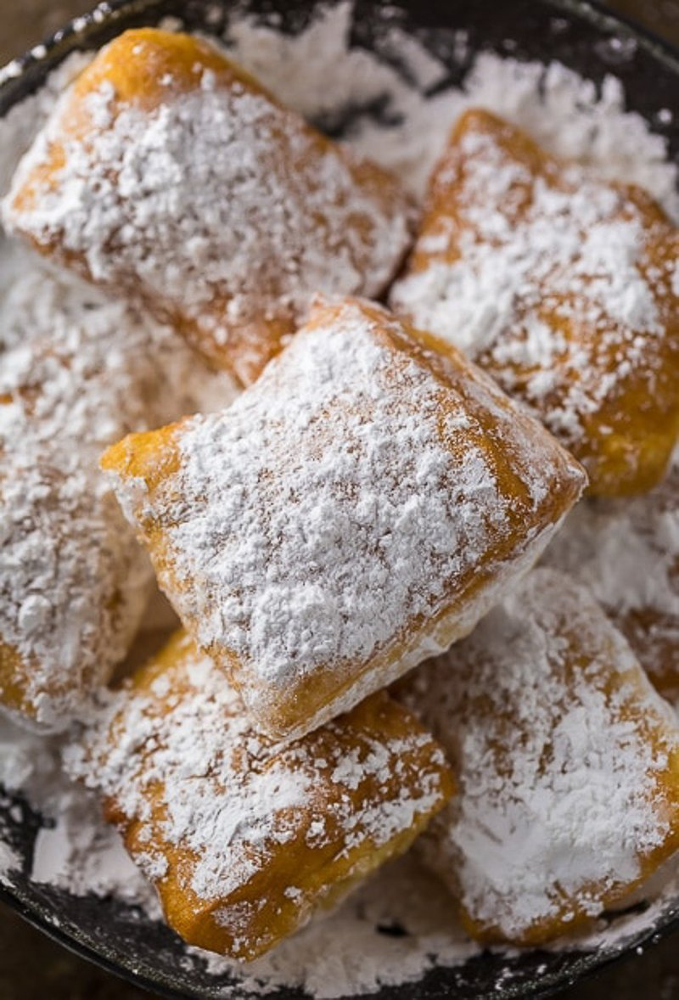

# Beignets

*The New Orleans pillowy fritter: a yeasted dough rolled thin, cut into squares and fried till puffed and pale gold. Doused in a snowdrift of icing sugar.*

**Serves:** 6 (makes about 30)

**Prep Time:** 20 minutes (plus 2 hours rising)

**Cook Time:** 20 minutes

## Overview
A soft eggy yeasted dough mixes, flour, yeast, sugar, salt, butter, egg, milk and a touch of evaporated milk for the classic richness. Rises for 2 hours (or overnight in the fridge). Rolls to 5 mm thick on a floured surface; cuts into 5 cm squares. Fries at 180°C 90 seconds per side. Drains briefly; dusts heavily with icing sugar; eaten hot.

## Ingredients

- 500 g plain flour
- 1 sachet (7 g) fast-action yeast
- 60 g caster sugar
- 1 teaspoon salt
- 30 g unsalted butter (melted)
- 1 egg (large, beaten)
- 200 ml warm whole milk
- 100 ml evaporated milk (or more whole milk)
- 1 ½ litres vegetable oil for deep frying
- 150 g icing sugar (for dusting - be generous)

## Method

### Stage 1 - Dough
1. Whisk flour, yeast, sugar and salt in a wide bowl.
1. Whisk the melted butter, beaten egg, warm milk and evaporated milk together.
1. Pour the wet into the dry; mix to a soft, slightly sticky dough.
1. Knead 6-8 minutes until smooth (or 4 minutes in a stand mixer with a dough hook).
1. Cover; rise 2 hours (or overnight in the fridge).

### Stage 2 - Roll and cut
1. Tip the dough onto a floured surface.
1. Roll to 5 mm thick.
1. Cut into 5 cm squares with a knife or pastry wheel.

### Stage 3 - Fry
1. Heat oil to 180°C in a deep heavy pan.
1. Fry in batches of 6-8 squares, 60-90 seconds per side, until puffed and deep gold all over (push them under with a slotted spoon to colour evenly).
1. Drain very briefly on kitchen paper (don't let them sit and go soggy).

### Stage 4 - Sugar
1. Dust heavily with icing sugar (a sifter helps).

### Stage 5 - Serve
1. Eat hot, immediately, with chicory coffee or strong espresso.

## Notes
- **Hot oil, fast fry:** Cool oil gives soggy, greasy beignets that don't puff. 180°C is right.
- **Generous icing sugar:** Café du Monde uses a comically large amount. Don't be shy.
- **Make-ahead dough:** Overnight refrigeration gives slightly better flavour and easier handling. Cut from cold dough straight into the fryer.

## Storage
- Eat fresh. Beignets stale fast.
- Dough keeps overnight refrigerated. Don't try to keep cooked beignets.
